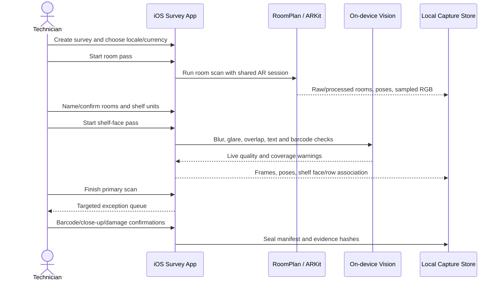
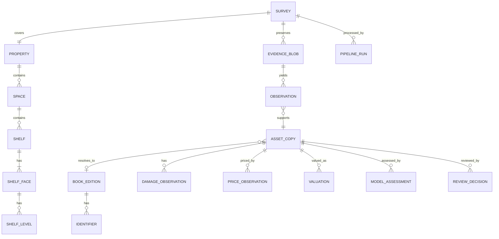
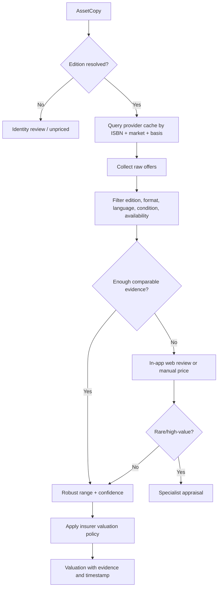
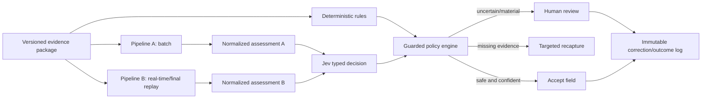
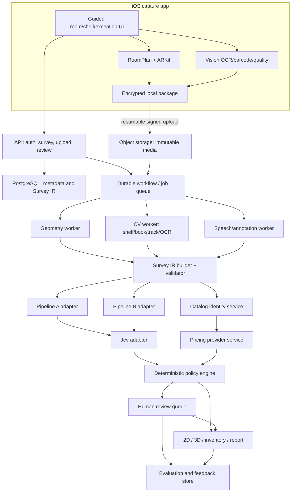
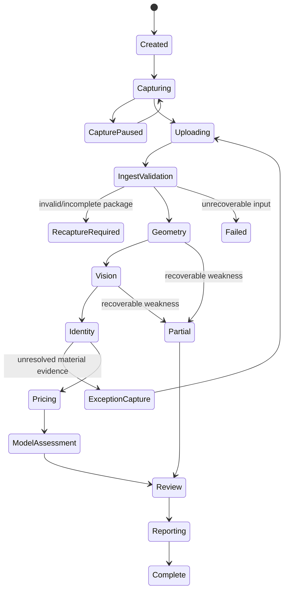
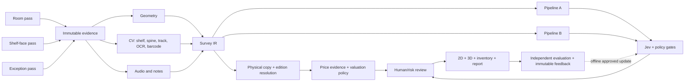

# Library Survey and Valuation System — Final Architecture Plan

**Status:** proposed architecture for alignment before implementation  
**Date:** 2026-09-20  
**Inputs reviewed:** `question.md`, `initial-chatgpt-plan.md`, and the previous Cozmo FloorPlan assignment in `/Users/harshsinha/VS Code/assignment`

## 1. Executive decision

This should be built as a **computer-vision evidence system with a guided capture app**, not as a general video sent to three AI models.

The system has six distinct responsibilities:

1. capture the building, shelf faces, books, other assets, speech, and notes;
2. reconstruct the 2D/3D property geometry;
3. turn repeated visual detections into distinct physical asset copies;
4. resolve book editions and identifiers without pretending every spine exposes an ISBN;
5. obtain time- and geography-specific price evidence and calculate a defensible valuation range;
6. compare the two required model pipelines, route uncertainty through Jev, and learn only from independently verified outcomes.

The governing rule is:

> Capture once, preserve original evidence, make deterministic claims where possible, use models only for ambiguity, and let a human see and correct every material uncertainty.

The first deliverable is this architecture. Implementation should begin only after the decisions in [Section 19](#19-decisions-to-align-on-before-building) are accepted.

## 2. Corrections to the initial ChatGPT plan

The initial plan has a strong foundation: a common IR, `Asset` versus `Observation`, spatial deduplication, provenance, independent model outputs, human review, and offline feedback. The final design keeps those ideas and corrects these weaknesses:

| Initial weakness | Final decision |
| --- | --- |
| One room walkthrough appears sufficient for geometry and book recognition. | Use three guided passes. Room-scale video rarely contains enough pixels for reliable spine text, condition detail, or rear-cover barcodes. |
| An ISBN is treated almost like a physical-book ID. | An ISBN identifies an edition/product. `AssetCopy` identifies a physical copy. Two copies with the same ISBN remain two assets. |
| Barcode detection is presented as the best normal case. | Most ISBN barcodes are on the rear cover, not the visible spine. Barcode capture is an exception/verification pass, not the main shelf-count path. |
| Arbitrary weighted deduplication scores are suggested. | Start with constrained rules and calibrated features; learn thresholds from labeled double-pass scans. Never merge solely because ISBNs match. |
| A single median web price becomes replacement value. | Preserve individual offers, edition/format/condition/geography, shipping/tax, retrieval time, and source. Produce a range plus an insurer-defined valuation basis. |
| Fixed condition multipliers are shown. | Condition adjustment is policy/configuration data validated by the insurer, not a guessed table embedded in code. Prefer comparable offers of the same condition. |
| Amazon scraping is treated mainly as an engineering inconvenience. | Put pricing behind a provider contract. Use permitted APIs/search integrations or human-confirmed in-app web evidence. Do not make the demo depend on brittle or unauthorized scraping. |
| Fable, Astra, and Jev are allowed near factual fields. | Deterministic barcode checks, geometry, counts, currency arithmetic, and fetched prices remain code-owned. Models emit candidates and classifications only. |
| Jev is close to being described as ground-truth evaluation. | Jev is a typed decision/router. Evaluation uses manually labeled inventory, independent measurements, and verified price references. |
| “RL loop” sounds online and immediate. | Begin with immutable feedback logs and a contextual-bandit/routing evaluation. Train offline; deploy shadow → canary → approved version. |
| Capture failure and retry behavior is underspecified. | Every shelf face has explicit coverage, quality, and unresolved-state gates, with targeted recapture instructions. |
| Simultaneous RoomPlan and high-resolution recording is assumed. | Run a device feasibility spike. Prefer a shared AR session and sampled `ARFrame` evidence; use deliberate high-resolution stills/close shelf passes where required. Do not assume two camera owners can run concurrently. |
| Security, retention, offline upload, and audit boundaries are thin. | Add resumable capture packages, hashes, encryption, least privilege, retention policy, redaction, and immutable run/version records. |

## 3. Scope and non-goals

### MVP scope

- Native iPhone/iPad capture app using RoomPlan/ARKit on a supported LiDAR device.
- Multiple rooms combined into one structure.
- Synchronized RGB evidence, pose, audio notes, and written notes.
- Shelf units, shelf faces, shelf levels, and physical book-copy counting.
- Barcode/EAN and OCR evidence; ISBN-10/ISBN-13 validation and catalog resolution.
- Multi-copy and repeat-pass deduplication.
- Books, paintings/portraits, electronics, furniture, shelves, cups, and `other`.
- Condition/damage evidence with an explicit review state.
- Geography-aware book price evidence and valuation ranges.
- 2D plan, 3D RoomPlan model, inventory, review queue, and evidence report.
- Two isolated model pipelines and a Jev decision layer.
- A labeled evaluation set and immutable feedback log.

### Explicit non-goals for the first demo

- Perfect ISBN recovery from every spine.
- Fully automatic rare-book or fine-art appraisal.
- Real-estate market appraisal from RoomPlan alone.
- Hidden/concealed-damage detection.
- Fully autonomous insurance approval.
- Online reinforcement learning that changes production behavior after each survey.
- Photorealistic NeRF reconstruction.
- Reliance on one retailer or on CAPTCHA/anti-bot bypasses.

## 4. Three-pass capture protocol

The capture protocol is the product. Downstream models cannot recover details that were never visible.

### Pass A — property and room geometry

The technician creates a survey, records country/city/currency and property metadata, then scans each room with RoomPlan. The app preserves the raw room result, processed room result, transforms, and exported USDZ. Multiple room scans are merged into a `CapturedStructure` when supported.

This pass collects:

- walls, floors, openings, doors, windows, room transforms, and recognized large objects;
- camera trajectory and selected RGB frames;
- room/floor labels;
- a coverage indicator and incomplete-scan warnings.

It does **not** claim to identify every book.

### Pass B — guided shelf-face scan

The app asks the technician to scan every shelf face at close range. A freestanding double-sided shelf has two identities, such as `shelf_04.face_A` and `shelf_04.face_B`. The screen overlays the face boundary and marks horizontal shelf levels as covered.

For each face, the user performs a slow sweep with enough overlap. The app gives live warnings for blur, glare, excessive speed, inadequate overlap, text too small, occlusion, and unscanned strips. It saves the video/frames, poses, and a rectified shelf mosaic if quality permits.

The output is a **coverage map**, not merely a “scan complete” flag:

```text
shelf_04.face_A
  row_01  covered 96%  readable 88%
  row_02  covered 91%  readable 73%
  row_03  covered 54%  -> recapture requested
```

### Pass C — exceptions and valuable assets

The app generates a targeted queue:

- unresolved or ambiguous books;
- suspected duplicate merges;
- barcode/ISBN confirmation required;
- damaged books or objects requiring a close-up;
- paintings, portraits, signed/rare books, and other potentially high-value assets;
- audio notes that could not be linked to an asset.

The technician can pull out a book and scan the rear-cover EAN/ISBN, photograph the title/copyright page, or confirm that access is not permitted. An unresolved result is valid; it must not be silently guessed.

### Capture sequence



## 5. Capture package and trust boundary

Use the successful pattern from the previous Cozmo assignment: preserve original inputs, validate one versioned package at the boundary, normalize into one IR, and produce structured partial/failed results rather than crashing.

```text
survey_<id>/
  manifest.json
  property.json
  roomplan/
    raw/
    processed/
    structure.json
    model.usdz
  shelf_scans/
    shelf_04_face_A/
      video.mov
      frames.jsonl
      poses.jsonl
      quality.json
  closeups/
  audio/
    survey.m4a
    segments.jsonl
  notes/
    annotations.jsonl
  device/
    calibration.json
  checksums.sha256
```

`manifest.json` records:

- schema version, survey/session/device IDs, app/build version;
- locale, country, currency, timezone, and consent/retention policy;
- start/end times and monotonic-clock anchor;
- files, MIME types, byte sizes, and SHA-256 hashes;
- capture modes and device capabilities;
- RoomPlan/iOS/Vision versions;
- whether capture is complete, interrupted, resumed, or manually sealed;
- upload status without changing the immutable evidence identity.

The app writes locally first, survives interruption, and uploads with resumable signed URLs. The backend rejects unsafe paths, hash mismatches, unsupported schema versions, missing required members, and inconsistent timestamps before starting CV work.

## 6. Canonical Survey IR

The canonical contract is `SurveyIR v1`; model-specific responses never become the database schema.

### Core entities



### The distinctions that prevent silent errors

- **Observation:** one detection in one frame/crop at one time and pose.
- **Track:** observations believed to be the same visible object during a continuous sweep.
- **AssetCopy:** one physical object in the library.
- **BookEdition:** bibliographic product/edition/format/language.
- **Work:** the conceptual title; several editions can represent one work.
- **Identifier:** ISBN, EAN, internal library barcode, OCLC, LCCN, ISSN, or unknown.
- **PriceObservation:** one source's observed offer at one time and market.
- **Valuation:** the policy-driven conclusion from accepted price evidence.

An ISBN is never the primary key of `AssetCopy`.

### Measurement and assertion shape

Every material result carries uncertainty and evidence:

```json
{
  "value": 37,
  "unit": "count",
  "status": "estimated",
  "confidence": 0.94,
  "interval": { "low": 35, "high": 39, "level": 0.95 },
  "method": "shelf-instance-model-v3",
  "evidence_refs": ["frame_201", "mosaic_04A", "track_88"],
  "run_id": "run_count_v3_20260920"
}
```

Top-level and per-stage statuses are `ok`, `partial`, `failed`, or `needs_review`. A schema-valid file is not the same as an accurate result, and a completed job is not the same as a passed evaluation.

## 7. Computer-vision pipeline

### End-to-end CV flow


### 7.1 Quality and coverage

For each frame, compute sharpness, exposure, glare/highlight clipping, motion, text pixel height, shelf visibility, occlusion, and pose stability. Do not create a universal hand-tuned “quality truth” score. Retain the components and learn acceptance thresholds from the evaluation set.

Coverage is measured in shelf-face coordinates. The app should know which part of a face has usable evidence and request only the missing row/strip.

### 7.2 Shelf and spine detection

Use a hierarchical detector:

```text
room → shelf unit → shelf face → shelf level → book spine → physical copy
```

The detector must support:

- vertical, horizontal, leaning, thin, and partially occluded books;
- bookends and decorative items between books;
- stacks rather than only upright spines;
- double-sided shelves and shelves against walls;
- glass doors, glare, shadows, and repeated visual designs.

Start with a pretrained detector/segmenter plus a small labeled library dataset. Fine-tune only after baseline error analysis identifies the dominant misses.

### 7.3 Tracking and physical-copy deduplication

Deduplication operates at two levels:

1. **Within a continuous sweep:** temporal tracking joins the same spine across adjacent frames.
2. **Across sweeps or revisit paths:** spatial association joins tracks that occupy the same shelf-face coordinates and have compatible appearance.

Candidate pairs are blocked by room, shelf unit, face, row, and approximate 3D position before any expensive comparison. Features include:

- continuous track membership;
- projected 3D/spatial distance and uncertainty;
- shelf-face/row coordinate overlap;
- visual embedding similarity;
- OCR token similarity;
- capture trajectory and time;
- edition identifier agreement or contradiction.

Hard constraints:

- Same ISBN alone **cannot merge** two copies.
- Different shelf faces/positions normally mean different physical copies.
- A continuous track cannot split merely because OCR changes.
- Strong identifier contradiction prevents automatic merge.
- Ambiguous cross-pass pairs enter review; they do not automatically collapse.

For a double-sided shelf, face normal and shelf-plane position prevent the rear walkaround from being treated as a repeat of the front face.

### 7.4 Moved books

If a technician or patron moves a book during capture, geometry can conflict with identity. Mark the candidate `possibly_moved` when strong visual/identifier evidence matches but spatial evidence changes after a discontinuity. Preserve both observations and request human confirmation rather than counting or merging automatically.

## 8. ISBN and bibliographic identity

“ISV” is not treated as a known book identifier in this design; unless Cosmo defines it separately, it is assumed to mean **ISBN**. The schema remains extensible to ISBN, EAN/UPC, ISSN, OCLC, LCCN, and a library's internal accession barcode.

### 8.1 Identifier evidence ladder

Use the strongest available evidence in this order:

1. rear-cover EAN-13/Bookland barcode captured in Pass C;
2. printed ISBN-13 or ISBN-10 text from copyright/back-cover evidence;
3. exact catalog match from title + author + publisher + edition/format/language/year;
4. title/author candidate match with unresolved edition;
5. unknown identity with a stable physical-copy ID.

Spine OCR can suggest a work or edition, but should not invent an ISBN. If several editions fit, store ranked candidates and ask for a back-cover/title-page scan.

### 8.2 Deterministic ISBN validation

Before catalog lookup:

- normalize spaces and hyphens while preserving the raw observed string;
- distinguish ISBN-10 and ISBN-13;
- validate the appropriate check digit;
- for EAN-13, verify that the payload is a book prefix when classifying it as an ISBN rather than a generic retail barcode;
- separate any supplemental 5-digit price add-on;
- retain OCR confidence and bounding box;
- query at least one catalog and compare returned title/author/edition with the visual evidence.

Reject a checksum-valid but metadata-incompatible code as a likely wrong/adjacent barcode. Checksum validity proves formatting, not that the code belongs to the observed book.

### 8.3 Important edge cases

- Pre-ISBN, rare, self-published, local, or damaged books may have no ISBN.
- Different bindings, editions, languages, and sometimes regional products have different ISBNs.
- A 979 ISBN may not have an ISBN-10 equivalent.
- Journals/serials can use ISSN rather than ISBN.
- Boxed sets and multi-volume works can have both set-level and volume-level identifiers.
- An internal library barcode may identify a physical copy but is not a market ISBN.
- The barcode can be obscured by a library label or protective cover.
- Two identical physical copies should share a `BookEdition` but keep separate `AssetCopy` rows.

### 8.4 Catalog resolution

Use a provider chain with normalized output:

```text
Local cache → Open Library / Google Books metadata → optional library catalog → manual resolution
```

Catalog results are candidates, not unquestioned truth. Store provider ID, raw response hash, retrieval time, match fields, and the reason a candidate was chosen. Open Library distinguishes works from individual editions, which maps cleanly to this IR. Google Books can search volumes and expose identifiers and country-dependent sale information.

## 9. Non-book assets, damage, and spoken notes

### Asset taxonomy

Start with a closed, versioned taxonomy:

```text
book | serial | painting | portrait | sculpture | computer | monitor |
printer | furniture | shelf | appliance | cup | decorative_object | other
```

Every detected object can be inventoried even when `valuation_required=false`. This proves deliberate exclusion instead of confusing “zero value” with “not seen.” The policy engine—not the detector—decides whether an asset is building, contents, excluded, or requires appraisal.

### Damage evidence

Damage is a separate observation attached to an asset or surface:

```text
type + severity candidate + region/mask + evidence + source + confidence
```

The app requests a close-up and scale/reference when a damage claim is material. A spoken statement such as “this portrait is damaged in the lower-right” is an operator assertion, not visual truth.

### Audio/note association

Speech-to-text segments share the capture clock. Association uses:

- visible candidates at the segment time;
- object nearest the reticle/image center;
- explicit tap/selection state;
- camera pose and recent focus history;
- semantic compatibility between note and candidate class.

If two assets are plausible, the app asks the operator to select one. It never silently binds a high-value damage note to the nearest object.

### High-value asset policy

Paintings, signed books, manuscripts, antiques, and unusual objects default to `requires_appraisal` when identity/provenance/value is material. The system can collect evidence and comparable listings, but must not claim a professional appraisal from an image.

## 10. Geometry and the 2D/3D output

RoomPlan provides the spatial layer; it does not provide independent ground truth and does not identify every small asset. The app should preserve raw and processed room data and merge nearby room scans where supported. Apple's `CapturedStructure` represents merged room sessions and can export a 3D asset.

The shared geometry contract records:

- rooms, walls, floor polygons, openings, doors/windows, transforms, and units;
- value plus interval/confidence and evidence source for reported dimensions;
- RoomPlan/ARKit version and coordinate frame;
- `ok`, `partial`, or `failed` status and actionable warnings.

Generate both outputs from the same IR:

- **2D:** vector floor plan with room labels, shelf footprints, asset pins, coverage overlays, and damage markers;
- **3D:** RoomPlan/USDZ base with selectable shelves/assets and evidence links.

Building replacement cost is not the real-estate sale price. It requires a separately sourced local reconstruction-rate input, occupancy/construction classification, finish level, age/condition, and insurer policy. The system must label the basis: `replacement_cost`, `market_value`, or `manual_appraisal`; it must never mix them.

## 11. Price search and valuation

### 11.1 Pricing is evidence collection, not one lookup

For each resolved edition and market, the pricing service gathers normalized `PriceObservation` rows:

```json
{
  "asset_copy_id": "book_copy_182",
  "isbn13": "9780132350884",
  "market": "IN",
  "currency": "INR",
  "source": "provider_name",
  "listing_url": "https://...",
  "listing_id": "...",
  "edition_match": "exact",
  "format": "paperback",
  "condition": "used_good",
  "item_price": 825,
  "shipping": 60,
  "tax_included": null,
  "availability": "in_stock",
  "seller_type": "marketplace",
  "observed_at": "2026-09-20T10:00:00Z",
  "evidence_hash": "sha256:..."
}
```

### 11.2 In-app web search

The app can include a **Price Evidence** screen:

1. expose a **Search Web** action for every detected book in the inventory;
2. search by a validated ISBN when one is available; otherwise search by the recognized book name, supplemented by author, publisher, edition/format, language, and country when those fields are available;
3. support running this lookup individually during review or as a queued lookup for every found book, while deduplicating the external search for copies that share the same edition and market;
4. keep the search query and the identifier/title evidence used to create it, so a reviewer can see whether the result came from an ISBN lookup or a name-based lookup;
5. call the backend pricing/search provider;
6. show source links and candidate offers inside the app;
7. let the technician/reviewer confirm edition and condition comparability;
8. save the selected offer, retrieval timestamp, visible fields, and evidence reference;
9. allow manual entry with a reason when automatic extraction is not permitted or not reliable.

The search fallback is therefore:

```text
validated ISBN
  → exact ISBN web search
  → if no useful result, ISBN + title/author

no validated ISBN
  → book name + author
  → add publisher/edition/format/language when known

insufficient name evidence
  → request a closer spine/title-page scan or leave pricing unresolved
```

Name-based results have lower identity confidence than an exact-ISBN result. They must be checked against the captured cover/spine and edition metadata before contributing to valuation.

Do not embed an unrestricted scraper in the mobile client. A server-side `BookPriceProvider` owns rate limits, source-specific rules, caching, and credentials. If a site permits only human browsing, open it in an in-app browser and require confirmation rather than pretending a brittle scraper is a production integration.

Provider order for the MVP:

1. catalog metadata: Open Library and/or Google Books;
2. permitted book/retail price integration or search provider;
3. Amazon Creators API if account/access and use terms fit the project;
4. human-confirmed retailer listing;
5. manual appraisal/unavailable.

Google Books `saleInfo` is country-dependent and often describes an eBook offer, so it must not automatically price a physical copy. Amazon's current official Creators API requires an Associates account/credentials and has usage limits tied to the program. The architecture therefore cannot depend on Amazon access or scraping.

### 11.3 Estimation rule

Filter offers before aggregation:

- exact edition/ISBN where available;
- correct physical format and language;
- correct country/market and currency;
- availability within the freshness window;
- condition comparable to the asset and insurer valuation basis;
- landed price where shipping/tax data are available;
- remove obvious bundles, rentals, digital editions, and extreme mismatches.

Then produce:

- accepted-offer count and source count;
- low/central/high estimate (for example, robust quantiles/median only after enough comparable offers);
- currency and captured FX rate if conversion is needed;
- confidence and reasons for exclusions;
- price age/TTL and next refresh time;
- `estimated`, `quoted`, `manual`, `requires_appraisal`, or `unavailable` status.

With one weak offer, return a low-confidence range or review request—not a precise replacement value. Each physical copy receives its own condition conclusion even when copies share the same base edition price.

### Pricing decision flow



## 12. Two model pipelines and Jev

The assignment's names are retained as **Pipeline A (Fable/Anthropic)**, **Pipeline B (Astra/Astro real-time)**, and **Jev** until exact provider model IDs, API access, supported media, regions, and prices are confirmed. Those are deployment configuration, not schema names.

### Evidence package

Both model pipelines receive the same versioned, bounded package, independently:

- best asset crops and optional damage close-up;
- OCR candidates and raw confidence;
- barcode/catalog candidates;
- spatial/shelf context;
- operator note and transcript segment;
- deterministic flags and allowed taxonomy;
- requested task only.

They do not receive each other's answer. Both return the same strict schema. Models may classify category, condition, damage type, note meaning, and ambiguous identity candidates. They may not write geometry, validate ISBN checksums, perform currency arithmetic, fetch a hidden price, or alter an original observation.

### Runtime roles

- **Pipeline B / real-time:** gives capture assistance and provisional candidates. It is never the final authoritative inventory during capture.
- **Pipeline A / batch:** reasons over the completed evidence package after deterministic processing.
- **Jev:** consumes normalized structured state and produces bounded probabilities/actions such as accept, targeted recapture, alternate resolver, or human review.
- **Policy engine:** validates Jev's proposed action against hard thresholds, value/risk rules, retry budgets, and permissions.
- **Human reviewer:** resolves uncertainty and supplies labeled feedback.



Agreement between two models is not ground truth. A wrong consensus still routes to review when deterministic evidence conflicts or financial impact is high.

## 13. Feedback and RL design

Start with logged supervision, not online RL.

For every decision, store:

- compact state and evidence IDs;
- full model distributions/structured outputs;
- Jev distribution and proposed action;
- policy version, executed action, and action reason;
- human correction and independent truth where available;
- downstream insurer acceptance/rework outcome, elapsed time, and cost.

The first learning problem is a contextual bandit/routing policy: given quality, disagreement, confidence, and impact, should the system accept, recapture, use another resolver, or ask a person? Sequential RL is justified only when one action changes later evidence, such as recapture → reprocess → review.

Rewards must be computed from external outcomes. False merging two physical copies, missing a high-value asset, and assigning a wrong edition should receive materially different costs, but the weights must be agreed with the insurance stakeholder and tested for perverse incentives. “Fewer human reviews” is not a safe reward by itself.

Promotion path:

```text
immutable logs → offline train/evaluate → temporal/property holdout → shadow → small canary → approved version → rollbackable deployment
```

No single survey updates live model weights or thresholds.

## 14. Backend architecture

### Logical production architecture



### Service boundaries

| Component | Owns | Does not own |
| --- | --- | --- |
| Capture app | acquisition, local quality, package, upload, review UI | final count/valuation truth |
| Ingestion API | auth, survey lifecycle, signed URLs, manifest acceptance | media processing |
| Workflow engine | retries, dependencies, timeouts, idempotency, dead-letter state | domain inference |
| Geometry worker | RoomPlan normalization and 2D/3D geometry | asset identity or value |
| CV worker | quality, shelves, detections, tracking, crops, OCR/barcodes | catalog truth or valuation policy |
| Identity service | deterministic identifier validation and catalog candidates | physical-copy deduplication |
| Pricing service | source adapters, cache, offer normalization, FX snapshot | insurer policy or appraisal |
| Model adapters | bounded ambiguous classification | arithmetic, direct mutation, hard rules |
| Policy engine | confidence/value gates and allowed transitions | perception |
| Review/report | corrections, sign-off, evidence presentation | silent model retraining |

### MVP deployment profile

For the $50 demonstration, keep the logical boundaries but deploy simply:

- SwiftUI iOS app;
- Python FastAPI API and worker on the development Mac or one small hosted service;
- SQLite for a single-user local demo, with repository interfaces compatible with PostgreSQL;
- local filesystem or low-cost S3-compatible storage;
- an in-process/durable local job table instead of adding Redis prematurely;
- OpenCV/PyTorch/Vision for local CV;
- paid model calls only for uncertain evidence packages.

For production, swap SQLite/filesystem/local jobs for PostgreSQL, object storage, and a durable workflow engine without changing the IR or provider interfaces.

### Suggested repository layout

```text
ios/LibrarySurvey/
backend/app/api/
backend/app/domain/
backend/app/workflows/
backend/app/providers/catalog/
backend/app/providers/pricing/
backend/app/providers/models/
backend/app/policy/
cv/library_vision/
schemas/survey-ir.schema.json
schemas/evidence-package.schema.json
schemas/model-assessment.schema.json
eval/
fixtures/
docs/
```

Reuse concepts and carefully extracted code from the previous assignment—RoomPlan capture/export, capture-package validation, geometry normalization, schema checks, SVG rendering, and evidence/evaluation discipline—but do not copy its old assumptions or report its previous measured accuracy as evidence for this new problem.

## 15. API and workflow contract

### Minimal API

```text
POST   /v1/surveys
GET    /v1/surveys/{id}
POST   /v1/surveys/{id}/uploads
POST   /v1/surveys/{id}/seal
GET    /v1/surveys/{id}/jobs
GET    /v1/surveys/{id}/inventory
GET    /v1/surveys/{id}/review
POST   /v1/reviews/{id}/decision
POST   /v1/assets/{id}/price-search
POST   /v1/assets/{id}/price-observations
GET    /v1/surveys/{id}/report
GET    /v1/evidence/{id}
```

Mutations require idempotency keys. Processing jobs use stable keys such as `survey_id + stage + input_hash + pipeline_version`. Retrying a stage must update or replace its own versioned output, never append duplicate assets.

### State machine



Store both overall survey status and each stage's status. An individual asset can remain unresolved while the survey completes with disclosed partial coverage.

## 16. Mobile product flow

1. **Create Survey** — property, locale, currency, valuation basis, consent.
2. **Device Check** — LiDAR/support, storage, battery, camera/mic permission, network optional.
3. **Room Pass** — RoomPlan guidance, name rooms, confirm joins.
4. **Shelf Map** — detect/confirm shelf units and sides.
5. **Shelf Pass** — live quality/coverage overlay per face and row.
6. **Other Assets** — tap/mark paintings, electronics, furniture, excluded objects.
7. **Speak/Write Notes** — preferably tap an asset first; unbound notes are visible.
8. **Exception Pass** — barcode/title-page/damage close-ups and high-value items.
9. **Seal and Upload** — hashes, progress, pause/resume, local copy until acknowledgment.
10. **Processing** — stage-specific progress and actionable failures.
11. **Overview** — room/area, coverage, physical-copy count, resolved editions, estimated value, unresolved material items.
12. **2D/3D** — select shelf/asset and open evidence.
13. **Inventory** — distinguish physical copies from unique editions; filter by room/shelf/status; run **Search Web** for any individual book or queue searches for all found books using ISBN-or-name fallback.
14. **Review** — merge/keep separate, choose edition, rescan barcode, bind note, confirm price, request appraisal.
15. **Report** — signed-off JSON/PDF plus evidence manifest and limitations.

Accessibility requirements include Dynamic Type, VoiceOver labels, high-contrast status cues that do not rely on color, large touch targets, captions/transcripts, and safe one-handed operation during capture.

## 17. Failure policy and operator actions

| Failure | System result | Operator action |
| --- | --- | --- |
| RoomPlan unsupported/no LiDAR | Geometry tier unavailable or alternate capture marked partial | Use supported device or documented photo/video fallback; do not claim metric LiDAR accuracy |
| Room loop/opening incomplete | `geometry.partial` with missing region | Rescan named wall/doorway |
| Shelf face not fully covered | Count remains partial for that face | Rescan highlighted rows only |
| Motion blur/glare/text too small | Evidence rejected before identity stage | Slow down, change angle/light, move closer |
| Barcode decodes but checksum fails | Preserve raw code; identifier rejected | Rescan barcode/title page |
| Valid ISBN conflicts with visible title | Candidate quarantined | Check adjacent barcode/label and confirm book |
| No ISBN | Stable copy remains; title/author candidates or unknown | Scan title/copyright page or accept unresolved |
| Same ISBN in two locations | Two `AssetCopy` rows | No action unless spatial evidence itself is ambiguous |
| Repeat pass appears duplicated | Cross-pass review candidate | Merge only with strong spatial/visual evidence or human decision |
| Book moved mid-scan | `possibly_moved` | Confirm one moved copy versus two copies |
| Audio names several visible objects | Note remains unbound | Technician selects target asset |
| Price source unavailable/rate-limited | Cached value labeled stale or no estimate | Try another allowed provider/manual evidence |
| Only eBook price found | Reject for physical replacement basis | Search physical format |
| One extreme marketplace listing | Low confidence; not central value | Add comparables or appraisal |
| Potentially valuable art/rare book | No automated precise value | Specialist appraisal |
| Model pipelines disagree | Jev/policy routes by impact and evidence | Human review or targeted recapture |
| Both models agree but deterministic evidence conflicts | Model output vetoed | Review factual evidence |
| Upload interrupted | Local package remains; resumable upload | Resume without recapturing |
| Worker/model provider fails | Bounded retry then partial/fallback | Review or rerun; no duplicated outputs |
| Schema/output write fails | No report published | Preserve run/error; repair and rerun idempotently |

## 18. Evaluation plan and acceptance gates

The demo needs controlled ground truth. Prepare a small library zone with known counts, repeated titles/copies, difficult spines, one deliberate rescan, one moved-book case, damaged objects, a mug, and a high-value/manual-review object.

### Ground truth

- manually numbered physical copies and shelf positions;
- verified ISBN/edition where present;
- explicit `no ISBN` cases;
- manually labeled condition/damage with reviewer agreement;
- tape/laser room dimensions kept independent of RoomPlan;
- manually verified comparable price evidence and valuation basis;
- transcript-to-asset links;
- an incumbent/manual workflow time and result, if comparison is required.

### Metrics

| Area | Metrics |
| --- | --- |
| Coverage | usable shelf area, missed rows, recapture success |
| Detection/count | instance precision/recall/F1, absolute count error per face and survey |
| Deduplication | pairwise precision/recall, false merges, false splits, double-pass count error |
| Identity | ISBN exact accuracy, resolved coverage, title/edition accuracy, selective accuracy at confidence thresholds |
| OCR/barcode | character/word error, decode rate by evidence type/language |
| Damage | class precision/recall/F1, region overlap, note-link accuracy |
| Geometry | room dimension/floor-area error and interval coverage versus independent measurements |
| Pricing | exact-edition coverage, comparable-offer count, stale rate, range coverage versus reviewer reference |
| Models | Pipeline A/B accuracy, disagreement, calibration, cost, latency, Jev routing utility |
| Product | scan time, review time, recapture rate, crash/retry success, upload recovery |

### Proposed release gates to agree, not claimed results

- No automatic merge from ISBN alone.
- Every final count and value can open its evidence/provenance.
- The deliberate left-to-right then right-to-left scan does not double the shelf count.
- Two distinct copies with the same ISBN remain two copies.
- Invalid ISBN checksums never enter pricing automatically.
- Physical-book valuation never uses an eBook offer silently.
- A high-value/unresolved asset cannot be auto-finalized.
- Interrupted upload and worker retry do not duplicate assets.
- Original evidence hashes remain unchanged through processing.
- All metrics are reported with numerator/denominator and unresolved coverage; accuracy is never reported only on easy resolved cases.

Numerical accuracy thresholds should be frozen after a baseline run and stakeholder risk review. Do not lower a threshold after seeing the final holdout.

## 19. Decisions to align on before building

These choices materially change implementation and must be confirmed:

1. Exact identities/API access for “Fable,” “Astra/Astro,” and Jev.
2. Supported capture device and minimum iOS version.
3. Whether the MVP is one room/local library zone or a true multi-room property.
4. Valuation basis for books: new replacement, like-for-like used replacement, actual cash value, or another insurer rule.
5. Countries/currencies required in the demo.
6. Whether technicians may pull books out for barcode/title-page capture.
7. Which external sources are legally/contractually approved for automated price extraction.
8. Whether shelf/furniture value belongs to building, contents, or a configurable policy category.
9. Retention, data residency, face/person redaction, and consent requirements.
10. Who supplies building reconstruction-rate data and who signs off high-value appraisals.
11. Required report/export format for the insurance company.
12. Proposed quantitative acceptance gates and the independent holdout procedure.

## 20. Implementation sequence with exit criteria

### Phase 0 — freeze contracts and benchmark

- Write Survey IR, evidence package, model assessment, pricing, and review JSON Schemas.
- Create the labeled controlled-shelf protocol and acceptance metrics.
- Verify model/provider names, account access, costs, and allowed price sources.

**Exit:** schemas validate fixtures; ground-truth protocol is executable; no unresolved architectural decision blocks capture.

### Phase 1 — capture feasibility spike

- Reuse/adapt the previous RoomPlan capture knowledge.
- Prove one shared AR session can produce RoomPlan plus timestamped RGB/pose evidence at acceptable thermal/frame performance.
- If not, implement explicit room and shelf modes while preserving coordinate registration.
- Record audio/notes on the same monotonic timeline.

**Exit:** one sealed package reopens with valid hashes, aligned timestamps, raw/processed RoomPlan, shelf evidence, and a displayed 2D/3D room.

### Phase 2 — guided shelf coverage and physical counting

- Shelf/face/row confirmation UI.
- Quality checks and coverage heatmap.
- Spine instance baseline, tracking, and double-pass association.

**Exit:** controlled shelf count and deliberate rescan are evaluated; false merges/splits are visible and reviewable.

### Phase 3 — identity resolution

- On-device/server OCR and barcode extraction.
- ISBN-10/13 validation and identifier typing.
- Catalog provider abstraction, candidates, cache, and manual barcode/title-page review.

**Exit:** exact ISBN metrics and unresolved coverage are reported; no guessed ISBN is promoted without evidence.

### Phase 4 — non-book assets, audio, and damage

- Closed taxonomy and potentially valuable-asset rules.
- Timestamp/gaze/tap-based note association.
- Damage close-up workflow and appraisal routing.

**Exit:** the planned portrait damage note links to the right asset, a mug is inventoried/excluded, and ambiguous notes require review.

### Phase 5 — price evidence and valuation

- Catalog/price provider contracts, caching, permitted in-app search, offer normalization, currency snapshot, and policy configuration.
- Separate contents and building replacement calculations.

**Exit:** each estimated value exposes matching offers, timestamp, market, basis, range, and exclusions; rare/high-value cases remain appraisal items.

### Phase 6 — model A, model B, and Jev

- Freeze one evidence package and shared output schema.
- Run blind Pipeline A/B assessments.
- Add Jev and deterministic policy gates.
- Log cost/latency/version/disagreement.

**Exit:** independent metrics for A, B, and combined routing exist; provider failure produces disclosed partial/fallback state.

### Phase 7 — review, reports, and security

- Inventory/review screens, 2D/3D overlays, evidence viewer, JSON/PDF export.
- Auth, encryption, signed URLs, retention/deletion, audit log, redaction controls.

**Exit:** a reviewer can reproduce every material claim from evidence and sign off unresolved items.

### Phase 8 — final evaluation and demo hardening

- Freeze model/policy/source versions.
- Run unit, schema, integration, retry, offline, performance, and security checks.
- Run the unseen holdout without retuning.
- Package raw evidence, predictions, truth, metrics, costs, and limitations.

**Exit:** demo completes from capture through report; failures remain explainable; no unsupported accuracy or valuation claim is made.

## 21. $50 demo budget

Use a hard per-survey ledger and stop expensive stages at the cap.

| Area | Target cap | Strategy |
| --- | ---: | --- |
| Hosting/storage | $5 | local-first or free/low-cost tier; small controlled scan |
| Pipeline A | $15 | best crops only; no raw long video |
| Pipeline B | $15 | sampled uncertain/high-value cases; cache replay |
| Jev/evaluation calls | $5 | compact structured state only |
| Search/catalog/misc. | $5 | free/approved sources and caching |
| Contingency | $5 | failed calls or final rerun |

This is a planning allocation, not a claim about current provider prices. Verify live pricing before implementation. The app records per-run input/output usage and estimated cost. Local barcode/OCR/quality/deduplication should handle the bulk of evidence; paid models see only the small ambiguous set.

## 22. Security, privacy, and auditability

- Encrypt local packages and network transport; encrypt server storage.
- Use signed, short-lived upload/download URLs and least-privilege service roles.
- Keep secrets server-side; never ship retailer/model keys in the app.
- Capture consent for video/audio and show recording state clearly.
- Detect/redact bystanders/faces where policy requires it; avoid precise location unless needed.
- Separate customer/tenant data and log evidence access.
- Define retention/deletion for raw media, derived crops, transcripts, and reports.
- Hash original files and keep original evidence immutable.
- Version schemas, code, models, prompts, policies, catalog/pricing adapters, FX data, and report templates.
- Log human changes as append-only decisions; do not overwrite model output.
- Keep provider payloads minimal and document where data leaves the device/region.

## 23. Final demo script

Use a controlled 50–100-book area containing:

- two physical copies with the same ISBN;
- one shelf deliberately scanned twice in opposite directions;
- one book with no visible/valid ISBN;
- one ambiguous edition requiring a rear-cover scan;
- one moved-book test;
- one damaged book;
- one portrait with a spoken damage note and close-up;
- one mug that is counted but excluded from valuation;
- one item that must route to specialist appraisal.

Show, in order:

1. RoomPlan geometry and multi-pass guidance.
2. Shelf coverage warning and targeted recapture.
3. Physical count before identity resolution.
4. The repeat scan not doubling the count.
5. Same-ISBN copies remaining separate.
6. Barcode/ISBN validation and catalog candidate evidence.
7. In-app price search with exact-edition/source/timestamp evidence and range.
8. Portrait audio note linked to the correct damage close-up.
9. Mug deliberately excluded and art deliberately routed to appraisal.
10. Pipeline A/B disagreement, Jev proposal, deterministic gate, and human review.
11. 2D plan, 3D model, inventory, total ranges, unresolved coverage, and audit report.
12. Evaluation metrics and actual spend, including failures and limitations.

## 24. Research references

- Apple RoomPlan [`CapturedStructure`](https://developer.apple.com/documentation/roomplan/capturedstructure) and shared [`ARSession` RoomCaptureView initializer](https://developer.apple.com/documentation/roomplan/roomcaptureview/init%28frame%3Aarsession%3A%29)
- Apple Vision [framework](https://developer.apple.com/documentation/vision), [barcode detection](https://developer.apple.com/documentation/vision/vndetectbarcodesrequest), and [text recognition](https://developer.apple.com/documentation/vision/recognizing-text-in-images)
- Google Books API [usage](https://developers.google.com/books/docs/v1/using) and [volume/sale fields](https://developers.google.com/books/docs/v1/reference/volumes)
- Open Library [developer APIs](https://openlibrary.org/developers/api), [Books API](https://openlibrary.org/dev/docs/api/books), and [Search API](https://openlibrary.org/dev/docs/api/search)
- Amazon [Creators API onboarding](https://affiliate-program.amazon.com/creatorsapi/docs/en-us/onboarding), [usage limits](https://affiliate-program.amazon.com/creatorsapi/docs/en-us/concepts/api-rates), and [offer caveats](https://affiliate-program.amazon.com/creatorsapi/docs/en-us/api-reference/resources/offersV2)
- International ISBN Agency [ISBN Users' Manual](https://www.isbn-international.org/content/isbn-users-manual)

## 25. Architecture summary



The key implementation order is therefore:

> **capture quality → physical counting → deduplication → identity → price evidence → model comparison → guarded review → valuation/report.**

Pricing and model sophistication cannot rescue a bad physical count, and an ISBN cannot rescue an untracked physical copy. The first engineering spike should prove the capture package and shelf-face evidence, not the LLM calls.
