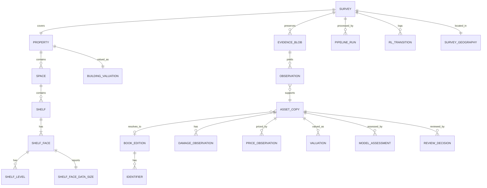
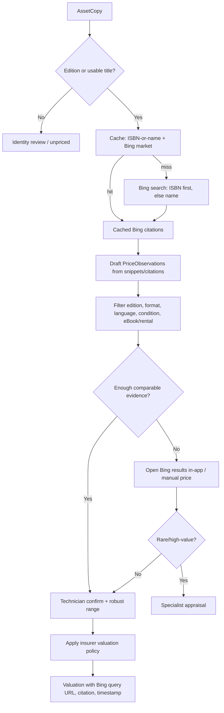
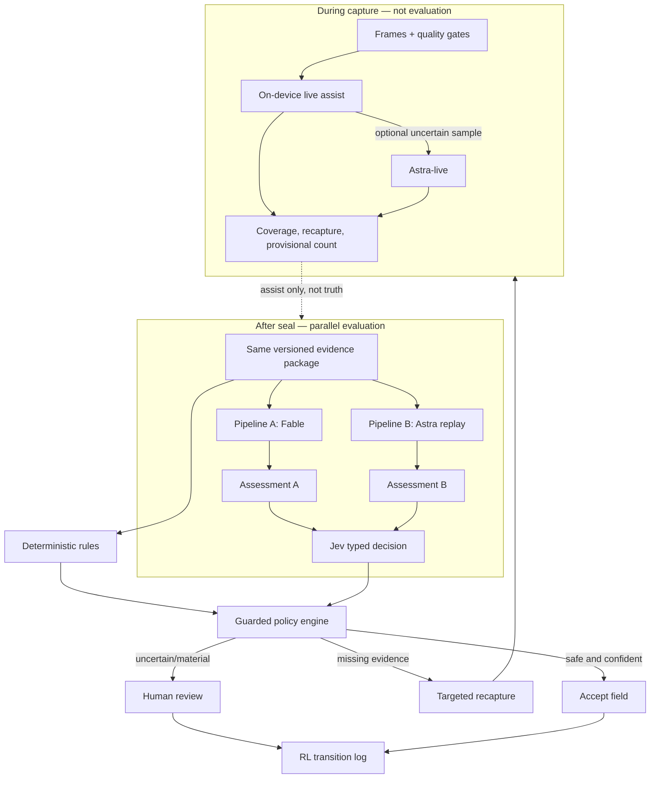
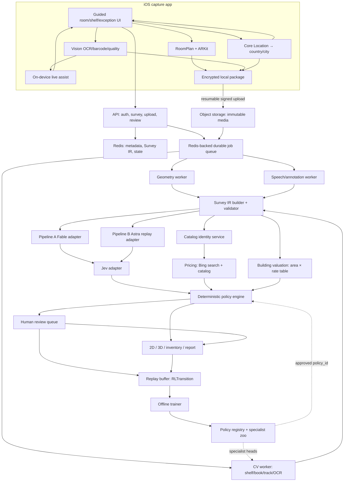
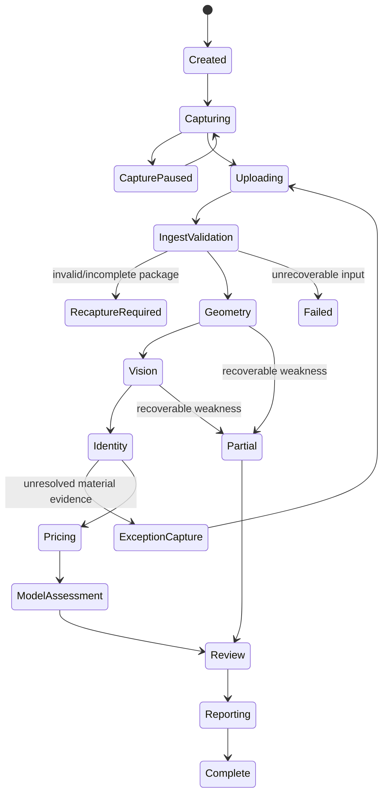
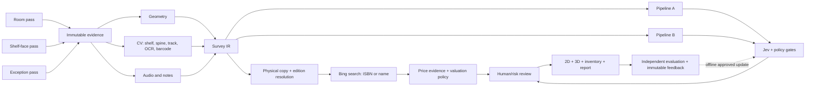

# Library Survey and Valuation System — Final Architecture Plan

**Status:** proposed architecture for alignment before implementation  
**Date:** 2026-09-20  
**Inputs reviewed:** `question.md`, `initial-chatgpt-plan.md`, and the previous Cozmo FloorPlan assignment in `/Users/harshsinha/VS Code/assignment`

## 1. Executive decision

This should be built as a **computer-vision evidence system with a guided capture app**, not as a general video sent to three AI models.

The system has six distinct responsibilities:

1. capture the building, shelf faces, books, other assets, speech, and notes;
2. reconstruct the 2D/3D property geometry;
3. turn repeated visual detections into distinct physical asset copies;
4. resolve book editions and identifiers without pretending every spine exposes an ISBN;
5. obtain time- and geography-specific price evidence and calculate a defensible valuation range;
6. compare Fable and Astra on the same sealed evidence package, use a separate live-assist path during capture, route uncertainty through Jev, and run a staged RL loop from logged transitions into offline-trained routing and specialist policies.

The governing rule is:

> Capture once, preserve original evidence, make deterministic claims where possible, use models only for ambiguity, and let a human see and correct every material uncertainty.

The first deliverable is this architecture. Implementation follows the five stages in [`IMPLEMENTATION.md`](IMPLEMENTATION.md). Demo defaults in that file freeze enough of [Section 19](#19-decisions-to-align-on-before-building) to start Stage 1 without waiting.

## 2. Corrections to the initial ChatGPT plan

The initial plan has a strong foundation: a common IR, `Asset` versus `Observation`, spatial deduplication, provenance, independent model outputs, human review, and offline feedback. The final design keeps those ideas and corrects these weaknesses:

| Initial weakness | Final decision |
| --- | --- |
| One room walkthrough appears sufficient for geometry and book recognition. | Use three guided passes. Room-scale video rarely contains enough pixels for reliable spine text, condition detail, or rear-cover barcodes. |
| An ISBN is treated almost like a physical-book ID. | An ISBN identifies an edition/product. `AssetCopy` identifies a physical copy. Two copies with the same ISBN remain two assets. |
| Barcode detection is presented as the best normal case. | Most ISBN barcodes are on the rear cover, not the visible spine. Barcode capture is an exception/verification pass, not the main shelf-count path. |
| Arbitrary weighted deduplication scores are suggested. | Start with constrained rules and calibrated features; learn thresholds from labeled double-pass scans. Never merge solely because ISBNs match. |
| A single median web price becomes replacement value. | Preserve individual offers, edition/format/condition/geography, shipping/tax, retrieval time, and source. Produce a range plus an insurer-defined valuation basis. |
| Fixed condition multipliers are shown. | Condition adjustment is policy/configuration data validated by the insurer, not a guessed table embedded in code. Prefer comparable offers of the same condition. |
| Amazon scraping is treated mainly as an engineering inconvenience. | **Deliberate refusal of the specified method.** Do not scrape. Discover listings with **Bing search** (ISBN first, else name), then human-confirm. See [§11.2](#112-bing-search-is-the-price-discovery-path). |
| Fable and Astra are described as two parallel end-to-end pipelines, with Astra also called real-time. | **Deliberate split into two Astra runtimes.** Live assist during capture is not the evaluation pipeline. After seal, Fable and Astra replay the same package so Jev can compare them. See [Section 12](#12-two-model-pipelines-and-jev). |
| Fable, Astra, and Jev are allowed near factual fields. | Deterministic barcode checks, geometry, counts, currency arithmetic, and fetched prices remain code-owned. Models emit candidates and classifications only. Price and geography are not vision class labels. |
| Jev is close to being described as ground-truth evaluation. | Jev is a typed decision/router. Evaluation uses manually labeled inventory, independent measurements, and verified price references. |
| “RL loop” sounds online and immediate. | **Deliberate staging, not a downgrade to logs.** Give RL a real state/action/reward home. Log transitions from day one; train offline; never update live weights from one survey. See [Section 13](#13-feedback-and-rl-design). |
| Capture failure and retry behavior is underspecified. | Every shelf face has explicit coverage, quality, and unresolved-state gates, with targeted recapture instructions. |
| Simultaneous RoomPlan and high-resolution recording is assumed. | Run a device feasibility spike. Prefer a shared AR session and sampled `ARFrame` evidence; use deliberate high-resolution stills/close shelf passes where required. Do not assume two camera owners can run concurrently. |
| Security, retention, offline upload, and audit boundaries are thin. | Add resumable capture packages, hashes, encryption, least privilege, retention policy, redaction, and immutable run/version records. |

## 3. Scope, requirement map, and deliberate deviations

This section is the alignment contract. Engineering choices that differ from a literal reading of `question.md` are named here so they cannot be read as dropped requirements.

### MVP scope

- Native iPhone/iPad capture app using RoomPlan/ARKit on a supported LiDAR device.
- IR and merge support for multiple rooms; the first demo is one controlled library zone.
- Synchronized RGB evidence, pose, audio notes, and written notes.
- Shelf units, shelf faces, shelf levels, physical book-copy counting, and shelf **data size** (occupancy + evidence payload).
- Barcode/EAN and OCR evidence; ISBN-10/ISBN-13 validation and catalog resolution.
- Multi-copy and repeat-pass deduplication.
- Books, paintings/portraits, electronics, furniture, shelves, cups, and `other`.
- Condition/damage evidence with an explicit review state.
- Geography-aware book price evidence via Bing search (ISBN first, else name), with **device location** to set the local market.
- Building **reconstruction** value from measured area × labeled demo local rates (country from location or manual override).
- 2D plan, 3D RoomPlan model, inventory, review queue, and evidence report.
- Two isolated post-scan model pipelines, a separate live-assist path, and a Jev decision layer.
- A labeled evaluation set, immutable transition log, and an offline RL / specialist-model loop.

### Deliberate deviations from the literal ask

These are kept on purpose. They are not missed requirements.

| Literal ask | This plan | Why |
| --- | --- | --- |
| One continuous recording of the place, processed by RoomPlan, while the technician speaks. | Three guided passes. RoomPlan owns geometry only. Speech runs on the same clock across all passes. | Room-scale video does not have enough pixels for spines, barcodes, or damage. One walkthrough cannot both map the room and count every book. |
| Fable and Astra as parallel end-to-end pipelines; Astra also called a real-time model. | **Two Astra runtimes.** Live assist during capture (on-device first). After seal, Pipeline A (Fable) and Pipeline B (Astra replay) score the **same** evidence package so Jev can compare them. | Naive parallel E2E on raw video blows the $50 budget and makes Jev incomparable. “Real-time” is honored as live assist, not by skipping the parallel evaluation the assignment requires. |
| An RL feedback loop for your own models. | A real MDP with logged transitions from day one; contextual bandit, then offline RL, then specialist models; shadow → canary. **No** per-survey online weight update. | Insurance output must be reproducible. Online learning after each survey is unsafe. Logs without a state/action/reward home are not an RL loop either. |
| Count every book. | Count every **visible physical copy on covered shelf faces**. Uncovered rows stay `unresolved`, never silently zero. Pass A does not count books. | “Every book in the building” is only true if every face was scanned. The product promise is complete count of covered area plus disclosed gaps. |
| Put a value on the place. | Ship a **reconstruction** estimate: measured floor/wall area × labeled demo local rates. Not a real-estate market appraisal from RoomPlan. | RoomPlan cannot price a sale. The assignment still gets a building value number, with the basis on the report. |
| Classifier that labels books by old/new, price, and geography. | Vision/models classify category and condition. **Price** is a Bing lookup. **Geography** comes from device location (country/city) plus manual override, not from a spine class. | Price and country are not visual labels. Location tells the system *which market* to query. |
| Scrape Amazon; do not use the web API because APIs are expensive. | **Refuse scraping.** Price via **Bing search** by ISBN or name, then human-confirmed listings. Amazon Creators API is optional if access exists; the demo must not depend on it. | Unauthorized scraping is brittle, against typical retailer terms, and a worse $50 risk than cached Bing lookups. The ask for book prices still ships. |
| “Data size” on the shelves. | Each shelf face reports occupied length, item count, fill ratio, and evidence payload bytes. | The phrase is ambiguous. Occupancy of the contents plus audit payload is the defensible reading. |

### Ask-to-landing map

Every requirement in `question.md` lands somewhere. `Shipped` means the architecture produces it. `Staged` means the demo path is smaller than production. `Refused` means we will not do that method and the replacement is named.

| Ask | Lands | Status |
| --- | --- | --- |
| Record video, photos, audio notes, written iPad notes while surveying | Capture package; SwiftUI iPhone/iPad app | Shipped |
| Speak while scanning (“this portrait is damaged…”) | Continuous audio on the capture clock; Pass C close-up | Shipped |
| RoomPlan → 2D sketch and 3D model | Pass A + §10 | Shipped. RoomPlan is the geometry processor, not the processor of all media. |
| Count all books; spines both sides; no double-count of the same face; copies in different areas count | §7.3, demo cases | Shipped |
| Count every book in the library | Covered-face complete count + unresolved coverage | Shipped with disclosed gaps. Not a silent 100% building count. |
| ISBN → price; Italy vs Japan local prices | Device location → country/city → Bing `market`; §11 search by ISBN or name | Shipped. GPS proposes the market; technician can override. |
| Classifier: condition old/new | Condition/damage models + review | Shipped |
| Classifier: by price and geography | Bing in the location-derived market; survey locale | Split on purpose. Location is the geography signal. |
| Count everything, including portraits and coffee cups | Closed taxonomy; mug `valuation_required=false` | Shipped |
| Price only books, valuables, and the place | Policy engine + building reconstruction | Shipped |
| Zoom in on damage | Pass C close-up queue | Shipped |
| Surface area of the place | Floor/wall area with interval in geometry IR | Shipped |
| Value the place | Demo reconstruction table in §10 | Shipped as replacement cost, not market value |
| Data size on the shelves | `ShelfFaceDataSize` in IR and report | Shipped (interpreted) |
| Fable / Anthropic pipeline | Pipeline A, post-scan, same package as B | Shipped |
| Parallel Astra / Astro pipeline | Pipeline B = Astra **replay**; live assist is separate | Shipped with the dual-runtime split |
| Jev evaluates both pipeline outputs | §12 | Shipped, because A and B now emit comparable assessments |
| RL feedback loop for your own models | §13 MDP, replay buffer, trainer, specialist heads | Shipped as staged RL. Online per-survey learning refused. |
| Align on backend architecture, then build systems and app | This document is deliverable 1 | Shipped |
| $50, run models, scan a local library, show it in a mobile app | §21–§23 | Staged to a 50–100 book zone |
| Amazon scrape, not API | Refused. Replacement: **Bing search** by ISBN or name (§11.2), then confirmed listing | Refused method, shipped pricing via Bing |

### True non-goals

These were **not** asked for. They stay out of the demo.

- Perfect ISBN recovery from every spine.
- Fully automatic rare-book or fine-art appraisal.
- Real-estate **market/sale** appraisal from RoomPlan.
- Hidden or concealed-damage detection.
- Fully autonomous insurance approval.
- Online reinforcement learning that changes production behavior after each survey.
- Photorealistic NeRF reconstruction.
- CAPTCHA / anti-bot bypasses or an unauthorized Amazon scraper.

## 4. Three-pass capture protocol

**Deliberate deviation.** The assignment describes one walkthrough: record the place, speak, and send that through RoomPlan. This plan uses three guided passes instead. Room-scale video cannot support spine reading, barcode capture, or damage close-ups. RoomPlan remains the geometry processor; it is not asked to identify every book.

The capture protocol is the product. Downstream models cannot recover details that were never visible.

On-device **live assist** (quality, coverage, provisional counts) runs during Pass B. Optional sampled Astra-live calls are capture UX only. They are not Pipeline B and are not stored as inventory truth.

### Pass A — property and room geometry

The technician creates a survey, records country/city/currency and property metadata, then scans each room with RoomPlan. The app requests **When In Use** location on this screen so geography is not typed from memory. A reverse-geocode fills country, region, city, currency suggestion, and Bing market (Italy vs Japan vs India). The technician must see and can override those fields before capture starts — a demo in one city can still be valued as another market, and a denied permission must not block the scan.

The app preserves the raw room result, processed room result, transforms, and exported USDZ. Multiple room scans are merged into a `CapturedStructure` when supported.

This pass collects:

- walls, floors, openings, doors, windows, room transforms, and recognized large objects;
- camera trajectory and selected RGB frames;
- room/floor labels;
- a coverage indicator and incomplete-scan warnings.

It does **not** count books. Complete book count is Pass B’s job on covered faces.

### Pass B — guided shelf-face scan

The app asks the technician to scan every shelf face at close range. A freestanding double-sided shelf has two identities, such as `shelf_04.face_A` and `shelf_04.face_B`. The screen overlays the face boundary and marks horizontal shelf levels as covered.

For each face, the user performs a slow sweep with enough overlap. The app gives live warnings for blur, glare, excessive speed, inadequate overlap, text too small, occlusion, and unscanned strips. It saves the video/frames, poses, and a rectified shelf mosaic if quality permits.

The output is a **coverage map plus data size**, not merely a “scan complete” flag:

```text
shelf_04.face_A
  row_01  covered 96%  readable 88%
  row_02  covered 91%  readable 73%
  row_03  covered 54%  -> recapture requested
  data_size
    occupied 3.8 m / 4.6 m  fill 83%
    items 87 copies  (81 resolved, 6 unresolved)
    evidence 412 MB
```

For a row with 8–10 visible books, the live view should outline each candidate spine as the technician sweeps it. Each outline maps to a distinct physical-copy candidate and row/slot. A reverse sweep updates evidence without adding copies. If occlusion, blur, or missed strips prevent a reliable count, the row remains partial with an explicit count interval and targeted recapture; it cannot be marked complete at a lower count. The physical-device row walkthrough is the first Stage 4 acceptance task in `IMPLEMENTATION.md`; it does not reopen the recorded Stage 2 gate.

### Pass C — exceptions and valuable assets

The app generates a targeted queue:

- unresolved or ambiguous books;
- suspected duplicate merges;
- barcode/ISBN confirmation required;
- damaged books or objects requiring a close-up;
- paintings, portraits, signed/rare books, and other potentially high-value assets;
- audio notes that could not be linked to an asset.

The technician can pull out a book and scan the rear-cover EAN/ISBN, photograph the title/copyright page, or confirm that access is not permitted. An unresolved result is valid; it must not be silently guessed.

For that same row, Pass C gives every physical-copy candidate a validated ISBN/catalog identity, a supported title/name identity, or a visible unresolved task. The technician can choose a book by its captured outline or row/slot, rescan its barcode, photograph the title page, or enter/correct the name. Several copies of one edition retain separate records. A single shelf sweep can count copies when coverage is good; it cannot promise readable names or barcodes from every spine. The row-wide device check is part of Stage 4 acceptance; it does not reopen the recorded Stage 3 gate.

### Capture sequence

```mermaid
sequenceDiagram
  actor T as Technician
  participant App as iOS Survey App
  participant RP as RoomPlan / ARKit
  participant V as On-device Vision
  participant Store as Local Capture Store

  T->>App: Create survey; allow location; confirm country/city/currency
  App->>App: Reverse-geocode to Bing market and rebuild-rate country
  T->>App: Start room pass
  App->>RP: Run room scan with shared AR session
  RP-->>Store: Raw/processed rooms, poses, sampled RGB
  T->>App: Name/confirm rooms and shelf units
  T->>App: Start shelf-face pass
  App->>V: Blur, glare, overlap, text and barcode checks
  V-->>App: Live quality and coverage warnings
  App-->>Store: Frames, poses, shelf face/row association
  T->>App: Finish primary scan
  App-->>T: Targeted exception queue
  T->>App: Barcode/close-up/damage confirmations
  App->>Store: Seal manifest and evidence hashes
```

## 5. Capture package and trust boundary

Use the successful pattern from the previous Cozmo assignment: preserve original inputs, validate one versioned package at the boundary, normalize into one IR, and produce structured partial/failed results rather than crashing.

```text
survey_<id>/
  manifest.json
  property.json
  roomplan/
    raw/
    processed/
    structure.json
    model.usdz
  shelf_scans/
    shelf_04_face_A/
      video.mov
      frames.jsonl
      poses.jsonl
      quality.json
  closeups/
  audio/
    survey.m4a
    segments.jsonl
  notes/
    annotations.jsonl
  device/
    calibration.json
    location.json
  checksums.sha256
```

`manifest.json` records:

- schema version, survey/session/device IDs, app/build version;
- locale, country, currency, timezone, and consent/retention policy;
- location permission state, reverse-geocoded country/city, Bing market, and whether geography was GPS, manual, or mixed;
- start/end times and monotonic-clock anchor;
- files, MIME types, byte sizes, and SHA-256 hashes;
- capture modes and device capabilities;
- RoomPlan/iOS/Vision versions;
- whether capture is complete, interrupted, resumed, or manually sealed;
- upload status without changing the immutable evidence identity.

The app writes locally first, survives interruption, and uploads with resumable signed URLs. The backend rejects unsafe paths, hash mismatches, unsupported schema versions, missing required members, and inconsistent timestamps before starting CV work.

## 6. Canonical Survey IR

The canonical contract is `SurveyIR v1`; model-specific responses never become the database schema.

### Core entities



### The distinctions that prevent silent errors

- **Observation:** one detection in one frame/crop at one time and pose.
- **Track:** observations believed to be the same visible object during a continuous sweep.
- **AssetCopy:** one physical object in the library.
- **BookEdition:** bibliographic product/edition/format/language.
- **Work:** the conceptual title; several editions can represent one work.
- **Identifier:** ISBN, EAN, internal library barcode, OCLC, LCCN, ISSN, or unknown.
- **PriceObservation:** one source's observed offer at one time and market.
- **Valuation:** the policy-driven conclusion from accepted price evidence.
- **ShelfFaceDataSize:** occupied length, capacity length, fill ratio, physical-copy count, unresolved count, and evidence payload bytes for one face.
- **BuildingValuation:** reconstruction estimate from measured area × local rate table, with basis and rate version labeled.
- **SurveyGeography:** country, region, city, currency, Bing market, and location source (`gps` / `manual` / `mixed`). Precise coordinates are optional and separately consented.
- **RLTransition:** one state/action/reward/next-state record for the routing or recapture policy.

An ISBN is never the primary key of `AssetCopy`.

### Measurement and assertion shape

Every material result carries uncertainty and evidence:

```json
{
  "value": 37,
  "unit": "count",
  "status": "estimated",
  "confidence": 0.94,
  "interval": { "low": 35, "high": 39, "level": 0.95 },
  "method": "shelf-instance-model-v3",
  "evidence_refs": ["frame_201", "mosaic_04A", "track_88"],
  "run_id": "run_count_v3_20260920"
}
```

Top-level and per-stage statuses are `ok`, `partial`, `failed`, or `needs_review`. A schema-valid file is not the same as an accurate result, and a completed job is not the same as a passed evaluation.

## 7. Computer-vision pipeline

### End-to-end CV flow


### 7.1 Quality and coverage

For each frame, compute sharpness, exposure, glare/highlight clipping, motion, text pixel height, shelf visibility, occlusion, and pose stability. Do not create a universal hand-tuned “quality truth” score. Retain the components and learn acceptance thresholds from the evaluation set.

Coverage is measured in shelf-face coordinates. The app should know which part of a face has usable evidence and request only the missing row/strip.

### 7.2 Shelf and spine detection

Use a hierarchical detector:

```text
room → shelf unit → shelf face → shelf level → book spine → physical copy
```

The detector must support:

- vertical, horizontal, leaning, thin, and partially occluded books;
- bookends and decorative items between books;
- stacks rather than only upright spines;
- double-sided shelves and shelves against walls;
- glass doors, glare, shadows, and repeated visual designs.

Start with a pretrained detector/segmenter plus a small labeled library dataset. Fine-tune only after baseline error analysis identifies the dominant misses.

### 7.3 Tracking and physical-copy deduplication

Deduplication operates at two levels:

1. **Within a continuous sweep:** temporal tracking joins the same spine across adjacent frames.
2. **Across sweeps or revisit paths:** spatial association joins tracks that occupy the same shelf-face coordinates and have compatible appearance.

Candidate pairs are blocked by room, shelf unit, face, row, and approximate 3D position before any expensive comparison. Features include:

- continuous track membership;
- projected 3D/spatial distance and uncertainty;
- shelf-face/row coordinate overlap;
- visual embedding similarity;
- OCR token similarity;
- capture trajectory and time;
- edition identifier agreement or contradiction.

Hard constraints:

- Same ISBN alone **cannot merge** two copies.
- Different shelf faces/positions normally mean different physical copies.
- A continuous track cannot split merely because OCR changes.
- Strong identifier contradiction prevents automatic merge.
- Ambiguous cross-pass pairs enter review; they do not automatically collapse.

For a double-sided shelf, face normal and shelf-plane position prevent the rear walkaround from being treated as a repeat of the front face.

### 7.4 Moved books

If a technician or patron moves a book during capture, geometry can conflict with identity. Mark the candidate `possibly_moved` when strong visual/identifier evidence matches but spatial evidence changes after a discontinuity. Preserve both observations and request human confirmation rather than counting or merging automatically.

## 8. ISBN and bibliographic identity

“ISV” is not treated as a known book identifier in this design; unless Cosmo defines it separately, it is assumed to mean **ISBN**. The schema remains extensible to ISBN, EAN/UPC, ISSN, OCLC, LCCN, and a library's internal accession barcode.

### 8.1 Identifier evidence ladder

Use the strongest available evidence in this order:

1. rear-cover EAN-13/Bookland barcode captured in Pass C;
2. printed ISBN-13 or ISBN-10 text from copyright/back-cover evidence;
3. exact catalog match from title + author + publisher + edition/format/language/year;
4. title/author candidate match with unresolved edition;
5. unknown identity with a stable physical-copy ID.

Spine OCR can suggest a work or edition, but should not invent an ISBN. If several editions fit, store ranked candidates and ask for a back-cover/title-page scan.

### 8.2 Deterministic ISBN validation

Before catalog lookup:

- normalize spaces and hyphens while preserving the raw observed string;
- distinguish ISBN-10 and ISBN-13;
- validate the appropriate check digit;
- for EAN-13, verify that the payload is a book prefix when classifying it as an ISBN rather than a generic retail barcode;
- separate any supplemental 5-digit price add-on;
- retain OCR confidence and bounding box;
- query at least one catalog and compare returned title/author/edition with the visual evidence.

Reject a checksum-valid but metadata-incompatible code as a likely wrong/adjacent barcode. Checksum validity proves formatting, not that the code belongs to the observed book.

### 8.3 Important edge cases

- Pre-ISBN, rare, self-published, local, or damaged books may have no ISBN.
- Different bindings, editions, languages, and sometimes regional products have different ISBNs.
- A 979 ISBN may not have an ISBN-10 equivalent.
- Journals/serials can use ISSN rather than ISBN.
- Boxed sets and multi-volume works can have both set-level and volume-level identifiers.
- An internal library barcode may identify a physical copy but is not a market ISBN.
- The barcode can be obscured by a library label or protective cover.
- Two identical physical copies should share a `BookEdition` but keep separate `AssetCopy` rows.

### 8.4 Catalog resolution

Use a provider chain with normalized output:

```text
Local cache → Open Library / Google Books metadata → optional library catalog → manual resolution
```

Catalog results are candidates, not unquestioned truth. Store provider ID, raw response hash, retrieval time, match fields, and the reason a candidate was chosen. Open Library distinguishes works from individual editions, which maps cleanly to this IR. Google Books can search volumes and expose identifiers and country-dependent sale information.

## 9. Non-book assets, damage, and spoken notes

### Asset taxonomy

Start with a closed, versioned taxonomy:

```text
book | serial | painting | portrait | sculpture | computer | monitor |
printer | furniture | shelf | appliance | cup | decorative_object | other
```

Every detected object can be inventoried even when `valuation_required=false`. This proves deliberate exclusion instead of confusing “zero value” with “not seen.” The policy engine—not the detector—decides whether an asset is building, contents, excluded, or requires appraisal.

### Damage evidence

Damage is a separate observation attached to an asset or surface:

```text
type + severity candidate + region/mask + evidence + source + confidence
```

The app requests a close-up and scale/reference when a damage claim is material. A spoken statement such as “this portrait is damaged in the lower-right” is an operator assertion, not visual truth.

### Audio/note association

Speech-to-text segments share the capture clock. Association uses:

- visible candidates at the segment time;
- object nearest the reticle/image center;
- explicit tap/selection state;
- camera pose and recent focus history;
- semantic compatibility between note and candidate class.

If two assets are plausible, the app asks the operator to select one. It never silently binds a high-value damage note to the nearest object.

### High-value asset policy

Paintings, signed books, manuscripts, antiques, and unusual objects default to `requires_appraisal` when identity/provenance/value is material. The system can collect evidence and comparable listings, but must not claim a professional appraisal from an image.

## 10. Geometry and the 2D/3D output

RoomPlan provides the spatial layer; it does not provide independent ground truth and does not identify every small asset. The app should preserve raw and processed room data and merge nearby room scans where supported. Apple's `CapturedStructure` represents merged room sessions and can export a 3D asset.

The shared geometry contract records:

- rooms, walls, floor polygons, openings, doors/windows, transforms, and units;
- value plus interval/confidence and evidence source for reported dimensions;
- RoomPlan/ARKit version and coordinate frame;
- `ok`, `partial`, or `failed` status and actionable warnings.

Generate both outputs from the same IR:

- **2D:** vector floor plan with room labels, shelf footprints, asset pins, coverage overlays, damage markers, and per-shelf data-size labels;
- **3D:** RoomPlan/USDZ base with selectable shelves/assets and evidence links.

Stage 1 ships the wall/opening layer of that 2D plan now: numbered colored walls, lengths in centimetres, doors/windows drawn as gaps on the parent wall when RoomPlan reports them, a wall/door/window list, and a compass where **N is scan +Z, not magnetic north**. The sealed/upload screen shows that tagged plan plus the interactive USDZ. Visual spec from the prior Cosmo assignment: [`docs/cosmo-tagged-plan-reference.png`](docs/cosmo-tagged-plan-reference.png). Shelf footprints, coverage, and asset pins remain later overlays on the same geometry, not a second plan.

### Shelf data size

The assignment’s “data in the shelves / data size” is interpreted as a first-class shelf-face measurement, not as a throwaway comment.

For each `ShelfFace` the IR stores:

```json
{
  "shelf_face_id": "shelf_04.face_A",
  "capacity_length_m": 4.6,
  "occupied_length_m": 3.8,
  "fill_ratio": 0.83,
  "item_count": { "value": 87, "unresolved": 6, "status": "partial" },
  "evidence_bytes": 431718400,
  "method": "rectified-mosaic-occupancy-v1"
}
```

`occupied_length_m` is the measured span of detected spines and objects on that face. `capacity_length_m` is the usable shelf-face width from geometry. Uncovered rows make `item_count.status = partial`; they do not write a fake complete count. Evidence bytes are an audit field so a reviewer can see how much media backs the face.

The inventory and report show this per face and as a property total: occupied metres, copy count, unresolved count, evidence size.

### Building value — reconstruction, not a sale price

**Deliberate interpretation of “put a value on the place.”** The system will produce a building number. It will not pretend RoomPlan is a real-estate appraisal.

Building replacement cost is not the market sale price. The formula is:

```text
ReconstructionValue =
  floor_area_m2 × local_rate_per_m2[occupancy, finish]
  + wall_area_m2 × wall_rate_per_m2   (if the insurer basis includes walls)
  + adjustments[age, condition, fire/electrical notes]
```

The report must label `basis = replacement_cost`, the rate table version, the area evidence, and that this is **not** `market_value`.

The demo ships this labeled rate table so “value the place” has a number without waiting for an insurer data feed. These figures are **demo scaffolding**, not claimed construction-cost research.

```json
{
  "table_id": "demo_rebuild_rates_v1",
  "unit": "currency_per_m2",
  "disclaimer": "demo rates for architecture alignment; replace before any real survey",
  "rates": {
    "IN": { "currency": "INR", "commercial_library": { "low": 40000, "medium": 65000, "premium": 100000 } },
    "IT": { "currency": "EUR", "commercial_library": { "low": 1200, "medium": 1800, "premium": 2600 } },
    "JP": { "currency": "JPY", "commercial_library": { "low": 250000, "medium": 380000, "premium": 520000 } }
  }
}
```

Production replaces this table with the insurer’s reconstruction-rate vendor. The country key is the same `SurveyGeography.country_code` that location access proposed (or the technician’s override). The `ValuationProvider` interface does not change. Who signs off high-value appraisals remains a stakeholder decision; the demo routes those items to `requires_appraisal`.

## 11. Price search and valuation

### 11.1 Pricing is evidence collection, not one lookup

For each resolved edition and market, the pricing service gathers normalized `PriceObservation` rows:

```json
{
  "asset_copy_id": "book_copy_182",
  "isbn13": "9780132350884",
  "market": "IN",
  "currency": "INR",
  "source": "bing_search",
  "listing_url": "https://...",
  "listing_id": "...",
  "edition_match": "exact",
  "format": "paperback",
  "condition": "used_good",
  "item_price": 825,
  "shipping": 60,
  "tax_included": null,
  "availability": "in_stock",
  "seller_type": "marketplace",
  "observed_at": "2026-09-20T10:00:00Z",
  "evidence_hash": "sha256:..."
}
```

### 11.2 Bing search is the price-discovery path

The inventory **Search Bing** action is a Bing search, not a retailer scrape and not a generic unspecified web API.

For every detected book, search Bing using a validated ISBN when one exists; otherwise search by the recognized book name (plus author, publisher, edition/format, language, and country when known). Bing results are how we find local listing URLs and candidate prices. A human still confirms edition and condition before a candidate becomes a `PriceObservation`.

The classic Bing Search API v7 was retired on 11 August 2025. The current Bing-backed product is **Grounding with Bing Search** (Azure AI Foundry / Foundry `web_search`). Design against that, not the dead v7 endpoint. It charges per search transaction (listed at $14 per 1,000 as of 2026), supports `market` / `set_lang` / `count`, and requires the UI to show both the Bing query URL and the citation URLs.

#### Query construction

One search per unique `(edition_or_title, market)`, not per physical copy.

```text
validated ISBN
  q = "{isbn13} book price"
  if still weak: q = "{isbn13} {title} {author} buy {country}"

no validated ISBN
  q = "{title} {author} book price {country}"
  add publisher / edition / format / language when known

insufficient name evidence
  → request a closer spine/title-page scan or leave pricing unresolved
```

Pass Bing `market` from **device location**, not from a typed guess, so Italy and Japan do not share a US result set.

The app requests Core Location **When In Use** at survey creation. One reading is enough; do not track the technician for the whole walkthrough. Reverse-geocode to country / admin area / city, then map:

| Survey country | How it is set | Bing `market` | `set_lang` |
| --- | --- | --- | --- |
| India | GPS reverse-geocode or manual | `en-IN` | `en` |
| Italy | GPS reverse-geocode or manual | `it-IT` | `it` |
| Japan | GPS reverse-geocode or manual | `ja-JP` | `ja` |

Store on the survey:

```json
{
  "permission": "when_in_use",
  "source": "gps",
  "captured_at": "2026-09-20T10:00:00Z",
  "country_code": "IT",
  "admin_area": "Lombardia",
  "locality": "Milan",
  "currency": "EUR",
  "bing_market": "it-IT",
  "set_lang": "it",
  "rebuild_rate_key": "IT",
  "coordinates": { "lat": 45.4642, "lon": 9.1900, "accuracy_m": 12, "stored": false }
}
```

Default is **coarse geography** (country, city, market). Precise lat/lon is stored only if the technician consents to pin the property; otherwise keep it on-device for the reverse-geocode and drop it. If location is denied, timed out, or clearly wrong (VPN, indoor GPS jump), the survey still proceeds with a required manual country/city. `source` becomes `manual` or `mixed` when the human overrides GPS.

The same country key selects the building reconstruction-rate row. Bing queries include that country so “local prices of the books” follow where the library actually is.

Keep the exact `q`, `market`, location source, and whether the query was ISBN-based or name-based on the evidence record.

#### What Bing returns, and how a price is taken

```text
ISBN or name
  → BookPriceProvider.BingSearch
  → Grounding with Bing Search (count ≤ 10, market, set_lang)
  → citations + snippets + bing.com query URL
  → candidate PriceObservation drafts
  → filter eBook / rental / bundle / wrong edition
  → Price Evidence screen
  → technician confirms comparable offer
  → saved PriceObservation
```

The backend may parse obvious prices from titles and snippets (`₹825`, `€31.99`, `¥2,640`) into drafts. That is search-result extraction, not fetching and scraping the retailer HTML. If the snippet is ambiguous, open the Bing result (or the Bing results page) in the in-app browser and let the technician confirm the visible price.

Name-based hits have lower identity confidence than an exact-ISBN hit. They must match the captured spine/cover before they contribute to valuation.

#### App behavior

The **Price Evidence** screen:

1. **Search Bing** on one book, or queue every found book (deduped by edition + market).
2. Shows the Bing query string, the [bing.com search URL](https://www.bing.com/search?q=), and each citation’s title, URL, snippet, and any parsed price.
3. Lets the technician confirm edition, format, condition, and landed price.
4. Saves the selected offer, Bing query, citation URL, retrieval timestamp, and evidence hash.
5. Allows manual entry with a reason when Bing has no usable listing.

Bing’s use-and-display rules require showing the Bing query URL and the citation URLs in this UI. Do not hide that this was a Bing search.

#### Budget and fallback

Cache Bing responses by `sha256(q + market)` with a short TTL. A 50–100 book demo with ~40–80 unique editions is well under the $5 search line at $14 / 1,000 transactions.

If an Azure Grounding-with-Bing resource cannot be created inside the $50 cap, the same query builder still runs: open `https://www.bing.com/search?q=...` in the in-app browser (`mkt` on the URL), and the technician confirms a listing. That is still Bing search; it is just not an automated transaction.

**Deliberate refusal of “scrape Amazon, don’t use the API.”** The assignment asked for scraping because APIs are expensive. This plan still prices books. Bing is the search layer that finds Amazon and other retailer listings in the local market. The app will not scrape those pages, bypass CAPTCHAs, or depend on the Amazon Creators API.

Provider order for the MVP:

1. catalog metadata: Open Library and/or Google Books (identity, not physical-copy price);
2. **Bing search by ISBN, else by name**, market-scoped;
3. technician-confirmed retailer listing opened from a Bing citation;
4. Amazon Creators API **only if** access already exists — optional, not required;
5. manual appraisal / unavailable.

Google Books `saleInfo` is country-dependent and often describes an eBook offer, so it must not automatically price a physical copy. Amazon's Creators API is optional. Cached Bing lookups are the default paid search spend.

### 11.3 Estimation rule

Filter offers before aggregation:

- exact edition/ISBN where available;
- correct physical format and language;
- correct country/market and currency;
- availability within the freshness window;
- condition comparable to the asset and insurer valuation basis;
- landed price where shipping/tax data are available;
- remove obvious bundles, rentals, digital editions, and extreme mismatches.

Then produce:

- accepted-offer count and source count;
- low/central/high estimate (for example, robust quantiles/median only after enough comparable offers);
- currency and captured FX rate if conversion is needed;
- confidence and reasons for exclusions;
- price age/TTL and next refresh time;
- `estimated`, `quoted`, `manual`, `requires_appraisal`, or `unavailable` status.

With one weak offer, return a low-confidence range or review request—not a precise replacement value. Each physical copy receives its own condition conclusion even when copies share the same base edition price.

### Pricing decision flow



## 12. Two model pipelines and Jev

The assignment's names are retained as **Pipeline A (Fable/Anthropic)**, **Pipeline B (Astra/Astro)**, and **Jev** until exact provider model IDs, API access, supported media, regions, and prices are confirmed. Those are deployment configuration, not schema names.

### Deliberate split: live assist is not the parallel pipeline

The assignment frames Fable and Astra as **parallel** pipelines and also calls Astra a **real-time** model. Jev is then asked to evaluate both outputs. A single “Astra = live observer, Fable = batch reasoner” design would honor the real-time hint and fail the parallel-evaluation contract.

This plan therefore uses **two Astra runtimes** that share one assessment schema:

| Runtime | When | Input | Authority |
| --- | --- | --- | --- |
| **Live assist** (on-device first; optional sampled Astra-live) | During Pass B/C | Current frame, coverage, local detections | Capture UX only. Never inventory truth. Never written as a Pipeline B result. |
| **Pipeline A — Fable** | After seal | The same versioned evidence package as B | Independent assessment A |
| **Pipeline B — Astra replay** | After seal | The same versioned evidence package as A | Independent assessment B. This is the parallel pipeline Jev scores. |
| **Jev** | After A and B return | Normalized A, normalized B, deterministic flags | Typed decision: accept, recapture, other resolver, human review |

Live Astra is skipped when the budget or latency cannot support it. Pipeline B still runs once after seal. If Astra-live ran on a frame, that call is logged as assist metadata; it is not reused as Pipeline B’s answer.

Why not two end-to-end pipelines on the raw walkthrough video:

- it duplicates the CV work RoomPlan, tracking, and OCR already do;
- it exceeds the $50 budget;
- Jev cannot compare models that saw different, unversioned frame sets.

Fable and Astra still do not write geometry, validate ISBN checksums, perform currency arithmetic, fetch a hidden price, or alter an original observation. Price and geography stay in the pricing service and survey locale. Models classify category, condition, damage type, note meaning, and ambiguous identity candidates.

### Evidence package

Both **evaluation** pipelines receive the same versioned, bounded package, independently:

- best asset crops and optional damage close-up;
- OCR candidates and raw confidence;
- barcode/catalog candidates;
- spatial/shelf context including data-size summary;
- operator note and transcript segment;
- deterministic flags and allowed taxonomy;
- requested task only.

They do not receive each other's answer. Both return the same strict schema.

### Runtime roles

- **Live assist:** quality, coverage, “slow down / recapture this row,” provisional counts.
- **Pipeline A / Fable batch:** reasons over the completed evidence package after deterministic processing.
- **Pipeline B / Astra replay:** independent post-scan assessment of that same package.
- **Jev:** consumes normalized structured state and produces bounded probabilities/actions such as accept, targeted recapture, alternate resolver, or human review.
- **Policy engine:** validates Jev's proposed action against hard thresholds, value/risk rules, retry budgets, and permissions.
- **Human reviewer:** resolves uncertainty and supplies labeled feedback that becomes RL transitions.



Agreement between two models is not ground truth. A wrong consensus still routes to review when deterministic evidence conflicts or financial impact is high.

## 13. Feedback and RL design

**Deliberate staging, not a missing RL loop.** The assignment asks for an RL feedback loop for **your own models**. This plan builds that loop. It does **not** update production weights after each survey.

Logged feedback is stage 0 of RL, not a substitute for it. The first architecture had a state/action/reward record and a cost table; this plan keeps those and gives them a service home.

### MDP home

One **episode** is one survey, including any recapture cycles. Recapture is the sequential case: the action changes the next evidence state.

**State** (compact, versioned, stored by ID plus hashes — not raw video):

```text
coverage_vector, unreadability, disagreement(A,B),
jev_entropy, estimated_financial_impact,
retry_budget_remaining, unresolved_count,
asset_class, specialist_available
```

**Action** (policy engine may veto):

```text
accept
recapture(region)
alternate_resolver
human_review
use_specialist_head | use_frontier
```

**Transition record** (`RLTransition` in Survey IR):

```json
{
  "transition_id": "tr_0182",
  "survey_id": "survey_123",
  "policy_id": "route_v0_log_only",
  "state": { "disagreement": 0.41, "impact_band": "high", "coverage": 0.73 },
  "action": "human_review",
  "action_source": "jev+policy",
  "fable": { "condition": "damaged", "confidence": 0.88 },
  "astra": { "condition": "worn", "confidence": 0.74 },
  "jev": { "decision": "human_review", "p": { "accept": 0.11, "human_review": 0.79 } },
  "human_truth": { "condition": "damaged" },
  "independent_outcome": { "false_merge": false, "missed_high_value": false },
  "reward": -0.4,
  "next_state_id": null,
  "cost_usd": 0.03,
  "elapsed_ms": 14200
}
```

Every Jev/policy decision writes one of these, including accepts. No transition, no learning.

### Proposed reward (policy until insurer sign-off)

These weights are the architecture default so the loop is implementable. They are not claimed to be the insurer’s loss function. “Fewer human reviews” is not a reward.

| Outcome | Reward |
| --- | ---: |
| Correct physical-copy keep-or-merge | +1 |
| False merge of two copies | −5 |
| False split of one copy | −2 |
| Correct ISBN / edition | +2 |
| Wrong ISBN / edition | −3 |
| Missed high-value asset | −8 |
| Correct mug exclusion | +0.2 |
| Valued a mug or used an eBook offer as physical replacement | −4 |
| Recapture that recovered a missed row | +1.5 |
| Unnecessary recapture on an already-covered face | −0.5 |
| Correct specialist-appraisal routing | +1 |

Rewards are computed only from independent labels, measured geometry, or verified price references — never from Jev agreeing with Fable.

### What “your own models” means

Frontier A/B stay on ambiguous, high-value, or novel cases. Once enough labeled transitions exist, train small specialist heads on the same schema:

- book condition;
- value-eligibility (price vs exclude vs appraisal);
- damage type;
- duplicate-pair keep/merge suggestion (features only; hard ISBN/spatial constraints remain code);
- frame/row quality acceptance.

Those heads are **our models**. The RL loop’s first learned policy is the **router** that chooses accept / recapture / specialist / frontier / human. Specialist heads are trained with ordinary supervised losses on the same logged truth; they are then one of the router’s actions.

### Staged path

```text
Stage 0  Log-only policy. Every decision writes RLTransition. No learning.
Stage 1  Offline contextual bandit on the router (accept vs recapture vs human vs specialist).
Stage 2  Offline sequential RL only where action changes later evidence (recapture → reprocess).
Stage 3  Distill specialist heads from labeled transitions + review truth.
Stage 4  Shadow the new policy on holdout surveys. Do not act.
Stage 5  Small canary, then approved policy_id. Rollback by pinning the previous policy_id.
```

Promotion gate: temporal and property holdout; no survey used in training; reward and calibration reported with numerator/denominator. **No single survey updates live model weights or thresholds.**

### Service home

The backend owns:

- append-only **replay buffer** of `RLTransition` rows;
- **offline trainer** (local for the demo; a job in production);
- **policy registry** (`policy_id`, artifact hashes, stage, approved_at);
- **specialist model zoo** loaded by the CV worker and router.

The demo trains on the labeled 50–100 book zone plus held-out rescan cases. That is enough to show the loop, not enough to claim a production policy.

## 14. Backend architecture

### Logical production architecture



### Service boundaries

| Component | Owns | Does not own |
| --- | --- | --- |
| Capture app | acquisition, local quality, package, upload, review UI, location → geography | final count/valuation truth |
| Ingestion API | auth, survey lifecycle, signed URLs, manifest acceptance | media processing |
| Workflow engine | retries, dependencies, timeouts, idempotency, dead-letter state | domain inference |
| Geometry worker | RoomPlan normalization, 2D/3D geometry, shelf capacity length | asset identity or value |
| CV worker | quality, shelves, detections, tracking, crops, OCR/barcodes, occupied length | catalog truth or valuation policy |
| Identity service | deterministic identifier validation and catalog candidates | physical-copy deduplication |
| Pricing service | Bing query builder, Grounding-with-Bing adapter, cache, offer drafts, FX snapshot | insurer policy, Amazon HTML scrape, or appraisal |
| Building valuation | area × versioned rate table, basis label | market appraisal |
| Model adapters | bounded ambiguous classification; Pipeline B is Astra replay | live-assist UX, arithmetic, hard rules |
| Policy engine | confidence/value gates and allowed transitions | perception |
| RL trainer / policy registry | offline bandit/RL, specialist heads, policy_id promotion | live per-survey weight updates |
| Review/report | corrections, sign-off, evidence presentation, shelf data size | silent model retraining |

### MVP deployment profile

For the $50 demonstration, keep the logical boundaries but deploy simply:

- SwiftUI iOS app;
- Python FastAPI API and worker on the development Mac or one small hosted service;
- Redis for Survey IR, metadata, idempotency, state events, jobs, and cache, using namespaced/versioned keys with durable records that do not expire by accident;
- S3-compatible object storage for immutable capture media; local filesystem is development-only until the Stage 2 storage migration;
- OpenCV/PyTorch/Vision for local CV;
- paid model calls only for uncertain evidence packages, plus one Fable and one Astra-replay pass on the ambiguous set;
- local offline trainer on the labeled demo set (no cloud GPU).

Stage 1 currently has a temporary SQLite/filesystem implementation. Stage 2 replaces that implementation with Redis and object storage before additional inventory state is persisted; SQLite is not part of the target backend. Public deployment still requires the security controls in §22 and Stage 5.

### Suggested repository layout

```text
ios/LibrarySurvey/
backend/app/api/
backend/app/domain/
backend/app/workflows/
backend/app/providers/catalog/
backend/app/providers/pricing/
backend/app/providers/pricing/bing_search.py
backend/app/providers/models/
backend/app/policy/
backend/app/rl/
cv/library_vision/
schemas/survey-ir.schema.json
schemas/evidence-package.schema.json
schemas/model-assessment.schema.json
schemas/rl-transition.schema.json
eval/
eval/transitions/
fixtures/
docs/
```

Reuse concepts and carefully extracted code from the previous assignment—RoomPlan capture/export, capture-package validation, geometry normalization, schema checks, SVG rendering, and evidence/evaluation discipline—but do not copy its old assumptions or report its previous measured accuracy as evidence for this new problem.

## 15. API and workflow contract

### Minimal API

```text
POST   /v1/surveys
GET    /v1/surveys/{id}
POST   /v1/surveys/{id}/uploads
POST   /v1/surveys/{id}/seal
GET    /v1/surveys/{id}/jobs
GET    /v1/surveys/{id}/inventory
GET    /v1/surveys/{id}/review
POST   /v1/reviews/{id}/decision
POST   /v1/assets/{id}/price-search          # Bing: ISBN first, else name
POST   /v1/surveys/{id}/price-search-queue   # one Bing query per unique edition+market
POST   /v1/assets/{id}/price-observations
GET    /v1/surveys/{id}/report
GET    /v1/surveys/{id}/shelves
GET    /v1/evidence/{id}
GET    /v1/policies
POST   /v1/policies/{id}/shadow
```

Mutations require idempotency keys. Processing jobs use stable keys such as `survey_id + stage + input_hash + pipeline_version`. Retrying a stage must update or replace its own versioned output, never append duplicate assets.

### State machine



Store both overall survey status and each stage's status. An individual asset can remain unresolved while the survey completes with disclosed partial coverage.

## 16. Mobile product flow

1. **Create Survey** — request **When In Use** location; reverse-geocode country/city; suggest currency and Bing market; technician confirms or overrides; valuation basis; consent.
2. **Device Check** — LiDAR/support, storage, battery, camera/mic/location permission, network optional.
3. **Room Pass** — RoomPlan guidance, name rooms, confirm joins.
4. **Shelf Map** — detect/confirm shelf units and sides.
5. **Shelf Pass** — live quality/coverage overlay per face and row.
6. **Other Assets** — tap/mark paintings, electronics, furniture, excluded objects.
7. **Speak/Write Notes** — preferably tap an asset first; unbound notes are visible.
8. **Exception Pass** — barcode/title-page/damage close-ups and high-value items.
9. **Seal and Upload** — hashes, progress, pause/resume, local copy until acknowledgment.
10. **Processing** — stage-specific progress and actionable failures.
11. **Overview** — room/area, coverage, physical-copy count, shelf data size, resolved editions, contents range, building reconstruction estimate, survey city/market, unresolved material items.
12. **2D/3D** — select shelf/asset and open evidence; shelf label shows occupied metres and copy count.
13. **Inventory** — distinguish physical copies from unique editions; filter by room/shelf/status; **Search Bing** for any book by ISBN or name, or queue every found book.
    A shelf-row detail lists all physical copies against the captured row and expected/detected count. Selecting one highlights its spine and opens source images, identity status, Pass C action, condition, Bing search/price evidence, and reviewed range or explicit pending/no-comparable reason. Editing or rescanning one copy must retain its physical-copy ID and must not merge neighboring copies.
14. **Review** — merge/keep separate, choose edition, rescan barcode, bind note, confirm price, request appraisal.
15. **Report** — signed-off JSON/PDF plus evidence manifest, rate-table version, policy_id, and limitations.

Accessibility requirements include Dynamic Type, VoiceOver labels, high-contrast status cues that do not rely on color, large touch targets, captions/transcripts, and safe one-handed operation during capture.

## 17. Failure policy and operator actions

| Failure | System result | Operator action |
| --- | --- | --- |
| RoomPlan unsupported/no LiDAR | Geometry tier unavailable or alternate capture marked partial | Use supported device or documented photo/video fallback; do not claim metric LiDAR accuracy |
| Room loop/opening incomplete | `geometry.partial` with missing region | Rescan named wall/doorway |
| Shelf face not fully covered | Count remains partial for that face | Rescan highlighted rows only |
| Motion blur/glare/text too small | Evidence rejected before identity stage | Slow down, change angle/light, move closer |
| Barcode decodes but checksum fails | Preserve raw code; identifier rejected | Rescan barcode/title page |
| Valid ISBN conflicts with visible title | Candidate quarantined | Check adjacent barcode/label and confirm book |
| No ISBN | Stable copy remains; title/author candidates or unknown | Scan title/copyright page or accept unresolved |
| Same ISBN in two locations | Two `AssetCopy` rows | No action unless spatial evidence itself is ambiguous |
| Repeat pass appears duplicated | Cross-pass review candidate | Merge only with strong spatial/visual evidence or human decision |
| Book moved mid-scan | `possibly_moved` | Confirm one moved copy versus two copies |
| Audio names several visible objects | Note remains unbound | Technician selects target asset |
| Location denied, timed out, or indoor GPS jump | Geography `source=manual`; Bing market not auto-set | Technician enters country/city; scan continues |
| Location country conflicts with typed address | `source=mixed`; review flag | Confirm which market to use for Bing and rebuild rates |
| Price source unavailable/rate-limited | Cached Bing result labeled stale, or no estimate | Retry Bing, open bing.com in-app, or manual evidence |
| Only eBook price found | Reject for physical replacement basis | Search physical format |
| One extreme marketplace listing | Low confidence; not central value | Add comparables or appraisal |
| Potentially valuable art/rare book | No automated precise value | Specialist appraisal |
| Model pipelines disagree | Jev/policy routes by impact and evidence | Human review or targeted recapture |
| Both models agree but deterministic evidence conflicts | Model output vetoed | Review factual evidence |
| Upload interrupted | Local package remains; resumable upload | Resume without recapturing |
| Worker/model provider fails | Bounded retry then partial/fallback | Review or rerun; no duplicated outputs |
| Schema/output write fails | No report published | Preserve run/error; repair and rerun idempotently |

## 18. Evaluation plan and acceptance gates

The demo needs controlled ground truth. Prepare a small library zone with known counts, repeated titles/copies, difficult spines, one deliberate rescan, one moved-book case, damaged objects, a mug, and a high-value/manual-review object.

### Ground truth

- manually numbered physical copies and shelf positions;
- verified ISBN/edition where present;
- explicit `no ISBN` cases;
- manually labeled condition/damage with reviewer agreement;
- tape/laser room dimensions kept independent of RoomPlan;
- manually verified comparable price evidence and valuation basis;
- transcript-to-asset links;
- an incumbent/manual workflow time and result, if comparison is required.

### Metrics

| Area | Metrics |
| --- | --- |
| Coverage | usable shelf area, missed rows, recapture success |
| Detection/count | instance precision/recall/F1, absolute count error per face and survey |
| Deduplication | pairwise precision/recall, false merges, false splits, double-pass count error |
| Identity | ISBN exact accuracy, resolved coverage, title/edition accuracy, selective accuracy at confidence thresholds |
| OCR/barcode | character/word error, decode rate by evidence type/language |
| Damage | class precision/recall/F1, region overlap, note-link accuracy |
| Geometry | room dimension/floor-area error and interval coverage versus independent measurements |
| Pricing | exact-edition coverage, comparable-offer count, stale rate, range coverage versus reviewer reference |
| Models | Pipeline A/B accuracy, disagreement, calibration, cost, latency, Jev routing utility |
| Product | scan time, review time, recapture rate, crash/retry success, upload recovery |

### Proposed release gates to agree, not claimed results

- No automatic merge from ISBN alone.
- Every final count and value can open its evidence/provenance.
- The deliberate left-to-right then right-to-left scan does not double the shelf count.
- Two distinct copies with the same ISBN remain two copies.
- Invalid ISBN checksums never enter pricing automatically.
- Physical-book valuation never uses an eBook offer silently.
- A high-value/unresolved asset cannot be auto-finalized.
- Interrupted upload and worker retry do not duplicate assets.
- Original evidence hashes remain unchanged through processing.
- All metrics are reported with numerator/denominator and unresolved coverage; accuracy is never reported only on easy resolved cases.

Numerical accuracy thresholds should be frozen after a baseline run and stakeholder risk review. Do not lower a threshold after seeing the final holdout.

## 19. Decisions to align on before building

These choices materially change implementation and must be confirmed:

1. Exact identities/API access for “Fable,” “Astra/Astro,” and Jev.
2. Supported capture device and minimum iOS version.
3. Whether the MVP is one room/local library zone or a true multi-room property.
4. Valuation basis for books: new replacement, like-for-like used replacement, actual cash value, or another insurer rule.
5. Countries/currencies required in the demo.
6. Whether technicians may pull books out for barcode/title-page capture.
7. Which external sources are legally/contractually approved for automated price extraction — **default in this plan: Bing search** (Grounding with Bing Search, or in-app bing.com fallback). Retailer pages are opened from Bing citations, not scraped.
8. Whether shelf/furniture value belongs to building, contents, or a configurable policy category.
9. Retention, data residency, face/person redaction, and consent requirements.
10. Who supplies building reconstruction-rate data and who signs off high-value appraisals.
11. Required report/export format for the insurance company.
12. Proposed quantitative acceptance gates and the independent holdout procedure.

## 20. Implementation sequence with exit criteria

Build the **entire project** in five stages on a **24-hour clock**. The A-to-Z checklist, hour windows, APIs, screens, RL home, eval, and demo script live in [`IMPLEMENTATION.md`](IMPLEMENTATION.md). Nothing is skipped.

| Clock | Stage | Exit gate |
| --- | --- | --- |
| T+0–4h | Survey package and room | Sealed hashed package; location or manual geography; 2D + 3D |
| T+4–8h | Count physical copies | Reverse rescan does not double-count; data size on the face |
| T+8–12h | Identity, other assets, damage | Valid ISBN only; portrait note linked; mug excluded |
| T+12–16h | Bing prices + building reconstruction | ISBN and name-only Bing evidence; labeled rebuild estimate |
| T+16–24h | Fable, Astra live+replay, Jev, RL, report, eval, demo | Full product, RL home, demo script, spend ledger |

A few hours over the clock is acceptable. Dropping a requirement is not.

### Phase 0 — freeze contracts and benchmark

### Phase 0 — freeze contracts and benchmark

- Write Survey IR, evidence package, model assessment, pricing, and review JSON Schemas.
- Create the labeled controlled-shelf protocol and acceptance metrics.
- Verify model/provider names, account access, costs, and allowed price sources.

**Exit:** schemas validate fixtures; ground-truth protocol is executable; no unresolved architectural decision blocks capture.

### Phase 1 — capture feasibility spike

- Reuse/adapt the previous RoomPlan capture knowledge.
- Prove one shared AR session can produce RoomPlan plus timestamped RGB/pose evidence at acceptable thermal/frame performance.
- If not, implement explicit room and shelf modes while preserving coordinate registration.
- Record audio/notes on the same monotonic timeline.

**Exit:** one sealed package reopens with valid hashes, aligned timestamps, raw/processed RoomPlan, shelf evidence, and a displayed 2D/3D room.

### Phase 2 — guided shelf coverage and physical counting

- Shelf/face/row confirmation UI.
- Quality checks and coverage heatmap.
- Spine instance baseline, tracking, and double-pass association.

**Exit:** controlled shelf count and deliberate rescan are evaluated; false merges/splits are visible and reviewable.

### Phase 3 — identity resolution

- On-device/server OCR and barcode extraction.
- ISBN-10/13 validation and identifier typing.
- Catalog provider abstraction, candidates, cache, and manual barcode/title-page review.

**Exit:** exact ISBN metrics and unresolved coverage are reported; no guessed ISBN is promoted without evidence.

### Phase 4 — non-book assets, audio, and damage

- Closed taxonomy and potentially valuable-asset rules.
- Timestamp/gaze/tap-based note association.
- Damage close-up workflow and appraisal routing.

**Exit:** the planned portrait damage note links to the right asset, a mug is inventoried/excluded, and ambiguous notes require review.

### Phase 5 — price evidence and valuation

- Catalog metadata for identity (Open Library / Google Books).
- Bing query builder: ISBN first, else name; `market` from device location (overridable); cache by query hash.
- Grounding with Bing Search adapter, plus in-app bing.com fallback.
- Price Evidence UI: Bing query URL, citations, confirm offer.
- Building replacement: area × labeled demo rate table.

**Exit:** a book with an ISBN and a book with only a name both produce Bing evidence; each estimated value exposes the Bing query, citation, timestamp, market, basis, range, and exclusions; rare/high-value cases remain appraisal items.

### Phase 6 — model A, model B, and Jev

- Freeze one evidence package and shared output schema.
- Run blind Pipeline A/B assessments.
- Add Jev and deterministic policy gates.
- Log cost/latency/version/disagreement.

**Exit:** independent metrics for A, B, and combined routing exist; provider failure produces disclosed partial/fallback state.

### Phase 7 — review, reports, and security

- Inventory/review screens, 2D/3D overlays, evidence viewer, JSON/PDF export.
- Auth, encryption, signed URLs, retention/deletion, audit log, redaction controls.

**Exit:** a reviewer can reproduce every material claim from evidence and sign off unresolved items.

### Phase 8 — final evaluation and demo hardening

- Freeze model/policy/source versions.
- Run unit, schema, integration, retry, offline, performance, and security checks.
- Run the unseen holdout without retuning.
- Package raw evidence, predictions, truth, metrics, costs, and limitations.

**Exit:** demo completes from capture through report; failures remain explainable; no unsupported accuracy or valuation claim is made.

## 21. $50 demo budget

Use a hard per-survey ledger and stop expensive stages at the cap.

| Area | Target cap | Strategy |
| --- | ---: | --- |
| Hosting/storage | $5 | local-first or free/low-cost tier; small controlled scan |
| Pipeline A | $15 | best crops only; no raw long video |
| Pipeline B | $15 | sampled uncertain/high-value cases; cache replay |
| Jev/evaluation calls | $5 | compact structured state only |
| Search/catalog/misc. | $5 | Bing Grounding (~$14/1k txns), cache by ISBN/name+market; Open Library/Google Books free |
| Contingency | $5 | failed calls or final rerun |

This is a planning allocation, not a claim about current provider prices. Verify live pricing before implementation. The app records per-run input/output usage and estimated cost. Local barcode/OCR/quality/deduplication should handle the bulk of evidence; paid models see only the small ambiguous set.

## 22. Security, privacy, and auditability

- Encrypt local packages and network transport; encrypt server storage.
- Use signed, short-lived upload/download URLs and least-privilege service roles.
- Keep secrets server-side; never ship retailer/model keys in the app.
- Capture consent for video, audio, and **When In Use** location; show recording and location state clearly.
- Use location to set survey geography (country, city, Bing market, rebuild-rate key). One reading at create-survey; no continuous tracking during the walkthrough.
- Default to coarse geography. Store precise coordinates only with extra consent for a property pin. Reverse-geocode on-device when possible.
- Detect/redact bystanders/faces where policy requires it.
- Separate customer/tenant data and log evidence access.
- Define retention/deletion for raw media, derived crops, transcripts, and reports.
- Hash original files and keep original evidence immutable.
- Version schemas, code, models, prompts, policies, catalog/pricing adapters, FX data, and report templates.
- Log human changes as append-only decisions; do not overwrite model output.
- Keep provider payloads minimal and document where data leaves the device/region.

## 23. Final demo script

Use a controlled 50–100-book area containing:

- two physical copies with the same ISBN;
- one shelf deliberately scanned twice in opposite directions;
- one book with no visible/valid ISBN;
- one ambiguous edition requiring a rear-cover scan;
- one moved-book test;
- one damaged book;
- one portrait with a spoken damage note and close-up;
- one mug that is counted but excluded from valuation;
- one item that must route to specialist appraisal.

Show, in order:

1. RoomPlan geometry and multi-pass guidance, including location-derived city/market on the survey.
2. Shelf coverage warning and targeted recapture.
3. Physical count before identity resolution.
4. The repeat scan not doubling the count.
5. Same-ISBN copies remaining separate.
6. Barcode/ISBN validation and catalog candidate evidence.
7. **Search Bing** by ISBN, then by name if needed; show query URL, citations, confirmed price range.
8. Portrait audio note linked to the correct damage close-up.
9. Mug deliberately excluded and art deliberately routed to appraisal.
10. Pipeline A/B disagreement, Jev proposal, deterministic gate, and human review.
11. 2D plan, 3D model, inventory, total ranges, unresolved coverage, and audit report.
12. Evaluation metrics and actual spend, including failures and limitations.

## 24. Research references

- Apple RoomPlan [`CapturedStructure`](https://developer.apple.com/documentation/roomplan/capturedstructure) and shared [`ARSession` RoomCaptureView initializer](https://developer.apple.com/documentation/roomplan/roomcaptureview/init%28frame%3Aarsession%3A%29)
- Apple Vision [framework](https://developer.apple.com/documentation/vision), [barcode detection](https://developer.apple.com/documentation/vision/vndetectbarcodesrequest), and [text recognition](https://developer.apple.com/documentation/vision/recognizing-text-in-images)
- Google Books API [usage](https://developers.google.com/books/docs/v1/using) and [volume/sale fields](https://developers.google.com/books/docs/v1/reference/volumes)
- Open Library [developer APIs](https://openlibrary.org/developers/api), [Books API](https://openlibrary.org/dev/docs/api/books), and [Search API](https://openlibrary.org/dev/docs/api/search)
- Bing Search APIs [retired 11 August 2025](https://learn.microsoft.com/en-us/lifecycle/announcements/bing-search-api-retirement); successor [Grounding with Bing Search](https://learn.microsoft.com/en-us/azure/foundry/agents/how-to/tools/bing-tools) (`market`, `set_lang`, `count`) and [Foundry web search](https://learn.microsoft.com/en-us/azure/foundry/agents/how-to/tools/web-search)
- Grounding with Bing [pricing](https://www.microsoft.com/en-us/bing/apis) and [display requirements](https://www.microsoft.com/en-us/bing/apis) (show Bing query URL and citation URLs)
- Amazon [Creators API onboarding](https://affiliate-program.amazon.com/creatorsapi/docs/en-us/onboarding) — optional, not the demo path
- International ISBN Agency [ISBN Users' Manual](https://www.isbn-international.org/content/isbn-users-manual)

## 25. Architecture summary



The key implementation order is therefore:

> **capture quality → physical counting → deduplication → identity → price evidence → model comparison → guarded review → valuation/report.**

Pricing and model sophistication cannot rescue a bad physical count, and an ISBN cannot rescue an untracked physical copy. The first engineering spike should prove the capture package and shelf-face evidence, not the LLM calls.
