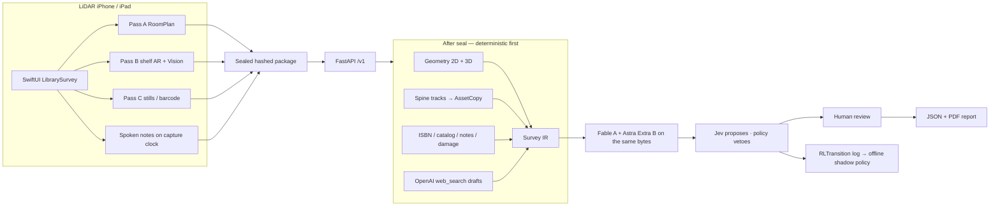

# Library Survey

iOS capture + FastAPI backend for a **library replacement-cost survey**. A technician scans rooms and shelves on a LiDAR iPhone; the backend turns that sealed package into geometry, physical-copy inventory, identity, local price *drafts*, model comparison, and a signed report.

Models classify and propose. They do **not** write count, ISBN, geometry, or money. Draft web prices stay drafts until an operator confirms a physical listing. Price and geography are not vision class labels.

**Diagrams (the full map):** [`docs/architecture.md`](docs/architecture.md) — RoomPlan, shelf/spine identification, voice, non-books, condition, ISBN/catalog, `web_search` pricing, Fable / Astra-live / Astra Extra replay / Jev, and the offline RL loop.

Alignment contract: [`FINAL-PLAN.md`](FINAL-PLAN.md). Build order: [`IMPLEMENTATION.md`](IMPLEMENTATION.md). USB install: [`INSTALLATION.md`](INSTALLATION.md). Remaining work: [`LEFTOVER.md`](LEFTOVER.md). Clocks: [`CHECKPOINTS.md`](CHECKPOINTS.md).

---

## Architecture at a glance



Governing rule: never trust one frame, one model, or one signal. Combine geometry, tracking, visual evidence, OCR, speech, and metadata, and keep confidence and provenance at every step.

### Three capture passes

| Pass | Owns the camera | Does | Does not |
| --- | --- | --- | --- |
| **A RoomPlan** | RoomPlan AR session | Walls, floors, openings, USDZ, sampled RGB/poses, geography | Count books |
| **B Shelf face** | Shelf AR after RoomPlan releases | Live quality, spine instances, coverage, Astra-live assist | Invent ISBNs or inventory truth from Astra-live |
| **C Exceptions** | Still camera after shelf AR stops | Barcode / title page / damage close-up / non-books | Optical zoom during RoomPlan |

Hierarchy: `room → unit → face A/B → row → spine instance → physical copy`. Face B is a different copy. A reverse sweep updates evidence; it does not mint a second copy. Same ISBN in two slots stays two IDs.

### What each intelligence path is for

| Path | When | Authority |
| --- | --- | --- |
| On-device Vision | Pass B/C | Quality, rectangles, OCR, barcodes, live spine overlays |
| **Astra-live Extra** | Pass B/C, ~2 s samples | Capture UX only (`assist_metadata`). Never inventory. Never Pipeline B. |
| Catalog (Open Library / Google Books) | After seal | Identity candidates. `saleInfo` never prices a physical copy. |
| OpenAI `web_search` | After seal / live price search | Listing *drafts* in the survey market (Italy ≠ Japan ≠ India) |
| **Fable (Pipeline A)** | After seal, every `AssetCopy` | Condition / category / damage / identity *candidates* |
| **Astra Extra (Pipeline B)** | After seal, same frozen bytes as A | Independent replay (`pipeline=astra_replay`) |
| **Jev** | After A and B | Typed route proposal. Does not write count or price. |
| Deterministic policy | Always | Vetoes high-value auto-accept, eBook-as-physical, ISBN-only merge, A/B disagreement |
| Offline RL | After labeled feedback | Shadow bandit + specialist heads. **No** per-survey live weight update. |

Condition (`new | good | worn | damaged | unknown`) is how “old vs new” is classified. Damage is a separate operator assertion plus model `damage.present`. A mug is inventoried and excluded. Paintings default to appraisal.

Full sequence, thresholds, schemas, and code map: [`docs/architecture.md`](docs/architecture.md).

---

## Current state (2026-09-22)

| Area | Status |
| --- | --- |
| Stage 1 capture, seal, 2D/3D | Closed on device (`eb3f30fa` canonical) |
| Stage 2–4 fixture/storage gates | Passed |
| Live Pass B count | On-device rectangles + shelf-face tracking; unread boxes are not minted; reverse sweep must not double |
| Stage 4/5 physical 8–10 book row | **Open** |
| Independent 50–100 copy holdout / policy promotion | **Open** |

**Storage:** Redis holds Survey IR, jobs, RL transitions, and state. Cloudflare R2 holds sealed media (`audio/survey.m4a`, frames, USDZ). SQLite is a Stage 1 archive only.

---

## Invertis Library report

Live survey **2026-09-22** at Invertis Library, Bareilly (`en-IN`).

- Survey ID: `4b9d7885-af80-42b8-b8c3-827c7a7f07fd`
- PDF: [`docs/invertis-library-report.pdf`](docs/invertis-library-report.pdf)
- Recorded copies: **45**
- Unique book titles / copies: **5 / 45**
- Confirmed / eligible books: **0 / 45** (no operator-confirmed listings)
- Draft-priced / eligible books: **18 / 45** (four titled groups with web-search unit prices × copy count)
- Contents confirmed: none
- Contents drafts (books): **8,288 INR** (not confirmed)
- Other object drafts: mattress, cupboards, coffee table, study tables, split ACs, windows (operator/speech counts × unit price; not confirmed)
- Building reconstruction: **37,761,129.14 INR** for **580.94 m²** (demo rebuild rates, **not** sale value)
- Fable (A), Astra Extra (B / replay), Jev, and Astra-live Extra assist all **ran**
- Inventory status: **partial**

This does **not** close the 8–10 book physical row gate.

### Sealed package

Hashes verified locally. 8 walls, **580.9 m²**, ceiling 250 cm. N is scan +Z, not magnetic north. Geography: Bareilly, IN (`source: gps`). 323 files. Shelf pins are **unregistered overlays** (not operator-placed footprints).


### Pass B on the stacks

Astra-live captions are assist only, not inventory. Rows stayed **partial** (blur / unconfirmed actual).


Download a sealed report from the laptop while uvicorn is up:

```bash
curl -o ~/Downloads/library-survey.pdf \
  http://127.0.0.1:8000/v1/surveys/4b9d7885-af80-42b8-b8c3-827c7a7f07fd/report.pdf
```

---

## Capture and processing that actually ship

1. **Sequential camera.** RoomPlan owns Pass A. Pass B shelf AR starts after RoomPlan releases. Pass C stills after shelf AR stops. No optical zoom during RoomPlan.
2. **Live spines.** Apple Vision rectangles + OCR; only boxes with readable letters become copies. Association is in shelf-face metres. Coverage is 8 cm bins along the face of readable detections.
3. **Voice.** AAC on the RoomPlan session clock. After seal, server STT; notes bind by tap / reticle / pose / time / semantics, or stay unbound.
4. **Astra-live Extra** during Pass B/C is assist metadata, not inventory.
5. **After seal.** Geometry → vision count → identity/notes/damage → `web_search` drafts → Fable (A) and Astra Extra (B) on the same sealed bytes → Jev + policy. Every decision appends an `RLTransition`.
6. **Price search** once per unique edition + market via OpenAI Responses `web_search` (`user_location` from survey geography). ISBN first, else name. No Bing. No Amazon scrape.
7. **Building value** is `floor_area × demo_rebuild_rates_v1[country]` with basis `replacement_cost`.

---

## Run

Copy [`.env.example`](.env.example) to `.env.local` (untracked). Never put keys in the iOS app.

```bash
make check         # Ruff, compileall, backend/schema tests
python3 -m uvicorn backend.app.main:production_app --factory --host 0.0.0.0 --port 8000
```

Phone Backend URL: `http://<Mac-Wi-Fi-IP>:8000`. Mac and iPhone must share a network that allows client-to-client traffic. Uvicorn binds `0.0.0.0`, not `127.0.0.1`.

```bash
make ios-project   # XcodeGen
make ios-build     # generic iOS Simulator
```

Physical install: [`INSTALLATION.md`](INSTALLATION.md).

---

## Layout

```text
backend/     FastAPI, Redis, R2, pricing, Fable/Astra Extra/Jev, RL, reports
ios/          LibrarySurvey (SwiftUI, RoomPlan, Vision, live spine tracker)
cv/           labeled-JSON shelf count helpers (shelf-count-v1)
schemas/      Survey IR, evidence package, model assessment, RL transition
docs/         architecture.md, gates, deployment, Invertis PDF and screenshots
eval/         holdout/preflight (templates are not device accuracy)
```
