# Library Survey

iOS capture + FastAPI backend for a **library replacement-cost survey**. A technician scans rooms and shelves on a LiDAR iPhone; the backend turns that sealed package into geometry, physical-copy inventory, identity, local price *drafts*, model comparison, and a signed report.

Models classify and propose. They do **not** write count, ISBN, geometry, or money. Draft web prices stay drafts until an operator confirms a physical listing. Price and geography are not vision class labels.

Alignment contract: [`FINAL-PLAN.md`](FINAL-PLAN.md). Thresholds, schemas, and code map: [`docs/architecture.md`](docs/architecture.md). Build order: [`IMPLEMENTATION.md`](IMPLEMENTATION.md). USB install: [`INSTALLATION.md`](INSTALLATION.md). Clocks: [`CHECKPOINTS.md`](CHECKPOINTS.md).

Governing rule: never trust one frame, one model, or one signal. Combine geometry, tracking, visual evidence, OCR, speech, and metadata, and keep confidence and provenance at every step.

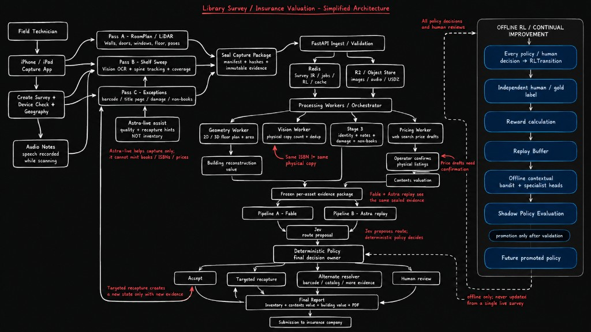

---

## Invertis Library report

Live survey **2026-09-22** at Invertis Library, Bareilly (`en-IN`).

- Survey ID: `4b9d7885-af80-42b8-b8c3-827c7a7f07fd`
- PDF: [`docs/invertis-library-report.pdf`](docs/invertis-library-report.pdf)
- Recorded copies: **45**
- Unique book titles / copies: **5 / 45** (four named groups plus 27 untitled copies)
- Confirmed / eligible books: **0 / 45** (no operator-confirmed listings)
- Draft-priced / eligible books: **18 / 45** (named groups only; web-search unit prices × copy count)
- Named draft titles:
  - *Organization Theory: Management and Leadership Analysis* — 2 × 447 INR
  - *Brand Management* — 5 × 176 INR
  - *Organization Development* — 3 × 800 INR
  - *Organizational Behavior* — 8 × 1,062 INR
- Contents confirmed: none
- Contents drafts (books): **12,670 INR** (not confirmed)
- Other object drafts: mattress, cupboards, coffee table, study tables, split ACs, windows (operator/speech counts × unit price; not confirmed)
- Building reconstruction: **37,761,129.14 INR** for **580.94 m²** (demo rebuild rates, **not** sale value)
- Fable (A), Astra Extra (B / replay), Jev, and Astra-live Extra assist all **ran**
- Inventory status: **partial**

This does **not** close the 8–10 book physical row gate.

### Sealed package

Hashes verified locally. 8 walls, **580.9 m²**, ceiling 250 cm. N is scan +Z, not magnetic north. Geography: Bareilly, IN (`source: gps`). 323 files. Shelf pins are **unregistered overlays** (not operator-placed footprints).

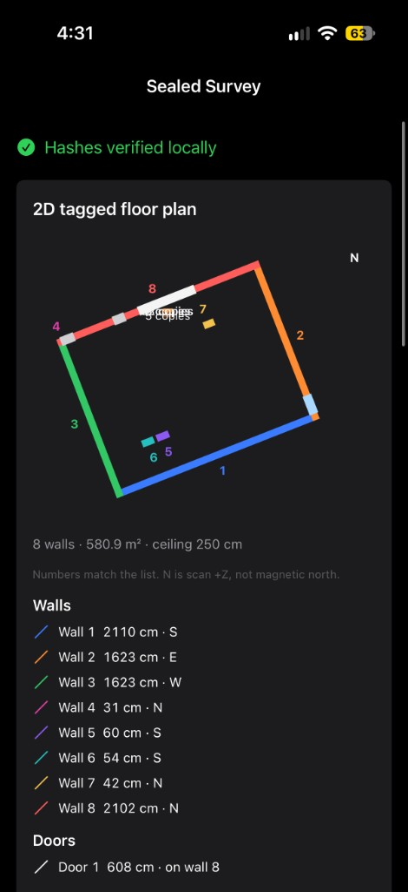

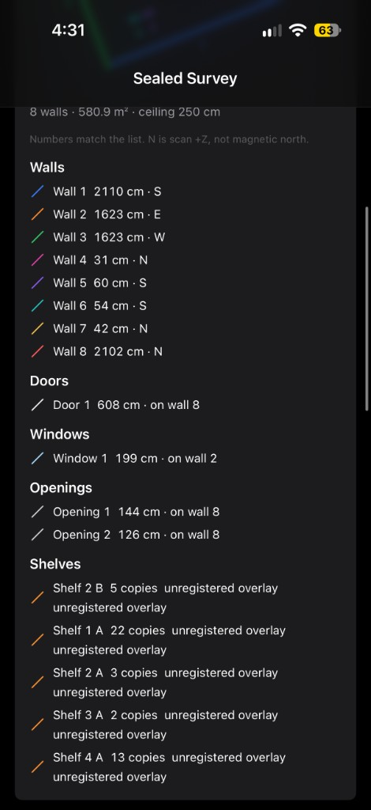

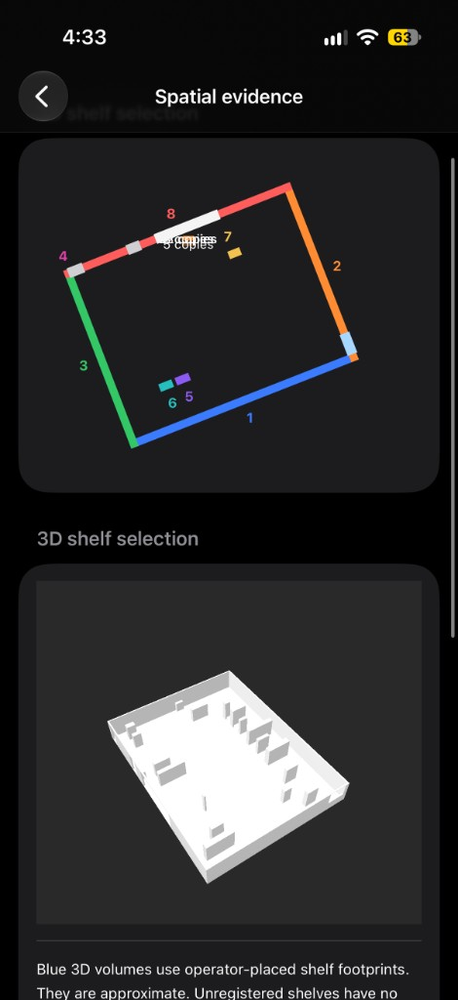

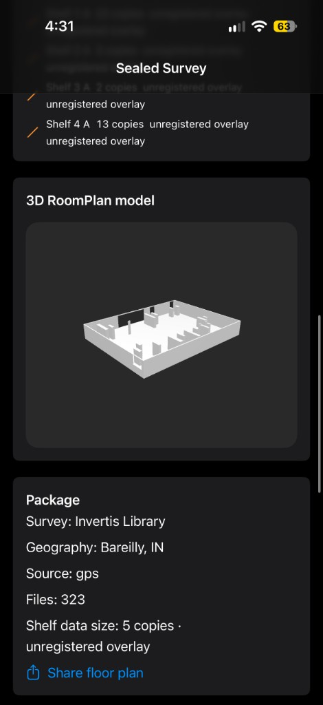

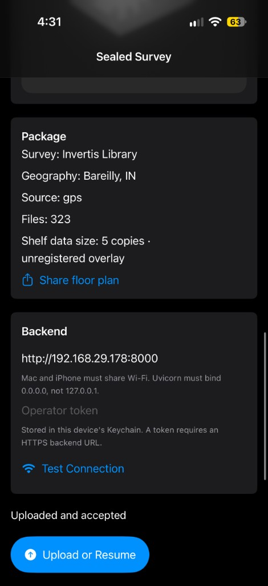

### Pass B on the stacks

Astra-live captions are assist only, not inventory. Rows stayed **partial** (blur / unconfirmed actual).

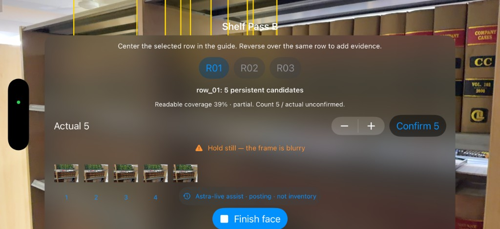

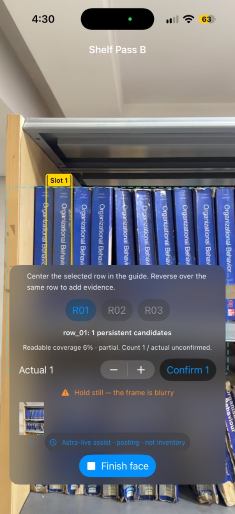

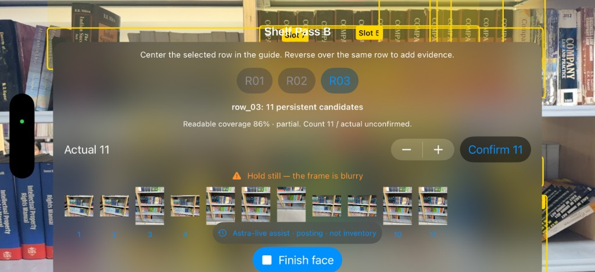

Download a sealed report from the laptop while uvicorn is up:

```bash
curl -o ~/Downloads/library-survey.pdf \
  http://127.0.0.1:8000/v1/surveys/4b9d7885-af80-42b8-b8c3-827c7a7f07fd/report.pdf
```

---

## Current state (2026-09-22)

| Area | Status |
| --- | --- |
| Stage 1 capture, seal, 2D/3D | Closed on device (`eb3f30fa` canonical) |
| Stage 2–4 fixture/storage gates | Passed |
| Live Pass B count | On-device rectangles + shelf-face tracking; unread boxes are not minted; reverse sweep must not double |
| Stage 4/5 physical 8–10 book row | **Open** |
| Independent 50–100 copy holdout / policy promotion | **Open** |

**Storage:** Redis holds Survey IR, jobs, RL transitions, and state. Cloudflare R2 holds sealed media (`audio/survey.m4a`, frames, USDZ). SQLite is a Stage 1 archive only.

---

## Capture and processing that actually ship

1. **Sequential camera.** RoomPlan owns Pass A. Pass B shelf AR starts after RoomPlan releases. Pass C stills after shelf AR stops. No optical zoom during RoomPlan.
2. **Live spines.** Apple Vision rectangles + OCR; only boxes with readable letters become copies. Association is in shelf-face metres. Coverage is 8 cm bins along the face of readable detections.
3. **Voice.** AAC on the RoomPlan session clock. After seal, server STT; notes bind by tap / reticle / pose / time / semantics, or stay unbound.
4. **Astra-live Extra** during Pass B/C is assist metadata, not inventory.
5. **After seal.** Geometry → vision count → identity/notes/damage → `web_search` drafts → Fable (A) and Astra Extra (B) on the same sealed bytes → Jev + policy. Every decision appends an `RLTransition`.
6. **Price search** once per unique edition + market via OpenAI Responses `web_search` (`user_location` from survey geography). ISBN first, else name. No Bing. No Amazon scrape.
7. **Building value** is `floor_area × demo_rebuild_rates_v1[country]` with basis `replacement_cost`.

---

## Run

Copy [`.env.example`](.env.example) to `.env.local` (untracked). Never put keys in the iOS app.

```bash
make check         # Ruff, compileall, backend/schema tests
python3 -m uvicorn backend.app.main:production_app --factory --host 0.0.0.0 --port 8000
```

Phone Backend URL: `http://<Mac-Wi-Fi-IP>:8000`. Mac and iPhone must share a network that allows client-to-client traffic. Uvicorn binds `0.0.0.0`, not `127.0.0.1`.

```bash
make ios-project   # XcodeGen
make ios-build     # generic iOS Simulator
```

Physical install: [`INSTALLATION.md`](INSTALLATION.md).

---

## Layout

```text
backend/     FastAPI, Redis, R2, pricing, Fable/Astra Extra/Jev, RL, reports
ios/          LibrarySurvey (SwiftUI, RoomPlan, Vision, live spine tracker)
cv/           labeled-JSON shelf count helpers (shelf-count-v1)
schemas/      Survey IR, evidence package, model assessment, RL transition
docs/         architecture.md, gates, deployment, Invertis PDF and screenshots
eval/         holdout/preflight (templates are not device accuracy)
```

---

## Architecture

The product is two programs and two stores. The iPhone app captures, hashes, and uploads a sealed package. It holds **no provider keys**. FastAPI turns that package into Survey IR: geometry, physical copies, identity, price *drafts*, model comparison, and a signed report. Redis holds IR, jobs, RL transitions, and caches. Cloudflare R2 holds immutable media (frames, `audio/survey.m4a`, USDZ).

Models classify and propose. They do **not** write count, ISBN, geometry, copy merge, currency, or money. Draft web prices stay drafts until an operator confirms a physical listing. Astra-live Extra during Pass B/C is capture assist, not inventory and not Pipeline B.

| Layer | Owns | Must not |
| --- | --- | --- |
| **iOS LibrarySurvey** | Three camera passes, live Vision overlays, spoken audio, local SHA-256 seal | Provider keys, inventing ISBNs, minting copies from unread boxes or Astra-live |
| **Seal workers** | Geometry → vision count → Stage 3 identity/notes/damage → pricing drafts → A/B replay | Merge copies on ISBN; treat a draft listing as a confirmed price |
| **Fable (A) / Astra Extra replay (B) / Jev** | Condition, category, damage *candidates*; a typed route *proposal* | Count, checksums, money, or inventory truth |
| **Deterministic policy** | Final accept / recapture / human / alternate action; vetoes | Learning from one live survey |
| **RL home** | Append-only `RLTransition` log, independent labels, offline trainer, shadow scores | Per-survey live weight updates |

Order of truth after seal: capture quality → physical count (ISBN is **not** a merge key) → identity → price evidence → Fable vs Astra Extra on identical frozen bytes → Jev proposal → policy veto → human review → valuation / report. Every policy or human decision appends an `RLTransition`. Learned routing is trained offline and scored in shadow; the live router stays `route_v0_log_only`.

Thresholds, schemas, and code map: [`docs/architecture.md`](docs/architecture.md).

### System context

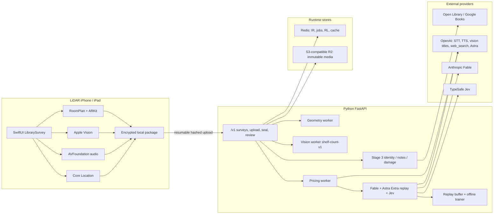
```mermaid
flowchart LR
  subgraph Device["LiDAR iPhone / iPad"]
    APP["SwiftUI LibrarySurvey"]
    RP["RoomPlan + ARKit"]
    VN["Apple Vision"]
    AV["AVFoundation audio"]
    CL["Core Location"]
    PKG["Encrypted local package"]
    APP --> RP
    APP --> VN
    APP --> AV
    APP --> CL
    RP --> PKG
    VN --> PKG
    AV --> PKG
    CL --> PKG
  end

  subgraph Backend["Python FastAPI"]
    API["/v1 surveys, upload, seal, review"]
    GEO["Geometry worker"]
    CV["Vision worker shelf-count-v1"]
    S3W["Stage 3 identity / notes / damage"]
    PRICE["Pricing worker"]
    MOD["Fable + Astra Extra replay + Jev"]
    RL["Replay buffer + offline trainer"]
    API --> GEO
    API --> CV
    API --> S3W
    API --> PRICE
    PRICE --> MOD
    MOD --> RL
  end

  subgraph Stores["Runtime stores"]
    REDIS["Redis: IR, jobs, RL, cache"]
    R2["S3-compatible R2: immutable media"]
  end

  subgraph Providers["External providers"]
    OL["Open Library / Google Books"]
    OAI["OpenAI: STT, TTS, vision titles, web_search, Astra"]
    ANT["Anthropic Fable"]
    JEV["TypeSafe Jev"]
  end

  PKG -->|"resumable hashed upload"| API
  API --> REDIS
  API --> R2
  S3W --> OL
  PRICE --> OAI
  MOD --> ANT
  MOD --> OAI
  MOD --> JEV
```

The iOS app holds **no provider keys**. Live Astra during capture is **not** Pipeline B. Report copy uses **Astra Extra** for Pipeline B (`pipeline=astra_replay`) and **Astra-live Extra** for capture assist (`pipeline=astra_live`).

### End-to-end flow

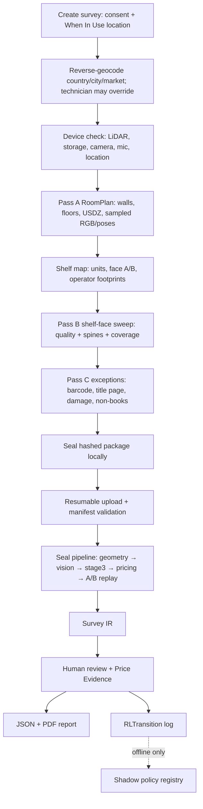
```mermaid
flowchart TB
  CREATE["Create survey: consent + When In Use location"] --> GEOG["Reverse-geocode country/city/market; technician may override"]
  GEOG --> DEV["Device check: LiDAR, storage, camera, mic, location"]
  DEV --> A["Pass A RoomPlan: walls, floors, USDZ, sampled RGB/poses"]
  A --> MAP["Shelf map: units, face A/B, operator footprints"]
  MAP --> B["Pass B shelf-face sweep: quality + spines + coverage"]
  B --> C["Pass C exceptions: barcode, title page, damage, non-books"]
  C --> SEAL["Seal hashed package locally"]
  SEAL --> UP["Resumable upload + manifest validation"]
  UP --> WORK["Seal pipeline: geometry → vision → stage3 → pricing → A/B replay"]
  WORK --> IR["Survey IR"]
  IR --> REVIEW["Human review + Price Evidence"]
  REVIEW --> REPORT["JSON + PDF report"]
  REVIEW --> RLLOG["RLTransition log"]
  RLLOG -.->|"offline only"| POL["Shadow policy registry"]
```

Order of truth: capture quality → physical count → dedup (ISBN is **not** a merge key) → identity → price evidence → model comparison → guarded review → valuation / report.

### Capture app and camera ownership

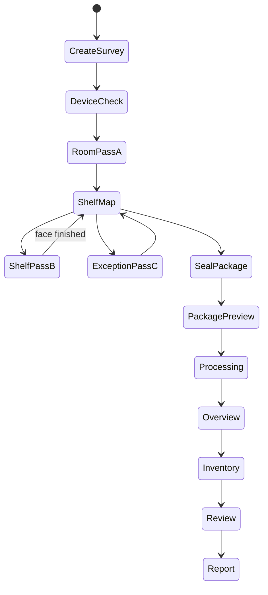
```mermaid
stateDiagram-v2
  [*] --> CreateSurvey
  CreateSurvey --> DeviceCheck
  DeviceCheck --> RoomPassA
  RoomPassA --> ShelfMap
  ShelfMap --> ShelfPassB
  ShelfPassB --> ShelfMap: face finished
  ShelfMap --> ExceptionPassC
  ExceptionPassC --> ShelfMap
  ShelfMap --> SealPackage
  SealPackage --> PackagePreview
  PackagePreview --> Processing
  Processing --> Overview
  Overview --> Inventory
  Inventory --> Review
  Review --> Report
```

| Pass | Owns the camera | Does | Does not |
| --- | --- | --- | --- |
| **A RoomPlan** | RoomPlan AR session | Walls, floors, openings, USDZ, sampled RGB/poses, geography | Count books |
| **B Shelf face** | Shelf AR after RoomPlan releases | Live quality, spine instances, coverage, Astra-live assist | Invent ISBNs or inventory from Astra-live |
| **C Exceptions** | Still camera after shelf AR stops | Barcode / title page / damage close-up / non-books | Optical zoom during RoomPlan |

Hierarchy: `room → unit → face A/B → row → spine instance → physical copy`. Face B is a different copy. A reverse sweep updates evidence; it does not mint a second copy. Same ISBN in two slots stays two IDs.

### Pass A — RoomPlan

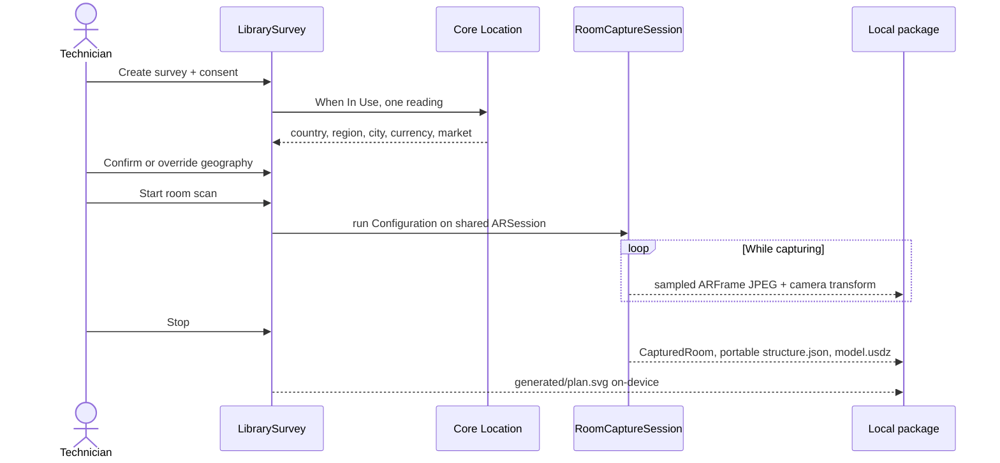
```mermaid
sequenceDiagram
  actor T as Technician
  participant App as LibrarySurvey
  participant Loc as Core Location
  participant RP as RoomCaptureSession
  participant Store as Local package

  T->>App: Create survey + consent
  App->>Loc: When In Use, one reading
  Loc-->>App: country, region, city, currency, market
  T->>App: Confirm or override geography
  T->>App: Start room scan
  App->>RP: run Configuration on shared ARSession
  loop While capturing
    RP-->>Store: sampled ARFrame JPEG + camera transform
  end
  T->>App: Stop
  RP-->>Store: CapturedRoom, portable structure.json, model.usdz
  App-->>Store: generated/plan.svg on-device
```

RoomPlan is geometry only. Compass **N = scan +Z**, not magnetic north. Geography sets the search market and rebuild-rate country (Italy ≠ Japan ≠ India). Denied GPS still proceeds with required manual country/city.

### Pass B — how a spine is identified

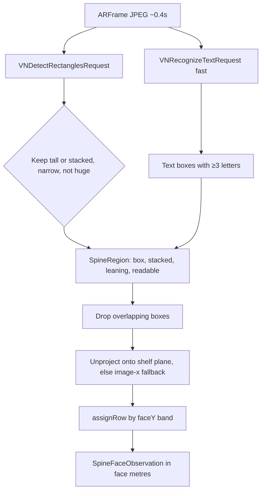
```mermaid
flowchart TB
  JPEG["ARFrame JPEG ~0.4s"] --> RECT["VNDetectRectanglesRequest"]
  JPEG --> OCR["VNRecognizeTextRequest fast"]
  RECT --> FILT{"Keep tall or stacked, narrow, not huge"}
  OCR --> TXT["Text boxes with ≥3 letters"]
  FILT --> PROP["SpineRegion: box, stacked, leaning, readable"]
  TXT --> PROP
  PROP --> NMS["Drop overlapping boxes"]
  NMS --> PROJ["Unproject onto shelf plane, else image-x fallback"]
  PROJ --> ROW["assignRow by faceY band"]
  ROW --> OBS["SpineFaceObservation in face metres"]
```

Unread rectangles are **not** minted as copies. Crochet/table squares without title letters leave the row `partial`.

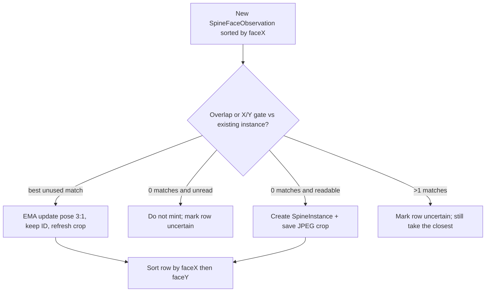
```mermaid
flowchart TB
  OBS["New SpineFaceObservation sorted by faceX"] --> MATCH{"Overlap or X/Y gate vs existing instance?"}
  MATCH -->|"0 matches and readable"| NEW["Create SpineInstance + save JPEG crop"]
  MATCH -->|"0 matches and unread"| DROP["Do not mint; mark row uncertain"]
  MATCH -->|"best unused match"| UPD["EMA update pose 3:1, keep ID, refresh crop"]
  MATCH -->|">1 matches"| UNC["Mark row uncertain; still take the closest"]
  UPD --> SORT["Sort row by faceX then faceY"]
  NEW --> SORT
```

Coverage is 8 cm bins along the face from readable `faceX`. A row is `ok` only if coverage ≥ 0.8, operator `actualCount` equals tracked `copyCount`, and the row is not uncertain.

### After seal — physical copies (no ISBN merge)

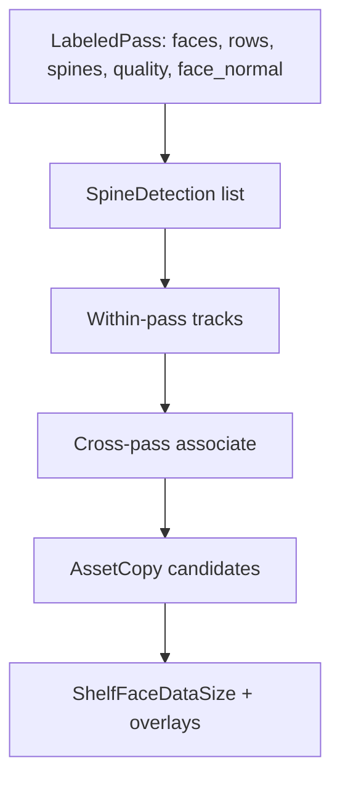
```mermaid
flowchart TB
  LAB["LabeledPass: faces, rows, spines, quality, face_normal"] --> DET["SpineDetection list"]
  DET --> TR["Within-pass tracks"]
  TR --> AS["Cross-pass associate"]
  AS --> COPY["AssetCopy candidates"]
  COPY --> FACE["ShelfFaceDataSize + overlays"]
```

Same ISBN at a different slot/face stays two copies (`possibly_moved` if identity matches and space jumps). Face-normal dot ≥ 0.7 is required to treat two sweeps as the same face.

### Pass C — barcodes and non-book items

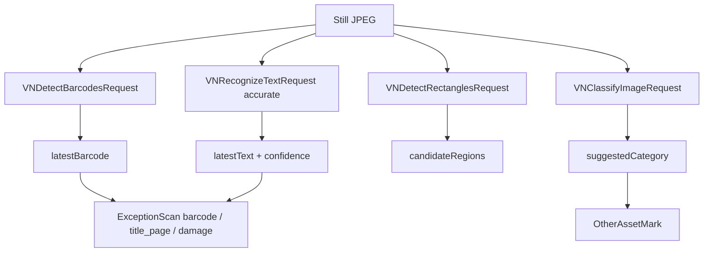
```mermaid
flowchart TB
  STILL["Still JPEG"] --> BC["VNDetectBarcodesRequest"]
  STILL --> OCR["VNRecognizeTextRequest accurate"]
  STILL --> RECT["VNDetectRectanglesRequest"]
  STILL --> CLS["VNClassifyImageRequest"]
  BC --> RAW["latestBarcode"]
  OCR --> TEXT["latestText + confidence"]
  RECT --> REG["candidateRegions"]
  CLS --> HINT["suggestedCategory"]
  HINT --> MARK["OtherAssetMark"]
  RAW --> SCAN["ExceptionScan barcode / title_page / damage"]
  TEXT --> SCAN
```

Closed taxonomy: `book | serial | painting | portrait | sculpture | computer | monitor | printer | furniture | shelf | appliance | cup | decorative_object | other`. A mug is inventoried and **excluded**. Paintings/portraits/sculpture default to appraisal.

### Voice and spoken notes

```mermaid
sequenceDiagram
  actor T as Technician
  participant Rec as AudioNoteRecorder
  participant Pkg as audio/survey.m4a + timing.json
  participant STT as OpenAI gpt-4o-transcribe-diarize
  participant S3 as Stage3Worker
  participant TTS as OpenAI gpt-4o-mini-tts marin

  T->>Rec: Speak while scanning ("this portrait is damaged")
  Rec->>Pkg: AAC on capture monotonic clock
  Note over Rec: Mixes with RoomPlan session; scan continues if mic fails
  Pkg->>STT: After seal, server-side only
  STT-->>S3: segments with start/end + speaker
  S3->>S3: Bind note to asset or leave unbound
  T->>TTS: Optional operator prompt (barcode / damage / unbound)
```

Binding scores tap, reticle, pose, time, and transcript keywords. If two objects are equally plausible, the note stays unbound.

### Condition: old vs new (not price, not geography)

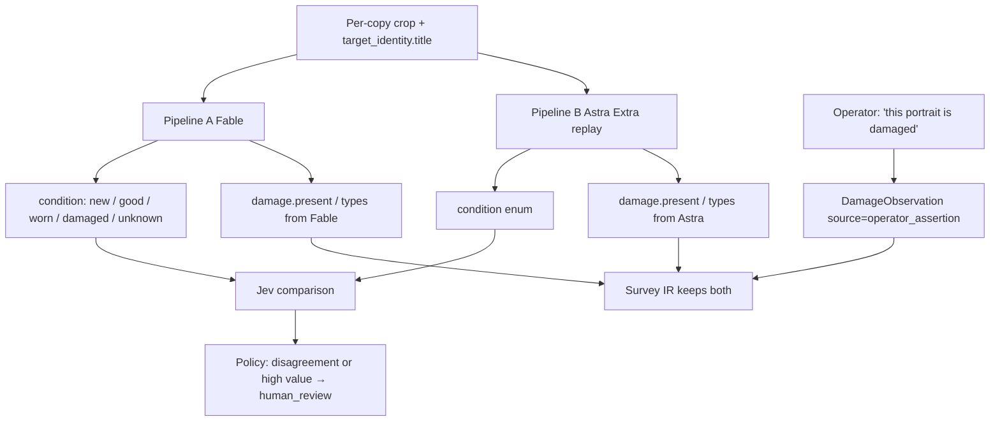
```mermaid
flowchart TB
  CROP["Per-copy crop + target_identity.title"] --> A["Pipeline A Fable"]
  CROP --> B["Pipeline B Astra Extra replay"]
  A --> CA["condition: new / good / worn / damaged / unknown"]
  B --> CB["condition enum"]
  CA --> J["Jev comparison"]
  CB --> J
  OP["Operator: 'this portrait is damaged'"] --> D["DamageObservation source=operator_assertion"]
  A --> DA["damage.present / types from Fable"]
  B --> DB["damage.present / types from Astra"]
  D --> IR["Survey IR keeps both"]
  DA --> IR
  DB --> IR
  J --> POL["Policy: disagreement or high value → human_review"]
```

Price is `web_search`. Geography is device location. Neither is a spine class label.

### ISBN and catalog identity

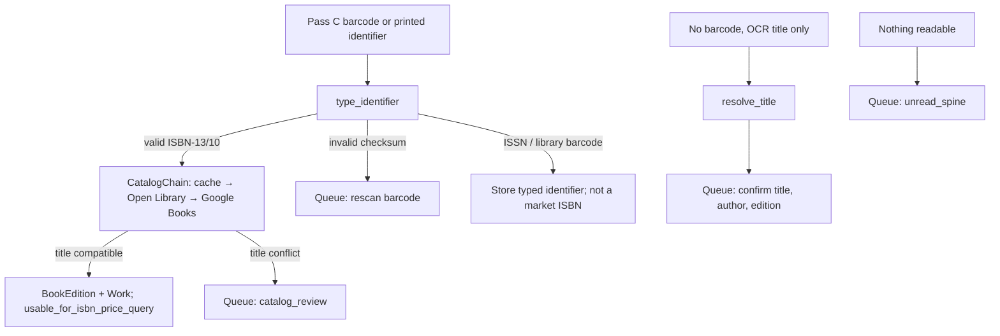
```mermaid
flowchart TD
  RAW["Pass C barcode or printed identifier"] --> TYPE["type_identifier"]
  TYPE -->|valid ISBN-13/10| CAT["CatalogChain: cache → Open Library → Google Books"]
  TYPE -->|invalid checksum| Q1["Queue: rescan barcode"]
  TYPE -->|ISSN / library barcode| KEEP["Store typed identifier; not a market ISBN"]
  CAT -->|title compatible| ED["BookEdition + Work; usable_for_isbn_price_query"]
  CAT -->|title conflict| Q2["Queue: catalog_review"]
  NOISBN["No barcode, OCR title only"] --> TCAT["resolve_title"]
  TCAT --> Q3["Queue: confirm title, author, edition"]
  NONE["Nothing readable"] --> Q4["Queue: unread_spine"]
```

Spine OCR must not invent an ISBN. Google Books `saleInfo` never prices a physical copy.

### Price discovery

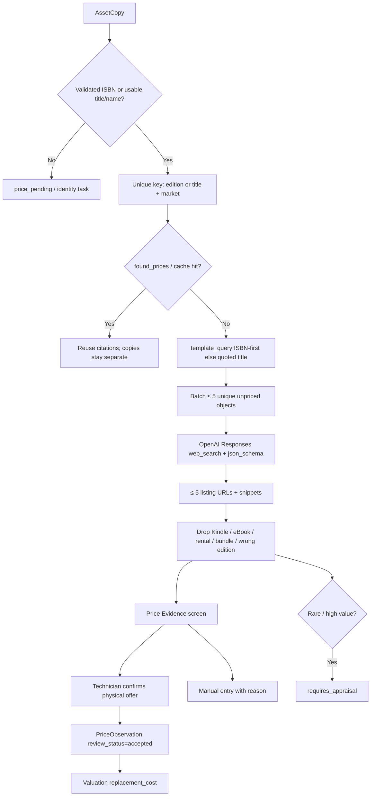
```mermaid
flowchart TB
  COPY["AssetCopy"] --> ID{"Validated ISBN or usable title/name?"}
  ID -->|No| PEND["price_pending / identity task"]
  ID -->|Yes| KEY["Unique key: edition or title + market"]
  KEY --> CACHE{"found_prices / cache hit?"}
  CACHE -->|Yes| DRAFT["Reuse citations; copies stay separate"]
  CACHE -->|No| Q["template_query ISBN-first else quoted title"]
  Q --> BATCH["Batch ≤ 5 unique unpriced objects"]
  BATCH --> WS["OpenAI Responses web_search + json_schema"]
  WS --> CIT["≤ 5 listing URLs + snippets"]
  CIT --> FILT["Drop Kindle / eBook / rental / bundle / wrong edition"]
  FILT --> UI["Price Evidence screen"]
  UI --> CONF["Technician confirms physical offer"]
  CONF --> PO["PriceObservation review_status=accepted"]
  PO --> VAL["Valuation replacement_cost"]
  UI --> MAN["Manual entry with reason"]
  FILT --> RARE{"Rare / high value?"}
  RARE -->|Yes| APP["requires_appraisal"]
```

No Bing. No Amazon scrape. Drafts are not confirmed prices. Building value is `floor_area × demo_rebuild_rates_v1[country]`, basis `replacement_cost`, not sale value.

### Fable, Astra-live Extra, Astra Extra replay, Jev

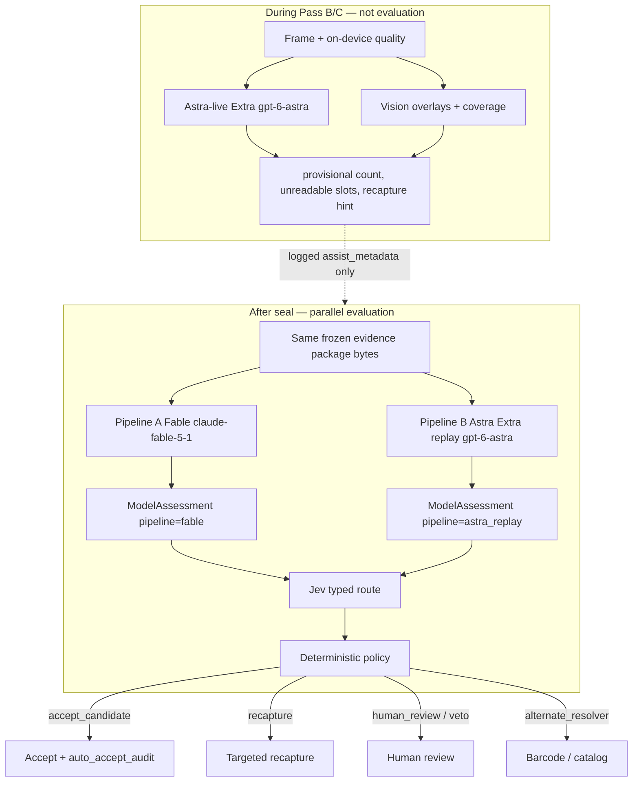
```mermaid
flowchart TB
  subgraph Capture["During Pass B/C — not evaluation"]
    F["Frame + on-device quality"] --> OD["Vision overlays + coverage"]
    F --> AL["Astra-live Extra gpt-6-astra"]
    AL --> UX["provisional count, unreadable slots, recapture hint"]
    OD --> UX
  end

  subgraph Seal["After seal — parallel evaluation"]
    PKG["Same frozen evidence package bytes"] --> FA["Pipeline A Fable claude-fable-5-1"]
    PKG --> AR["Pipeline B Astra Extra replay gpt-6-astra"]
    FA --> NA["ModelAssessment pipeline=fable"]
    AR --> NB["ModelAssessment pipeline=astra_replay"]
    NA --> J["Jev typed route"]
    NB --> J
    J --> POL["Deterministic policy"]
  end

  UX -.->|"logged assist_metadata only"| Seal
  POL -->|accept_candidate| AC["Accept + auto_accept_audit"]
  POL -->|recapture| RC["Targeted recapture"]
  POL -->|human_review / veto| H["Human review"]
  POL -->|alternate_resolver| ALT["Barcode / catalog"]
```

| Path | When | Authority |
| --- | --- | --- |
| On-device Vision | Pass B/C | Quality, rectangles, OCR, barcodes, live spine overlays |
| **Astra-live Extra** | Pass B/C, ~2 s samples | Capture UX only. Never inventory. Never Pipeline B. |
| **Fable (Pipeline A)** | After seal, every `AssetCopy` | Condition / category / damage / identity *candidates* |
| **Astra Extra (Pipeline B)** | After seal, same frozen bytes as A | Independent replay (`pipeline=astra_replay`) |
| **Jev** | After A and B | Typed route proposal. Does not write count or price. |
| Deterministic policy | Always | Vetoes high-value auto-accept, eBook-as-physical, ISBN-only merge, A/B disagreement |

### RL feedback loop

This is a real MDP home, not “log and hope.” Production weights **do not** update from one live survey. Insurance output has to be reproducible; online learning after each scan is unsafe. A log without a state / action / reward / next-state record is not an RL loop either.

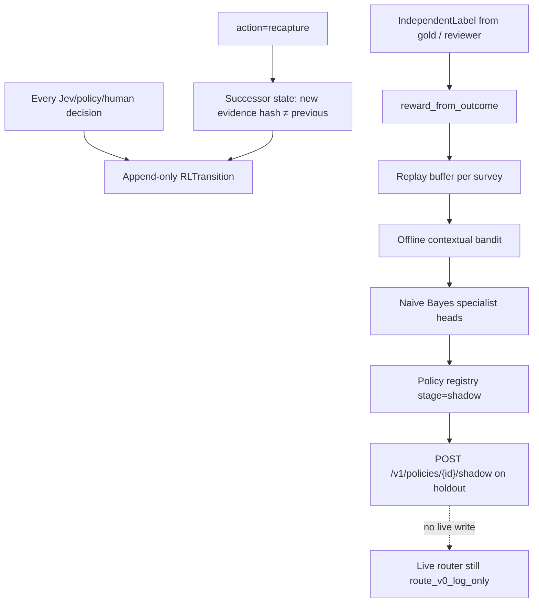
```mermaid
flowchart TB
  DEC["Every Jev/policy/human decision"] --> TR["Append-only RLTransition"]
  RC["action=recapture"] --> NEXT["Successor state: new evidence hash ≠ previous"]
  NEXT --> TR
  HUM["IndependentLabel from gold / reviewer"] --> REW["reward_from_outcome"]
  REW --> BUF["Replay buffer per survey"]
  BUF --> FIT["Offline contextual bandit"]
  FIT --> SPEC["Naive Bayes specialist heads"]
  SPEC --> REG["Policy registry stage=shadow"]
  REG --> SHADOW["POST /v1/policies/{id}/shadow on holdout"]
  SHADOW -.->|"no live write"| LIVE["Live router still route_v0_log_only"]
```

#### What one episode is

One **episode** is one survey, including recapture cycles. Recapture is the sequential case: the action changes later evidence.

| Piece | Implementation |
| --- | --- |
| **State** | Compact dict on the transition: `asset_copy_id`, `category`, A/B `disagreement`, `appraisal_required`, `evidence_package_hash`, `policy_reason`, optional `logging_propensity` and specialist prediction. Not raw video. |
| **Action** | `accept`, `recapture`, `alternate_resolver`, `human_review`, `use_specialist_head`, `use_frontier` |
| **Policy at capture** | Live: `route_v0_log_only`. Human Stage 3 / identity: `human_review_v1`. Price review: `price_review_v1`. |
| **Reward** | `null` until an independent label is posted. Then `reward_from_outcome` from the §13 table. Never from “Jev agreed with Fable”. |
| **Next state** | Only for `recapture`. `POST /v1/surveys/{id}/rl-successor-states` binds new evidence once; the hash **must** differ from the predecessor. |

`RLTransition` rows live in Redis (`…:survey:{id}:rl_transitions`). Code: `backend/app/rl/transitions.py`, `backend/app/rl/offline.py`. Schema: `schemas/rl-transition.schema.json`.

#### What actually writes a transition

| Decision | Source | Action logged |
| --- | --- | --- |
| After-seal Fable + Astra Extra + Jev + `_route` | `action_source=policy`, `policy_id=route_v0_log_only` | Policy action (`accept` if the route was `accept_candidate`). Auto-accepts also append `auto_accept_audit` (copy, evidence hash, A/B/Jev, who can still overturn). |
| Bind note / keep unresolved / identity correction | `action_source=human` | `human_review` |
| Rescan barcode | `action_source=human` | `recapture` with a reserved `next_state_id` |
| Confirm or manual price | `action_source=human` | `accept` |
| No comparable | `action_source=human` | `human_review` |

Offline fitting **excludes** human-selected actions. Only `policy` / `jev+policy` / `baseline` rows with `logging_propensity ∈ (0, 1]` enter the bandit.

#### How reward is computed

An operator or gold set posts `POST /v1/surveys/{id}/independent-labels`. The label is append-once (a second label on the same `transition_id` is rejected). Flags are independent observations, not model agreement:

| Outcome flag | Reward |
| --- | ---: |
| Correct keep-or-merge | +1 |
| False merge | −5 |
| False split | −2 |
| Correct ISBN/edition | +2 |
| Wrong ISBN/edition | −3 |
| Missed high-value | −8 |
| Correct mug exclusion | +0.2 |
| Valued a mug / eBook as physical | −4 |
| Recapture recovered a row | +1.5 |
| Unnecessary recapture | −0.5 |
| Correct specialist routing | +1 |

If the transition stored a specialist prediction, credit is forced to match gold for that head (`condition`, `eligibility`, `damage`, `duplicate_features`, `quality`). “Fewer human reviews” is not a reward.

#### Offline trainer and specialist heads

`POST /v1/policies/train` fits a policy artifact in Redis. Requirements: disjoint train vs holdout survey IDs, at least 10 independently labeled transitions with a known logging propensity.

- **Router (our first learned policy):** offline contextual bandit. Propensity-weighted linear reward regression, 200 steps, lr 0.02, only actions with ≥ 3 examples. Features: bias, category, disagreement, appraisal, Fable/Astra confidence.
- **Specialist heads (our models):** Laplace-smoothed naive Bayes on the same features, one head each for condition, eligibility, damage, duplicate-features, and quality. They are then one of the router’s actions (`use_specialist_head`). Frontier A/B stay on ambiguous, high-value, or novel cases.
- Artifact `stage` is `shadow`. `approved_at` stays `null` until a promotion that does not exist yet. Technique string is stored on the artifact so reports name the method, not a slogan.

`POST /v1/policies/{id}/shadow` scores that artifact on the holdout surveys. Inverse-propensity reward is reported only on **matched** logged actions, with an overlap warning. Shadow does not change live routing.

Staged path: log-only → offline bandit → sequential recapture RL → specialist heads → shadow → canary. Rollback = pin the previous `policy_id`. **No** single survey updates live model weights or thresholds.

**Current honesty:** the log, replay buffer, trainer, specialist fit, successor-state API, and shadow endpoint exist and are exercised on synthetic labels. There is no frozen 50–100 copy gold zone, no physical independent labels on Invertis, no phone auto-bind of recapture evidence, and no approved/canary router. The live path is still `route_v0_log_only`.

### Survey IR

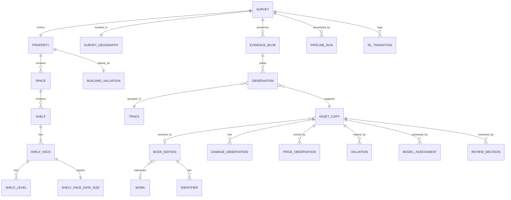
```mermaid
erDiagram
  SURVEY ||--|| PROPERTY : covers
  SURVEY ||--|| SURVEY_GEOGRAPHY : located_in
  PROPERTY ||--o{ SPACE : contains
  PROPERTY ||--|| BUILDING_VALUATION : valued_as
  SPACE ||--o{ SHELF : contains
  SHELF ||--|{ SHELF_FACE : has
  SHELF_FACE ||--o{ SHELF_LEVEL : has
  SHELF_FACE ||--|| SHELF_FACE_DATA_SIZE : reports
  SURVEY ||--o{ EVIDENCE_BLOB : preserves
  EVIDENCE_BLOB ||--o{ OBSERVATION : yields
  OBSERVATION }o--|| TRACK : grouped_in
  OBSERVATION }o--|| ASSET_COPY : supports
  ASSET_COPY }o--o| BOOK_EDITION : resolves_to
  BOOK_EDITION }o--o| WORK : expresses
  BOOK_EDITION ||--o{ IDENTIFIER : has
  ASSET_COPY ||--o{ DAMAGE_OBSERVATION : has
  ASSET_COPY ||--o{ PRICE_OBSERVATION : priced_by
  ASSET_COPY ||--o{ VALUATION : valued_as
  ASSET_COPY ||--o{ MODEL_ASSESSMENT : assessed_by
  ASSET_COPY ||--o{ REVIEW_DECISION : reviewed_by
  SURVEY ||--o{ PIPELINE_RUN : processed_by
  SURVEY ||--o{ RL_TRANSITION : logs
```

An ISBN is never the primary key of `AssetCopy`.

### Seal state machine

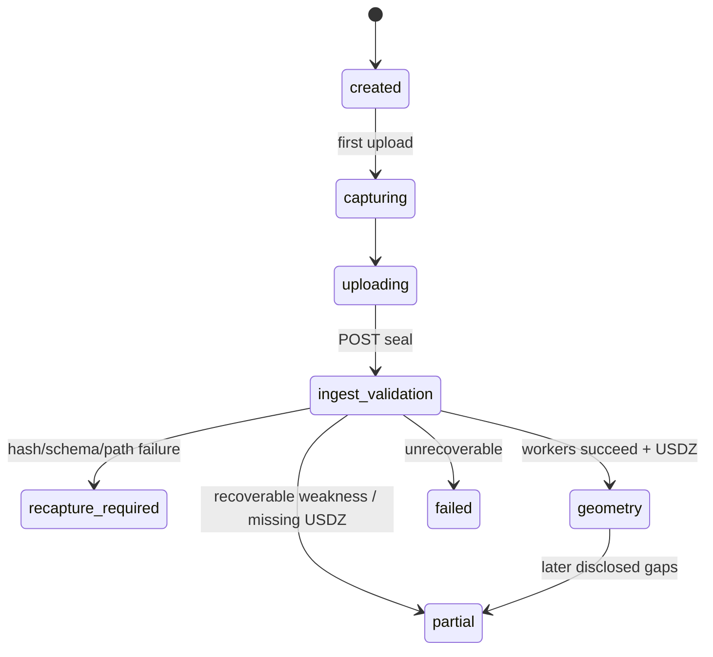
```mermaid
stateDiagram-v2
  [*] --> created
  created --> capturing: first upload
  capturing --> uploading
  uploading --> ingest_validation: POST seal
  ingest_validation --> recapture_required: hash/schema/path failure
  ingest_validation --> geometry: workers succeed + USDZ
  ingest_validation --> partial: recoverable weakness / missing USDZ
  ingest_validation --> failed: unrecoverable
  geometry --> partial: later disclosed gaps
```

Seal workers, in order: geometry → vision count → Stage 3 identity/notes/damage → pricing drafts → Fable + Astra Extra replay + Jev on every copy.
