# Library Survey — Implemented Architecture

This is the diagram-first map of **how the running system works**, not a restatement of the alignment plan. The alignment contract remains [`FINAL-PLAN.md`](../FINAL-PLAN.md). Code paths below are the current implementation.

Current shelf path:

> Scan the room with RoomPlan. Then photograph each shelf, or attach photos. Each image is one language-model request: identify the readable books, estimate the count, look up physical prices with web search, and calculate the shelf total. There is no spine detector on this path.

The model does not write room geometry. It does estimate book counts and attach the prices it looked up. Unidentified books are counted and left unpriced. Each photo is counted on its own, so a second photo of the same books is a second count. Packages that still contain `shelf_scans/labeled.json` and no `shelf_photos/manifest.json` keep the older vision counter described below. On that older path, models do not write count, ISBN, geometry, or money.

---

## Contents

1. [System context](#1-system-context)
2. [End-to-end flow](#2-end-to-end-flow)
3. [iOS capture product](#3-ios-capture-product)
4. [Pass A — RoomPlan geometry](#4-pass-a--roomplan-geometry)
5. [Pass B — shelf scan and spine identification](#5-pass-b--shelf-scan-and-spine-identification)
6. [Physical-copy tracking and deduplication](#6-physical-copy-tracking-and-deduplication)
7. [Pass C — exceptions, barcodes, non-book items](#7-pass-c--exceptions-barcodes-non-book-items)
8. [Voice, notes, and spoken association](#8-voice-notes-and-spoken-association)
9. [Condition: old vs new, wear, damage](#9-condition-old-vs-new-wear-damage)
10. [ISBN, catalog, and bibliographic identity](#10-isbn-catalog-and-bibliographic-identity)
11. [Price discovery and valuation](#11-price-discovery-and-valuation)
12. [Building reconstruction value](#12-building-reconstruction-value)
13. [Astra-live, Fable, Astra-replay, Jev](#13-astra-live-fable-astra-replay-jev)
14. [RL feedback loop](#14-rl-feedback-loop)
15. [Canonical Survey IR](#15-canonical-survey-ir)
16. [Survey state machine and seal](#16-survey-state-machine-and-seal)
17. [Storage, jobs, and API](#17-storage-jobs-and-api)
18. [Security, spend, and operator failures](#18-security-spend-and-operator-failures)
19. [Code map](#19-code-map)

---

## 1. System context

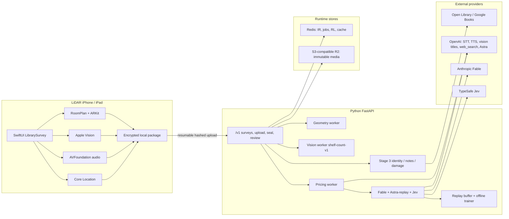

The iOS app holds **no provider keys**. Secrets stay in `.env.local` on the server. Live Astra during capture is **not** Pipeline B.

Report copy uses **Astra Extra** for Pipeline B and **Astra-live Extra** for capture assist. The stored pipeline ids remain `astra_replay` and `astra_live`.

---

## 2. End-to-end flow

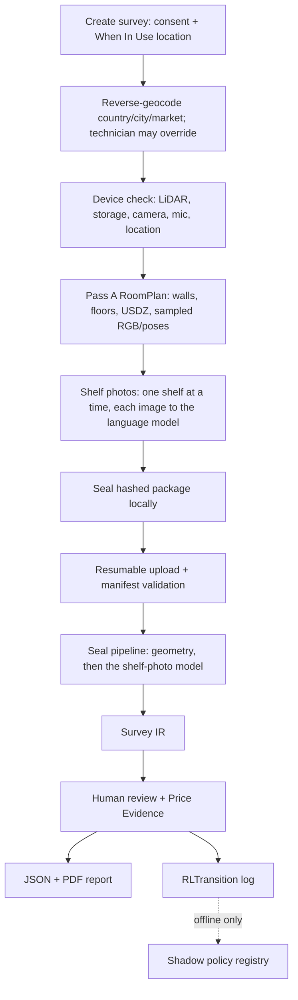

Order of truth:

1. Capture quality and coverage
2. Physical copy count
3. Deduplication (ISBN is **not** a merge key)
4. Identity
5. Price evidence
6. Model comparison
7. Guarded review
8. Valuation / report

---

## 3. iOS capture product

`RootView` is a linear capture machine. Review/inventory/report screens consume the sealed survey after upload.

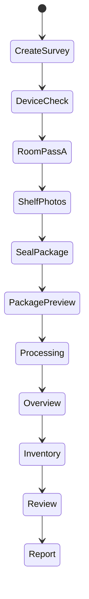

Camera ownership is exclusive (`CameraSessionCoordinator`):

| Owner | Pass | Why |
| --- | --- | --- |
| `roomPlan` | A | RoomPlan owns the AR session; RGB is sampled from that session |
| `stillCamera` | Shelf photos | A still camera starts only after RoomPlan released the session. Attached photos do not take the camera |
| `shelfAR` | Older sweeps | Unused on the photo path. Kept so a labeled shelf package can still be read |
| `idle` | between passes | Next pass may start |

If RoomPlan cannot sample RGB live, the app falls back to a sequential final frame (`sequential_final_frame`) rather than claiming two camera owners ran concurrently.

Audio records on the **same monotonic clock** as RoomPlan/ARKit, mixing with the RoomPlan session (`playAndRecord` + `.mixWithOthers`). Exclusive `.record` + Bluetooth HFP is rejected by iOS (`OSStatus -50`).

---

## 4. Pass A — RoomPlan geometry

RoomPlan is the **geometry processor only**. It does not count books.

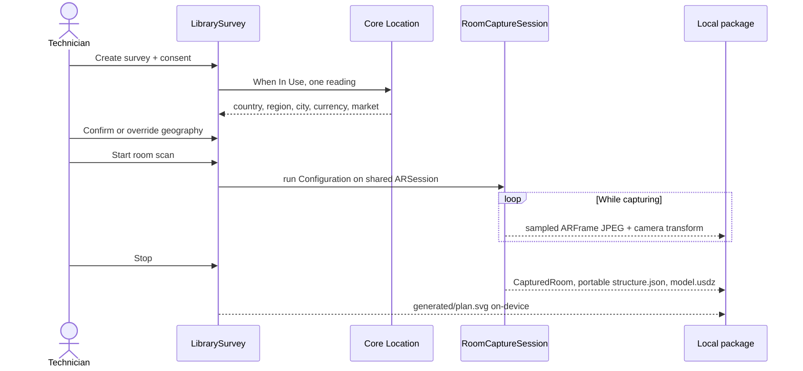

### What is captured

- Walls, floors, doors, windows, openings, room transforms
- Camera trajectory and sampled RGB (`roomplan/raw/frames/NNNN.jpg` + `poses.json`)
- Room labels
- Incomplete-scan warnings
- 3D `roomplan/model.usdz`
- Portable structure `roomplan/processed/structure.json`

### What the backend does after seal

`GeometryWorker` reads `roomplan/processed/structure.json` and builds a tagged 2D plan:

- Numbered colored walls, lengths in centimetres
- Doors/windows drawn as gaps on the parent wall
- Compass where **N = scan +Z**, not magnetic north
- Floor-area estimate for reconstruction pricing
- Later overlay: shelf footprints and copy-count labels from Pass B

Outputs: `derived/plan.svg`, `derived/geometry.json`, optional USDZ path.

Missing USDZ after a valid 2D plan is `partial`, not a crash.

### Geography (Italy vs Japan vs India)

Location is **not** a spine classifier. One reading at create-survey sets:

| Field | Example | Used for |
| --- | --- | --- |
| `country_code` | `IT` / `JP` / `IN` | rebuild-rate table key |
| `city` / `region` | Milan / Lombardia | OpenAI `web_search.user_location` |
| `market` | `it-IT` / `ja-JP` / `en-IN` | search market |
| `currency` | `EUR` / `JPY` / `INR` | price drafts and report |
| `source` | `gps` / `manual` / `mixed` | audit |

Precise lat/lon is stored only with extra consent. Denied GPS still proceeds with required manual country/city.

---

## 5. Pass B — shelf scan and spine identification

Hierarchical detection (never “image → 400 books”):

```text
room → shelf unit → shelf face (A/B) → shelf level/row → spine instance → physical AssetCopy
```

A freestanding double-sided shelf is two identities, e.g. `shelf_1.face_A` and `shelf_1.face_B`. Face normals are `[0,0,1]` vs `[0,0,-1]` so a walkaround cannot merge with the front.

### 5.1 Live quality (on-device)

`LiveQualityAnalyzer.analyze` computes **components**, not a fake single quality score:

| Component | How | Operator message |
| --- | --- | --- |
| Blur | Laplacian / convolution variance, mapped to `1 - blur/180` | Hold still — the frame is blurry if `> 0.55` |
| Glare | Fraction of RGB samples with R,G,B `> 245` | Tilt to reduce glare if `> 0.35` |
| Speed | Camera translation from ARKit transform `/ dt / 1.2` | Slow down the sweep if `> 0.45` |
| Text height | Apple Vision OCR box height in pixels | Move closer if `0 < height < 14` |
| Occlusion | **Not** inferred from pixel count; stays `0.0` until an independent actual count exists | — |

Coverage advances from **readable** detections only (8 cm bins on their projected `faceX`). Blur/glare/speed still warn the operator; they no longer gate binning. Unread detections never mint copies.

### 5.2 How a spine is identified in a frame

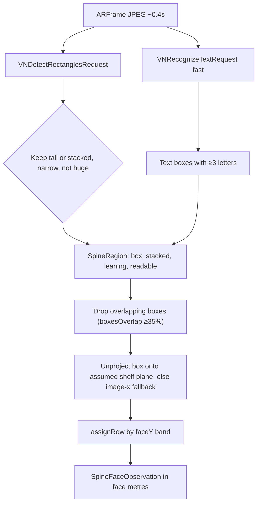

Rectangle gates (`LiveQualityAnalyzer.spineCandidates`):

- `minimumAspectRatio = 0.035`, `maximumAspectRatio = 1.2`
- `minimumSize = 0.04`, `minimumConfidence = 0.5`, max 100 observations
- Tall = `height > width * 1.4`; stacked = `width > height * 1.4`
- Narrow: tall width `≤ 0.25` or stacked height `≤ 0.45`
- Min span 0.07 (tall) / 0.12 (stacked); min area 0.008 / 0.02
- Max area 0.55 of the frame
- Leaning: tall spine whose top-left and bottom-left x differ by `> 0.4 * width`
- Readable: a letter-bearing OCR box overlaps the rectangle (`boxesOverlap`, ≥35% of the smaller area or centre-in-box)
- **Unread rectangles are dropped.** Crochet/table squares and nested inner covers without unique title letters are not minted as copies; the row stays `partial`

### 5.3 Projecting a box onto the shelf face

`ShelfCaptureStore` builds a local face plane from the camera:

- Right = camera X projected onto the horizontal plane
- Normal = `up × right`
- Plane origin = camera position + `normal * 0.65 m` (`trackingMode: ar_local_plane_assumed_0.65m`)

Each rectangle is unprojected to face-local metres `(faceX, faceY)` plus width/height. Accepted projected size is `width ∈ [0.003, 0.25]` (stacked up to 0.8) and `height ∈ [0.003, 0.9]`. If unprojection fails those bounds, the store falls back to image-normalised `midX * faceWidthMeters`. `assignRow` then maps `faceY` onto per-row bands (expanded from readable detections).

### 5.4 Live instance tracking (within the sweep)

`SpineInstanceTracker` is a nearest-neighbour associator per row, not ByteTrack:

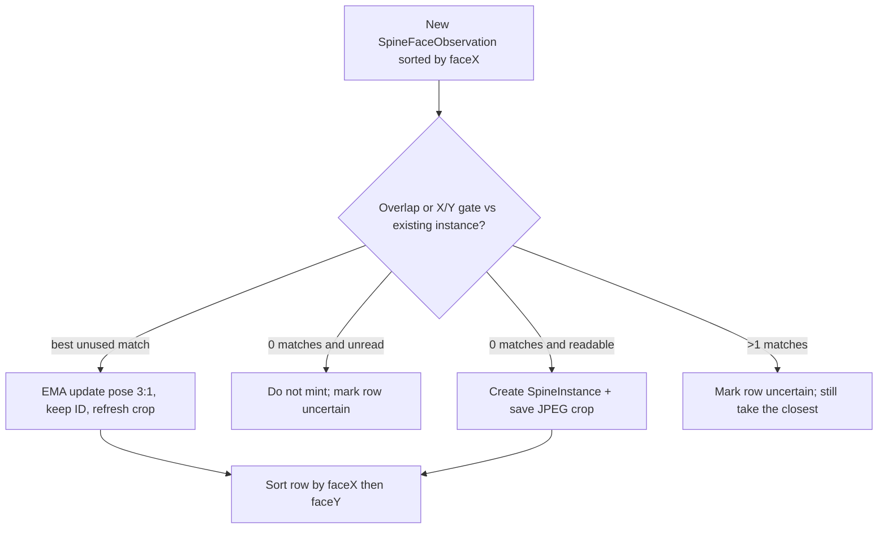

Match gates (`SpineInstanceTracker`):

- Overlap: ≥35% of the smaller box, or centre-in-box, or close midX with 30% height overlap
- Else `limitX = clamp(max(widths) * 0.9, 0.018, 0.04)` and `limitY = clamp(max(heights) * 0.35, 0.03, 0.08)`
- Same stacked flag, or Euclidean `Δx+Δy < 0.015`
- New instances require readable text

Live overlays (`visibleSpines`) are the persistent instances for every row, not only the current frame.

Crops are stored as `shelf_scans/crops/{rowId}_{uuid}.jpg`.

### 5.5 Coverage heatmap

Horizontal bins of **8 cm** along the face, from the min…max `faceX` of **readable** observations (at most 30 bins in one frame). Coverage ≈ `binCount * 0.08 / faceWidthMeters`.

A row is `ok` only if:

- coverage ≥ **0.8**
- operator `actualCount` equals tracked `copyCount`
- the row is not in `uncertainRows`

Otherwise it stays `partial` and is listed for recapture. Uncovered rows are **never silent zeros**.

### 5.6 Astra-live Extra during Pass B/C (assist only)

Optional sampled Astra Extra live assist (`POST /v1/surveys/{id}/astra-live`):

- Debounced **2 s**
- JPEG compressed to ≤ ~350 KB
- Authority: `assist_metadata`
- Stored under `derived/astra-live/`
- **Never** written as inventory or as Pipeline B

It may return `provisional_count`, `unreadable_slots`, `recapture_hint`, blur/glare/readable flags. On-device Vision remains the primary live overlay.

---

## 6. Physical-copy tracking and deduplication

After seal, `VisionWorker` reads `shelf_scans/labeled.json` (or `quality.json` with `passes`) and runs `cv.library_vision.pipeline.count_labeled_shelf` (`shelf-count-v1`).

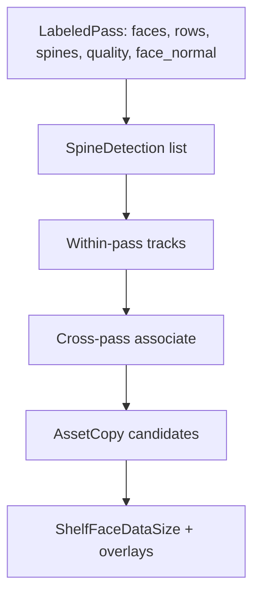

### Within-pass tracks

Grouped by `(pass_id, room, shelf, face, row)`, ordered by `(t, x)`. A detection joins the current track if:

- same `slot`
- `|Δx| ≤ 0.035` (`SLOT_MERGE`)
- `|Δt| ≤ 1.5 s`

### Cross-pass association (the reverse-sweep case)

Two observations merge into **one** `AssetCopy` only when they share **spatial** evidence:

- same room, shelf, face, row
- face-normal dot product ≥ **0.7**
- same slot and `|Δx| ≤ 0.035`

**ISBN alone cannot merge.** Same ISBN at a different slot/face with `|Δt| ≥ 2 s` sets `possibly_moved` instead of collapsing copies.

Same ISBN in two locations remains two `AssetCopy` rows.

### Shelf data size

Each face reports:

- `occupied_length_m` (0.04 m per counted copy in v1)
- `capacity_length_m`
- `fill_ratio`
- `copy_count` with interval when partial
- `unresolved_count`
- `evidence_bytes`

Job key: `{survey_id}:vision:{input_hash}:shelf-count-v1`. Retrying does not append duplicate assets.

---

## 7. Pass C — exceptions, barcodes, non-book items

`ExceptionCaptureStore` uses still images after the AR camera is released.

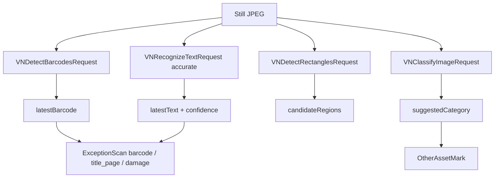

### Closed taxonomy

`book | serial | painting | portrait | sculpture | computer | monitor | printer | furniture | shelf | appliance | cup | decorative_object | other`

On-device classifier hints (not truth):

| Vision label contains | Suggested category |
| --- | --- |
| book | book |
| portrait / picture frame | portrait |
| cup / mug | cup |
| air conditioner | appliance |
| bed / wardrobe / almirah / table / desk / furniture | furniture |
| monitor / computer | monitor / computer |

### Policy (deterministic, not the detector)

`asset_policy(category, high_value)`:

| Category | `valuation_required` | `requires_appraisal` | `excluded` |
| --- | --- | --- | --- |
| `cup` | false | false | true |
| `painting`, `portrait`, `sculpture` | true | true | false |
| any + `high_value` | true | true | false |
| `book` and others | true | false unless high_value | false |

A mug is **inventoried** so exclusion is deliberate. It is never silently omitted and never auto-valued.

### Pass C scan kinds

- `barcode` / `title_page` — identifier ladder (next section)
- `damage` — operator assertion + close-up + scale; status `assertion_needs_review`
- Unbound scan — queue `Select a physical asset`

Books with no identity after Pass C go to queue kind `unread_spine`.

---

## 8. Voice, notes, and spoken association

```mermaid
sequenceDiagram
  actor T as Technician
  participant Rec as AudioNoteRecorder
  participant Pkg as audio/survey.m4a + timing.json
  participant STT as OpenAI gpt-4o-transcribe-diarize
  participant S3 as Stage3Worker
  participant TTS as OpenAI gpt-4o-mini-tts marin

  T->>Rec: Speak while scanning ("this portrait is damaged")
  Rec->>Pkg: AAC on capture monotonic clock
  Note over Rec: Mixes with RoomPlan session; scan continues if mic fails
  Pkg->>STT: After seal, server-side only
  STT-->>S3: segments with start/end + speaker
  S3->>S3: Bind note to asset or leave unbound
  T->>TTS: Optional operator prompt (barcode / damage / unbound)
```

### STT

- File: `audio/survey.m4a`
- Timing: `audio/timing.json` (`started_monotonic_seconds`)
- Model default: `OPENAI_STT_MODEL` / `gpt-4o-transcribe-diarize`
- `response_format=diarized_json`
- Each segment: `monotonic_seconds = started + segment.start`
- Status: `transcribed` / `failed` / `unconfigured` / `absent`

The capture app never receives the API key. TTS is `POST /v1/operator-prompts/{barcode|damage|unbound}/speech` and must disclose AI-generated speech.

### How “this” is bound

`Stage3Worker._associate` scores candidates; it **never** silently binds a high-value damage note to the nearest object.

| Signal | Score |
| --- | --- |
| Explicit tap `tapped_asset_id` | Immediate bind (`operator_tap`) |
| Same face + row + slot | +4 |
| Reticle / last focused asset | +3 |
| Pose asset id | +2 |
| Camera translation within 0.5 m | +2 |
| Note time within 3 s of asset time | +1 |
| Semantic category in the transcript | +1 |

Focus events within **5 s** of the note (and uniquely closer by ≥ 1 s) inject reticle/face/slot/pose before scoring.

Transcript keywords also hint categories: mug/coffee cup → `cup`; table/desk/bed/wardrobe/almirah → `furniture`; photo/picture frame → `portrait`; air conditioner / A/C → `appliance`.

If top-two scores differ by `< 2`, the note stays `unbound` and the review queue asks which object was meant.

Spoken cost phrases can be parsed (`parse_spoken_cost`) as **operator-stated** replacement hints for non-books, still subject to policy (cups stay excluded).

A damage phrase without a damage close-up queues `Capture damage close-up and scale`.

### Speech-aligned pricing

`plan_price_targets` aligns transcript windows with frames (`FRAME_MATCH_PAD = 1.5 s`, max 4 s). A small model may list unique `{name, kind: book|object, category}` items from that window. Generic placeholders such as “books on the bookshelf” are **not** searched.

---

## 9. Condition: old vs new, wear, damage

The assignment asked for a classifier of old/new **and** price/geography. This system **splits** those jobs:

| Question | Owner | Labels |
| --- | --- | --- |
| Condition / age / wear | Vision models on a **named copy** after seal | `new`, `good`, `worn`, `damaged`, `unknown` |
| Damage type / region | Operator assertion + model `damage.present/types` | never overwrites the other source |
| Price | OpenAI `web_search` + human confirm | not a class label |
| Geography | Device location / manual override | not a class label |

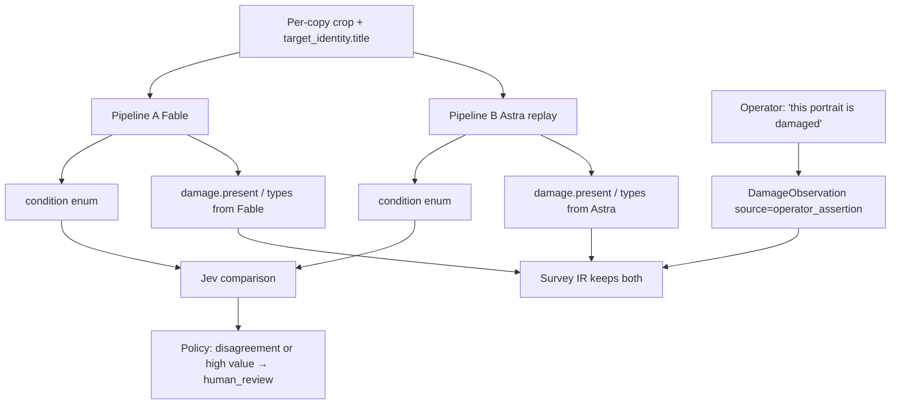

`new` vs `worn` is the implemented reading of “old/new”. There is no separate boolean `old`. Unknown is valid; the system must not invent an ISBN or a price from condition.

Specialist RL heads later fit the same condition vocabulary from independent labels (`HEADS = condition, eligibility, damage, duplicate_features, quality`).

Pricing prefers comparable offers of the same physical condition (e.g. `used_good`) when the technician confirms a listing. Condition adjustment is **not** a hardcoded multiplier table.

---

## 10. ISBN, catalog, and bibliographic identity

Stage B OCR **hints** have no checksum authority. On Stage 3 start, book `isbn` fields are cleared, then rebuilt only from Pass C evidence.

### Evidence ladder (strongest first)

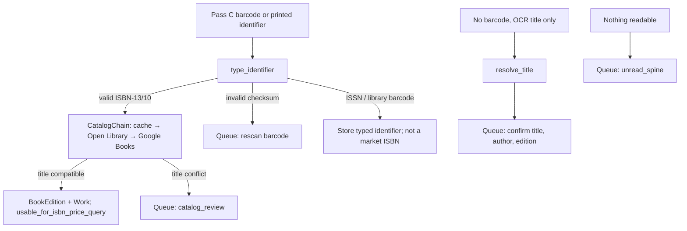

### Deterministic identifier typing

`type_identifier` (`backend/app/workflows/identifiers.py`):

- Strip spaces/hyphens; preserve raw string
- ISBN-10: 9 digits + digit/X, weighted checksum mod 11
- ISBN-13 / EAN-13: 13 digits, alternating 1/3 checksum; book prefix `978` or `979`
- Optional 5-digit EAN supplement stripped only when visibly separated
- ISSN: 8 chars, checksum mod 11
- `library_barcode` is a physical-copy mark, not a market ISBN
- Checksum-valid but catalog-incompatible codes are quarantined (wrong/adjacent barcode)

Spine OCR must **not** invent an ISBN.

### Catalog chain

Identity only. Google Books `saleInfo` is discarded and must not price a physical copy.

Title compatibility: ≥ about two-thirds of observed words longer than 2 characters must appear in the catalog title.

Several physical copies of one edition share a `BookEdition` / `Work` and keep separate `AssetCopy` IDs.

---

## 11. Price discovery and valuation

Scraping is refused. The discovery path is OpenAI Responses API `web_search`.

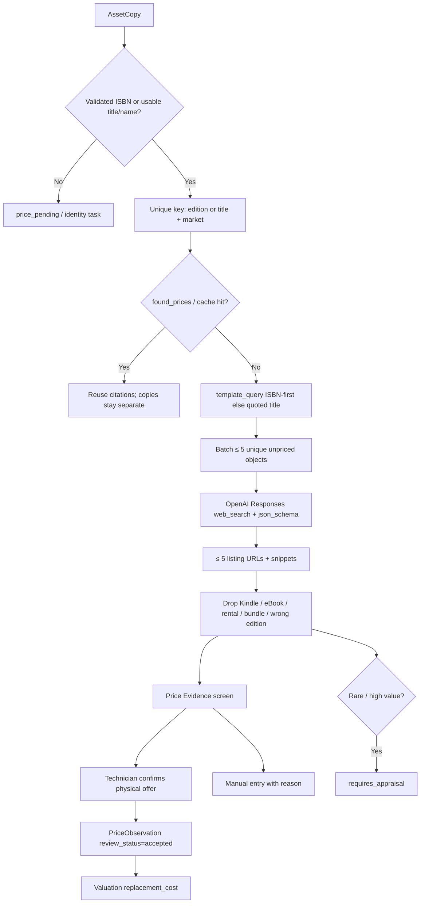

### Query construction

ISBN present:

```text
{isbn13} paperback hardcover buy price {amazon.in OR flipkart...} {city} {country} {currency}
query_kind = isbn
```

No ISBN:

```text
"{title}" {author} {publisher} {edition} paperback hardcover buy price ({shops}) {place} {currency}
query_kind = name
```

Country shop tables:

| Market | Book shops | Object shops |
| --- | --- | --- |
| IN | amazon.in, flipkart, bookswagon, crossword.in | amazon.in, flipkart, IKEA, Croma, Pepperfry |
| IT | amazon.it, ibs.it, mondadori | amazon.it, ikea.it, mediaworld |
| JP | amazon.co.jp, rakuten, kinokuniya | amazon.co.jp, rakuten, ikea.jp |

`user_location` is `{type: approximate, country, city, region}` from survey geography so Italy and Japan do not share a US result set.

Live Pass B can also send the current JPEG to `extract_book_titles` (`OPENAI_VISION_MODEL`, default `gpt-4o-mini`) and search by the recognized cover/spine name.

### What becomes a price

- Drafts from snippets (`₹825`, `€31.99`, `¥2,640`) are **not** confirmed prices
- `offer_type` must be `physical` (Kindle/eBook text is rejected)
- At most **5** searches per unpriced object; Redis `found_prices` stops further paid search
- Technician confirm writes `PriceObservation` with query, citation URL, timestamp, evidence hash
- Contents range = **sum of confirmed** physical replacement amounts only
- Status: `estimated | quoted | manual | requires_appraisal | unavailable | price_pending | no_comparable`

Mugs stay excluded. Art/rare items stay `requires_appraisal`. Unresolved identities stay visible and unpriced — never zero.

After seal, `PricingWorker.after_seal` runs:

1. `identify_from_frames`
2. `price_spoken_notes`
3. `queue` unique unpriced edition+market
4. `overview`
5. `replay_survey` (Fable + Astra-replay + Jev on every `AssetCopy`)

---

## 12. Building reconstruction value

RoomPlan is **not** a real-estate appraisal.

```text
ReconstructionValue =
  floor_area_m2 × demo_rebuild_rates_v1[country].commercial_library.{low, medium, premium}
```

- Basis: `replacement_cost`, `not_market_value = true`
- Country key = `SurveyGeography.country_code`
- Demo table: IN (INR), IT (EUR), JP (JPY)
- Central = medium finish; interval = low…premium
- Report labels rate-table version and area method

Contents and building totals are never mixed.

---

## 13. Astra-live, Fable, Astra-replay, Jev

Four runtimes share names but **not** authority.

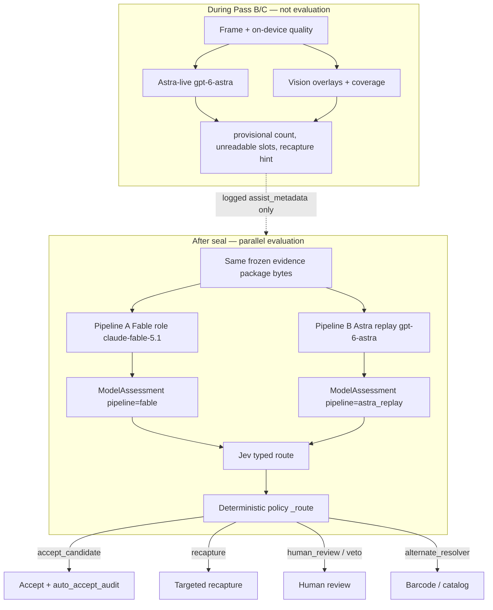

### Evidence package (same bytes to A and B)

Built in `replay_asset`:

- `asset_copy_id`, sealed `package_hash`
- observations for that copy
- up to **two** JPEG/PNG refs (crop preferred), each ≤ 2 MB, base64
- `target_identity`: title, ISBN already extracted, instruction “assess only this named copy”
- `task` string
- **No** Fable output in the Astra prompt and vice versa

Raw provider JSON is stored **before** normalization under `derived/model-runs/{run_id}/`.

Forbidden keys dropped before validation: `geometry`, `isbn*`, `price(s)`, `amount`, `currency`, `merge*`, `valuation`, `money`, `count`, `inventory`, `quoted_price`. Invented ISBNs not already on the package are nulled.

Shared assessment schema (`ModelAssessment v1`):

```text
category:  book | portrait | painting | cup | furniture | electronics | other | unknown
condition: new | good | worn | damaged | unknown
damage:    { present, types[], description }
identity_candidates[≤5]
recommended_action: accept_candidate | recapture | alternate_resolver | human_review
confidence, rationale, evidence_refs
```

Category aliases: computer/monitor/appliance/laptop → `electronics`; shelf/table/bed → `furniture`.

### Pipeline A — Fable

- Provider: Anthropic Messages API
- Model: `FABLE_MODEL` (repo default `claude-fable-5-1`; Invertis live call was `claude-fable-5.1`)
- Images as `type: image` base64 source
- Adapter accepts **only** `pipeline=fable`

### Pipeline B — Astra Extra (stored as `astra_replay`)

- Provider: OpenAI Responses API
- Model: `ASTRA_MODEL` default `gpt-6-astra`
- Strict `json_schema` `model_assessment`
- Independent of Astra-live Extra; live results are **not** reused as B
- Adapter accepts **only** `pipeline=astra_replay`
- PDF/report label: **Astra Extra (Pipeline B)**

If a provider fails, the copy is a **disclosed partial** that routes to human review. Adapters do not invent assessments.

`replay_survey` runs A and B on **every** `AssetCopy` after seal (and is reused when `package_hash` + copy IDs match). Optional per-copy button: `POST /v1/surveys/{id}/assets/{copy}/model-replay`. Models must not mutate inventory; the worker diffs inventory before/after and rolls back if they do.

### Jev

- Provider: TypeSafe `https://api.typesafe.ai/v1/systemone`
- Model: `JEV_MODEL` default `jev-latest`
- Input: compact state `{asset, fable, astra}` — not raw video
- Output: choice + probabilities over:
  - `accept_candidate`
  - `recapture`
  - `alternate_resolver`
  - `human_review`
- Probabilities must be in `[0,1]` and sum to ~1
- Jev **must not** write count or price
- Comparison record stores A fields, B fields, disagreed fields (`category`, `condition`, `damage`), chosen route, confidence

### Deterministic policy (owns the final action)

`_route` in `backend/app/workflows/models.py`, in order:

1. `requires_appraisal` or `high_value` → `human_review` (`high_value_veto`)
2. digital/eBook category → `human_review` (`ebook_physical_veto`)
3. `merge_basis == isbn_only` → `human_review`
4. missing A or B → `human_review` (`model_unavailable`)
5. either model category ≠ deterministic asset category → `human_review`
6. A/B disagree on category/condition/damage → `human_review`
7. min confidence `< 0.85` → `human_review`
8. both recommend `accept_candidate` → accept
9. Jev missing or Jev confidence `< 0.8` → `human_review`
10. otherwise Jev proposal if it is not a conflicting accept

Agreement of two models is **not** ground truth when deterministic evidence conflicts.

Every decision appends an `RLTransition` with `reward: null` until independently labeled.

---

## 14. RL feedback loop

This is a real MDP home. Production weights **do not** update from one live survey.

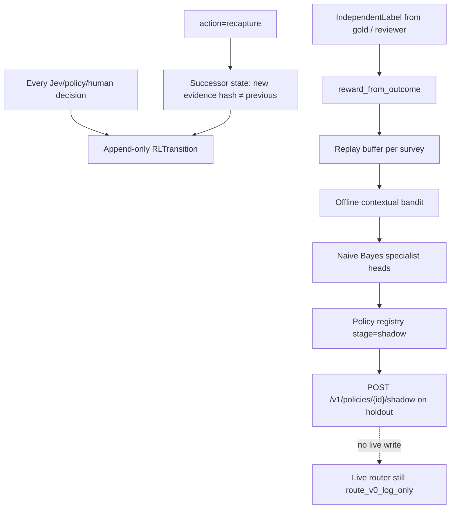

### MDP

| Piece | Implementation |
| --- | --- |
| Episode | One survey, including recapture cycles |
| State | Compact dict: `asset_copy_id`, `category`, `disagreement`, `appraisal_required`, `evidence_package_hash`, `logging_propensity`, specialist prediction, coverage/impact as logged |
| Action | `accept`, `recapture`, `alternate_resolver`, `human_review`, `use_specialist_head`, `use_frontier` |
| Policy id at capture | `route_v0_log_only` |
| Next state | Only for `recapture`; successor evidence **must** exist and hash-differ |

Human Stage 3 actions (`bind_note`, `rescan_barcode`, `keep_unresolved`) also append transitions with `action_source=human`. Offline training **excludes** human-selected actions from the bandit fit.

### Reward table (independent labels only)

Never from “Jev agreed with Fable”.

| Outcome flag | Reward |
| --- | ---: |
| Correct keep-or-merge | +1 |
| False merge | −5 |
| False split | −2 |
| Correct ISBN/edition | +2 |
| Wrong ISBN/edition | −3 |
| Missed high-value | −8 |
| Correct mug exclusion | +0.2 |
| Valued a mug / eBook as physical | −4 |
| Recapture recovered a row | +1.5 |
| Unnecessary recapture | −0.5 |
| Correct specialist routing | +1 |

### Offline trainer

- Requires disjoint train vs holdout survey IDs
- ≥ 10 independently labeled transitions with `logging_propensity ∈ (0,1]`
- Technique: propensity-weighted linear reward regression, 200 steps, lr 0.02, only actions with ≥ 3 examples
- Specialists: Laplace-smoothed naive Bayes on `{bias, category:*, disagreement, appraisal, fable_confidence, astra_confidence}`
- Gold set: freeze 50–100 unique copy IDs covering required cases (`same_isbn_two_copies`, `reverse_scan`, `no_isbn`, `ambiguous_edition`, `moved_book`, `damaged_book`, `portrait_spoken_damage`, `mug`, `appraisal_item`)
- Shadow reports IPS on **matched** logged actions only, with an overlap warning; it does not claim causal improvement and does not change live routing

Staged path: log-only → offline bandit → sequential recapture RL → specialist heads → shadow → canary. Rollback = pin previous `policy_id`.

Invertis Library (survey `4b9d7885-…`): 96 log-only transitions on 45 copies, 0 labels, 0 gold freeze, 0 trained policies. Live router is still `route_v0_log_only`. Excerpt: `docs/invertis-library/rl-trace-excerpts.json`.

---

## 15. Canonical Survey IR

Model JSON is never the database schema. `SurveyIR v1` distinctions:

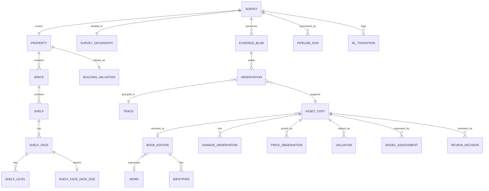

| Entity | Meaning |
| --- | --- |
| Observation | One detection in one frame/crop at one time and pose |
| Track | Observations of the same visible object during one sweep |
| AssetCopy | One physical object; ISBN is **never** its primary key |
| BookEdition | Bibliographic product |
| Work | Conceptual title |
| Identifier | ISBN-10/13, EAN, ISSN, library barcode, … |
| PriceObservation | One source offer at one time and market |
| Valuation | Policy conclusion from **accepted** physical offers |
| ModelAssessment | Fable or Astra-replay classification only |
| RLTransition | State/action/reward record |

Every material number carries `value, unit, status, confidence, interval, method, evidence_refs, run_id`. Statuses: `ok | partial | failed | needs_review`.

---

## 16. Survey state machine and seal

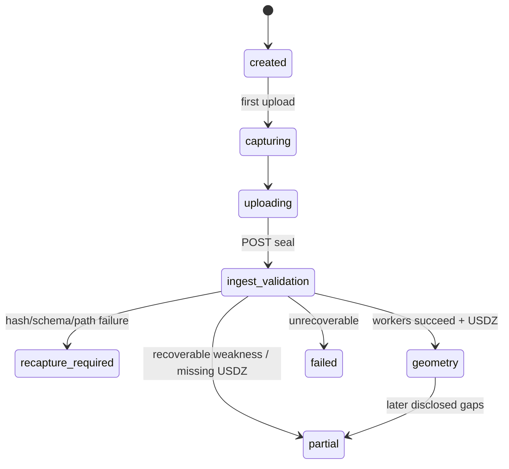

Seal pipeline (`SurveyWorkflow.seal`), all idempotent:

1. Reject unsafe paths, hash mismatches, bad schema, bad timestamps, `derived/` uploads
2. Write manifest, verify reopened bytes
3. `GeometryWorker.process`
4. `VisionWorker.process`
5. `Stage3Worker.process` (STT, identity, notes, damage, policy)
6. Re-render plan with shelf overlays
7. `PricingWorker.after_seal` (titles, spoken prices, queue, overview, **replay_survey**)

Capture package (local, then R2):

```text
survey_<id>/
  manifest.json
  property.json
  checksums.sha256
  device/location.json
  device/calibration.json
  roomplan/raw/room-data.json
  roomplan/raw/frames/NNNN.jpg
  roomplan/raw/poses.json
  roomplan/processed/structure.json
  roomplan/model.usdz
  generated/plan.svg
  shelf_scans/labeled.json
  shelf_scans/quality.json
  shelf_scans/frames/NNNN.jpg
  shelf_scans/crops/{row}_{uuid}.jpg
  closeups/*.jpg
  other_assets/marks.json
  exceptions/pass-c.json
  audio/survey.m4a
  audio/timing.json
  notes/annotations.json
```

Interrupted capture survives on disk; upload is resumable. Original hashes never change.

---

## 17. Storage, jobs, and API

| Store | Owns | Does not own |
| --- | --- | --- |
| Redis | Survey records, IR JSON, jobs, idempotency, events, RL lists, price cache, policy artifacts | Large RGB/audio/USDZ |
| R2 / S3 | Immutable sealed media and derived files | Survey state machine |
| SQLite | Stage 1 demo archive only | Runtime |

Durable Redis keys have **no accidental TTL**.

### Minimal HTTP surface

```text
POST   /v1/surveys
GET    /v1/surveys/{id}
POST   /v1/surveys/{id}/uploads
POST   /v1/surveys/{id}/seal
GET    /v1/surveys/{id}/jobs
GET    /v1/surveys/{id}/inventory
GET    /v1/surveys/{id}/shelves
GET    /v1/surveys/{id}/overview
GET    /v1/surveys/{id}/review
POST   /v1/reviews/{id}/decision
POST   /v1/surveys/{id}/books/{asset}/identity-correction
POST   /v1/assets/{id}/price-search
POST   /v1/surveys/{id}/live-price-search
POST   /v1/surveys/{id}/identify-and-price
POST   /v1/surveys/{id}/price-search-queue
POST   /v1/assets/{id}/price-observations
POST   /v1/surveys/{id}/astra-live
GET    /v1/surveys/{id}/astra-live
POST   /v1/surveys/{id}/assets/{copy}/model-replay
GET    /v1/surveys/{id}/model-runs
GET    /v1/surveys/{id}/rl-transitions
POST   /v1/surveys/{id}/rl-successor-states
POST   /v1/surveys/{id}/independent-labels
POST   /v1/surveys/{id}/gold-set
GET    /v1/surveys/{id}/report
GET    /v1/surveys/{id}/report.pdf
GET    /v1/surveys/{id}/usage
GET    /v1/policies
POST   /v1/policies/train
POST   /v1/policies/{id}/shadow
POST   /v1/operator-prompts/{id}/speech
GET    /v1/surveys/{id}/operator-actions
GET    /v1/surveys/{id}/evidence?path=
DELETE /v1/surveys/{id}   (X-Confirm-Delete)
```

Mutations require `Idempotency-Key`. Job keys are `survey_id + stage + input_hash + pipeline_version`.

---

## 18. Security, spend, and operator failures

- Encrypt local packages and transport; optional object encryption at rest
- Signed short-lived upload URLs (or local equivalent)
- Face/bystander redaction (`EvidenceFaceRedactor`, Vision face rectangles) before seal when enabled — failure must not seal unredacted bytes
- Consent for video, audio, When In Use location
- Retention/deletion; access log on evidence
- Append-only human decisions; model output is not overwritten
- Usage ledger per `X-Survey-Run-Id` (tokens, web_search calls, estimated USD). **No runtime dollar stop-at-cap**
- Operator failure table (`/operator-actions`) maps incomplete rooms, blur, bad checksums, unbound audio, eBook-only offers, A/B disagreement, etc. to a concrete next action rather than a crash

---

## 19. Code map

| Concern | Primary files |
| --- | --- |
| Pass A RoomPlan | `ios/.../Capture/RoomCaptureStore.swift`, `RoomCaptureContainer.swift`, `Export/CapturePackageWriter.swift` |
| Camera exclusion | `ios/.../Capture/CameraSessionCoordinator.swift` |
| Pass B quality + spines | `ios/.../Capture/LiveQualityAnalyzer.swift`, `SpineInstanceTracker.swift`, `ShelfCaptureStore.swift` |
| Pass C + taxonomy hints | `ios/.../Capture/ExceptionCaptureStore.swift`, `Models/Stage3Models.swift` |
| Voice capture | `ios/.../Services/AudioNoteRecorder.swift` |
| Astra-live client | `ios/.../Services/AstraLiveAssist.swift` |
| Geography | `ios/.../Services/LocationService.swift` |
| Face redaction | `ios/.../Security/EvidenceFaceRedactor.swift` |
| Geometry / 2D plan | `backend/app/workflows/geometry.py`, `floor_plan.py` |
| Spine count / dedup | `cv/library_vision/pipeline.py`, `backend/app/workflows/vision.py` |
| Identity / notes / damage | `backend/app/workflows/stage3.py`, `identifiers.py` |
| Catalog | `backend/app/providers/catalog/chain.py` |
| Voice server | `backend/app/providers/voice.py` |
| Pricing / web_search | `backend/app/workflows/pricing.py`, `providers/pricing/*` |
| Fable / Astra / Jev | `backend/app/providers/models/*`, `workflows/models.py`, `workflows/astra_live.py` |
| Policy route | `backend/app/workflows/models.py` `_route` |
| RL | `backend/app/rl/transitions.py`, `rl/offline.py` |
| Report | `backend/app/workflows/report.py` |
| Schemas | `schemas/*.schema.json` |

---

## Reading order for a reviewer

1. This file — diagrams of the implemented system
2. [`FINAL-PLAN.md`](../FINAL-PLAN.md) — why the splits (three passes, no scrape, dual Astra, offline RL)
3. [`docs/model-contracts.md`](model-contracts.md) — Fable/Astra/Jev payload rules
4. [`IMPLEMENTATION.md`](../IMPLEMENTATION.md) — stage gates and screens
